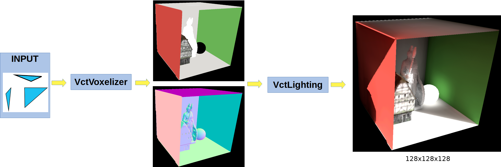
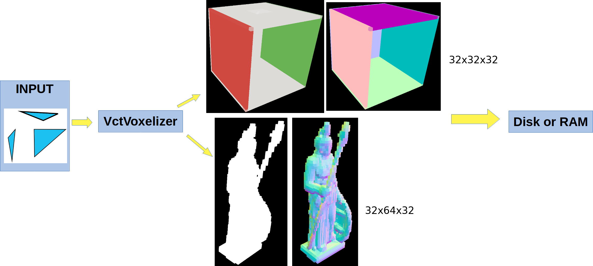
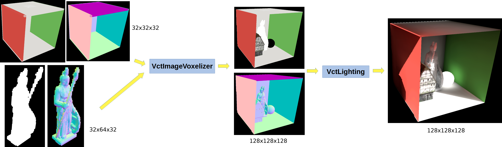
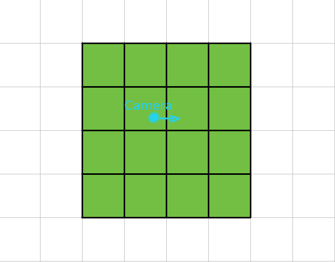
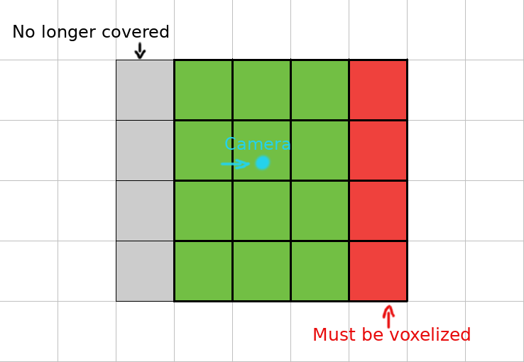

# Image Voxel Cone Tracing {#ImageVoxelConeTracing}

Ogre-Next offers a wide amount of [Global Illumination solutions](https://ogrecave.github.io/ogre-next/api/2.3/_gi_methods.html).

Some better than others, but VCT (Voxel Cone Tracing) stands out for its high quality at an acceptable performance (on high end GPUs).

However the main problem right now with our VCT implementation is that it's hard to use and needs a lot of manual tweaking:

1. Voxelization process is relatively slow. 10k triangles can take 10ms to voxelize on a Radeon RX 6800 XT, which makes it unsuitable for realtime voxelization (only load time or offline)
2. Large scenes / outdoors need very large resolution (i.e. 1024x32x1024) or just give up to large quality degradations
3. It works best on setting up static geometry on a relatively small scene like a room or a house.

If your game is divided in small sections that are paged in/out (i.e. PS1 era games like Resident Evil, Final Fantasy 7/8/9, Grim Fandango) VCT would be ideal.

But in current generation of games with continous movement over large areas, VCT falls short, not unless you do some insane amount of tricks.

So we're looking to improve this and that's where our new technique **Cascaded Image VCT** (CIVCT... it wouldn't be a graphics technique if we didn't come up with a long acronym) comes in:

1. Voxelizes much faster (10x to 100x), enabling real time voxelization. Right now we're focusing on static meshes but it should be possible to support dynamic stuff as well
2. User friendly
3. Works out of the box
4. Quality settings easy to understand
5. Adapts to many conditions (indoor, outdoor, small, large scenes)

That would be pretty much the holy grail of real time GI.

## Step 1: Image Voxelizer {#IVCT_Step1}

Our current VctVoxelizer is triangle based: It feeds on triangles, and outputs a 3D voxel (Albedo + Normal + Emissive). This voxel is then fed to VctLighting to produce the final GI result:

Right now we're using VctVoxelizer voxelizes the entire scene. This is slow.

Image Voxelizer is image-based and consists in two steps:

1. Reuse VctVoxelizer to separately voxelize each mesh offline and save results to disk (or during load time). At 64x64x64 a mesh would need between 2MB and 3MB of VRAM per mesh (and disk space) depending on whether the object contains emissive materials. Some meshes require much lower resolution though. This is user tweakable. You'd want to dedicate more resolution to important/big meshes, and lower resolution for the unimportant ones.
    - This may sound too much, but bear in mind it is a fixed cost independent of triangle count. A mesh with a million triangles and a mesh with a 10.000 triangles will both occupy the same amount of VRAM.
	- Objects are rarely square. For example desk table is often wider than it is tall or deep. Hence it could just need 64x32x32, which is between 0.5MB and 0.75MB
2. Each frame, we stitch together these 3D voxels of meshes via trilinear interpolation into a scene voxel. This is very fast.

**This feature has been fast thanks to Vulkan**, which allows us to dynamically index an arbitrary number of bound textures in a single compute dispatch.

OpenGL, Direct3D 11 & Metal* will also support this feature but may experience degraded performance as we must perform the voxelization in multiple passes. How much of a degradation depends on the API, e.g. OpenGL actually will let us dynamically index the texture but has a hard limit on how many textures we can bind per pass.

(*) I'm not sure if Metal supports dynamic texture indexing or not. Needs checking.

Therefore this is how it changed:

This step is done offline or at loading time:

This step can be done every frame or when the camera moves too much, or if an object is moved

### Downside {#IVCT_Step1_Downside}

There is a downside of this (aside from VRAM usage): We need to voxelize each mesh + material combo. Meaning that if you have a mesh and want to apply different materials, we need to consume 2-3MB per material

This is rarely a problem though because most meshes only use one set of materials. And for those that do, you may be able to get away with baking a material set that is either white or similar; the end results after calculating GI may not vary that much to worth the extra VRAM cost.

#### Non-researched solutions:

 - For simple colour swaps (e.g. RTS games, FPS with multiplayer teams), this should be workaroundeable by adding a single multiplier value, rather than voxelizing the mesh per material
 - It should be possible to apply some sort of BC1-like compression, given that the mesh opaqueness and shape is the same. The only thing that changes is colour; thus a delta colour compression scheme could work well

### Trivia

At first I panicked a little while developing the Image Voxelizer because the initial quality was far inferior than that of the original voxelizer.

The problem was that the original VCT is a 'perfect' voxelization. i.e. if a triangle touches a single voxel, then that voxel adopts the colour of the triangle. Its neighbour voxels will remain empty. Simple.
That results in a 'thin' voxel result.

However in IVCT, voxels are interpolated into a scene voxel that will not match in resolution and may be arbitrarily offsetted by subpixels. It's not aligned either.

The result is that certain voxels have 0.1, 0.2 ... 0.9 of the influence of the mesh. This generates 'fatter' voxels.

In 2D we would say that the image has a halo around the contours

Once I understood what was going on, I tweaked the math to thin out these voxels by looking at the alpha value of the interpolated mesh and applying an exponential curve to get rid of this halo.

And now it looks very close to the reference VCT implementation!

## Step 2: Row Translation {#IVCT_Step2}

We want to use cascades (a similar concept from shadow mapping, i.e. [Cascaded Shadow Maps](https://docs.microsoft.com/en-us/windows/win32/dxtecharts/cascaded-shadow-maps). In Ogre we call it Parallel Split Shadow Maps but it's the same thing) concentric around the camera.

That means when the camera moves, once the camera has moved too much, we must move the cascades and re-voxelize.

But we don't need to voxelize the entire thing from scratch. We can translate everything by 1 voxel, and then revoxelize the new row:

As the camera wants to move, once it moved far enough, we must translate the voxel cascade

When we do that, there will be a region that is no longer covered (it will be covered by a higher, lower quality cascade) marked in grey, and a row of missing information we must revoxelize, marked in red.

Given that we only need to partially update the voxels after camera movement, it makes supporting cascades very fast

Right now this step is handled by `VctImageVoxelizer::partialBuild`

## Step 3: Cascades {#IVCT_Step3}

**This step is currently a work in progress**. The implementation is planned to have N cascades (N user defined). During cone tracing, after we reach the end of a cascade we move on to the next cascade, which covers more ground but has coarser resolution, hence lower quality.

## Wait isn't this what UE5's Lumen does?

AFAIK Lumen is also a Voxel Cone Tracer. Therefore it's normal there will be many similarities. I don't know if they use cascades though.

As far as I've read, Lumen uses an entirely different approach to voxelizing which involves rasterizing from all 6 sides, which makes it very user hostile as meshes must be broken down to individual components (e.g. instead of submitting a house, each wall, column, floor and ceiling must be its own mesh).

With Ogre-Next you just provide the mesh and it will just work (although with manual tunning you could achieve greater memory savings if e.g. the columns are split and voxelized separately).

## Wait isn't this what Godot does?

Well, I was involved in [SDFGI advising Juan](https://godotengine.org/article/godot-40-gets-sdf-based-real-time-global-illumination) on the subject, thus of course there are a lot of similarities.

The main difference is that Godot generates a cascade of SDFs (signed distance fields), while Ogre-Next is generating a cascade of voxels.

This allows Godot to render on slower GPUs (and is specially better at specular reflections), but at the expense of accuracy (there's a significant visual difference when toggling between Godot's own raw VCT implementation and its SDFGI; but they both look pretty) but I believe these quality issues could be improved in the future.

Having an SDF of the scene also offers interesting potential features such as 'contact shadows' in the distance.

Ogre-Next in the future may generate an SDF as well as it offers many potential features (e.g. contact shadows) or speed improvements. Please understand that VCT is an actively researched topic and we are all trying and exploring different methods to see what works best and under what conditions.

Since this technique will be used in [Ignition Gazebo](https://ignitionrobotics.org/home) for simulations, I had to err on the side of accuracy.
