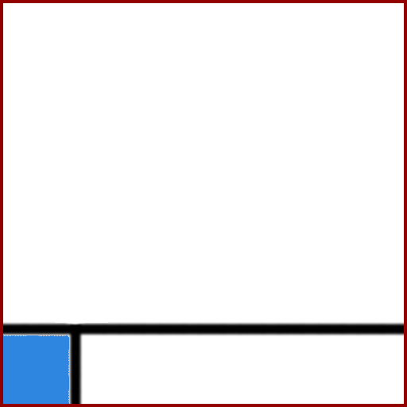
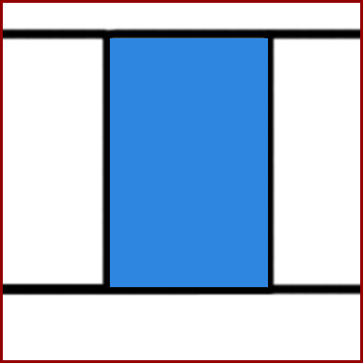

# Behavior of StagingTexture in D3D11 {#BehaviorStagingTextureD3D11}

__Note:__ this article is intended for developers who want to understand or modify
Ogre.

@tableofcontents

Both GL & Metal use 1D buffers to copy data from a staging area into the final Texture
residing in GPU. That's why both GL3PlusStagingTexture & MetalStagingTexture derive
from StagingTextureBufferImpl in OgreStagingTextureBufferImpl.cpp

This is easy because loading a 1024x1024 RGBA8 texture followed by a 2048x2048 RGBA8 one
requires 20MB of contiguous memory and that's it. Furthermore their formats don't matter.
One could load an RGBA8 texture followed by a RG16_FLOAT and the API does not care, it's
all about bytes.
As long as the buffer is big enough, all is well.

However D3D11 decided to use a "StagingTexture" that can be 1D, 2D or 3D.

This heavily complicates streaming of textures for which we don't currently know
their resolutions in advance.

Loading a 1024x1024 RGBA8 texture followed by a 2048x2048 RGBA8 one requires a staging
texture of 4096x4096x1; or one of 2048x2048x2.

This problem is essentially the same faced by sprite packers when generating an atlas.

Furthermore an RGBA8 and a RG16_FLOAT cannot be placed in the same StagingTexture.

Because the implementation details of D3D11StagingTexture are complicated, they are
explained here.

# Attempting to be contiguous

It was our goal that array textures could be mapped contiguously, e.g. mapping a
1024x1024x6 array texture could be done with one mapRegion() call.

Unfortunately Direct3D only allows mapping one slice at a time.

Fortunately, Direct3D allows copying from a 3D Staging Texture into an array texture.
Meaning we can use 3D volume staging textures instead.

But unfortunately (again), 3D volume staging textures cannot exceed 2048x2048 in
resolution, and thus the implementation will fallback to array staging textures (which can
only be mapped one slice at a time) if the texture exceeds that resolution.
GL & Metal artificially follow these same restrictions for the sake of consistency and
finding out these problems sooner rather than later.

# Slicing in 3

Every time a region is requested (by calling StagingTexture::mapRegion),
D3D11StagingTexture will look at the smallest entry in their list of free boxes and use
that one. Any available space is further subdivided in 2 more boxes and added back to the
free list, like in the picture:

The blue region is the requested box from StagingTexture::mapRegion; this causes the
available regions to be split in 4, and 3 of these regions will be added to mFreeBoxes.

When a new region is requested, the process is repeated with the smallest region capable
of fitting it:

And now again, with a bigger texture:

And now again, with an even bigger texture:

If no available region can satisfy the requirements, then we return failure, returning 0
in TextureBox::data.

The relevant code in charge of this is in D3D11StagingTexture::shrinkRecords

# Slicing in the middle

When mapRegion tries to map multiple slices (and width, height and depth are all <= 2048)
we may end up mapping a region that is in the middle of slice 0:

However, slices 1 & 2 may be fully empty. That means we need to slice their empty space
in 5:

This is what D3D11StagingTexture::shrinkMultisliceRecords tries to do.

Because it is imperative that the slices have empty space (otherwise if there's
"an obstacle" in the middle of a slice, we may not be able to fullfill the mapRegion
request), we prioritize consuming the first slices over the later ones.

This algorithm works best if all textures are of the same resolution, or multiples of each
other.
