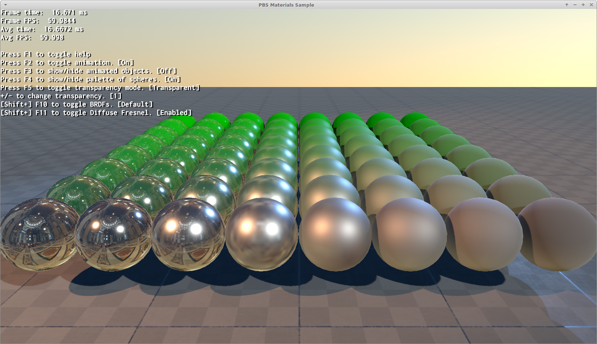
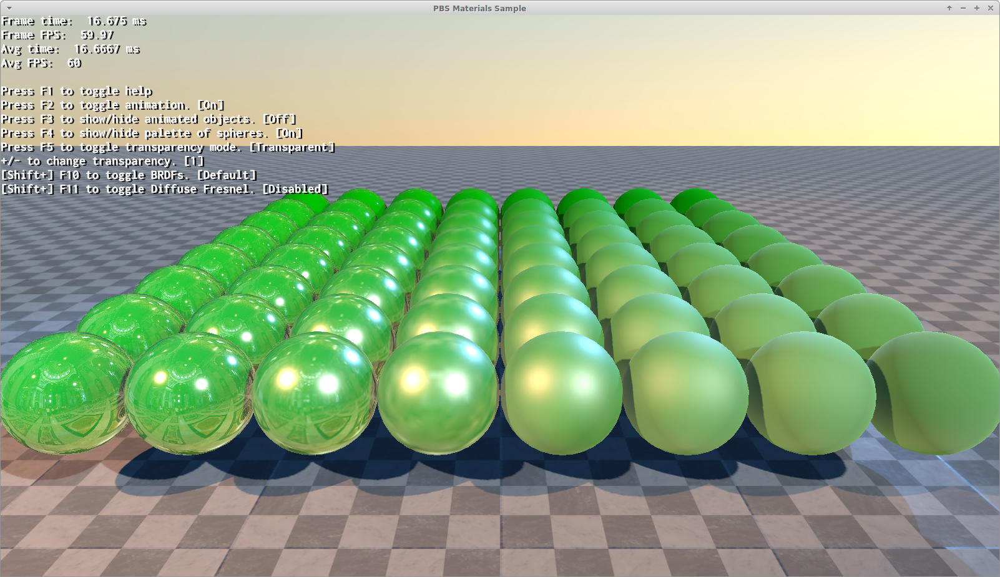
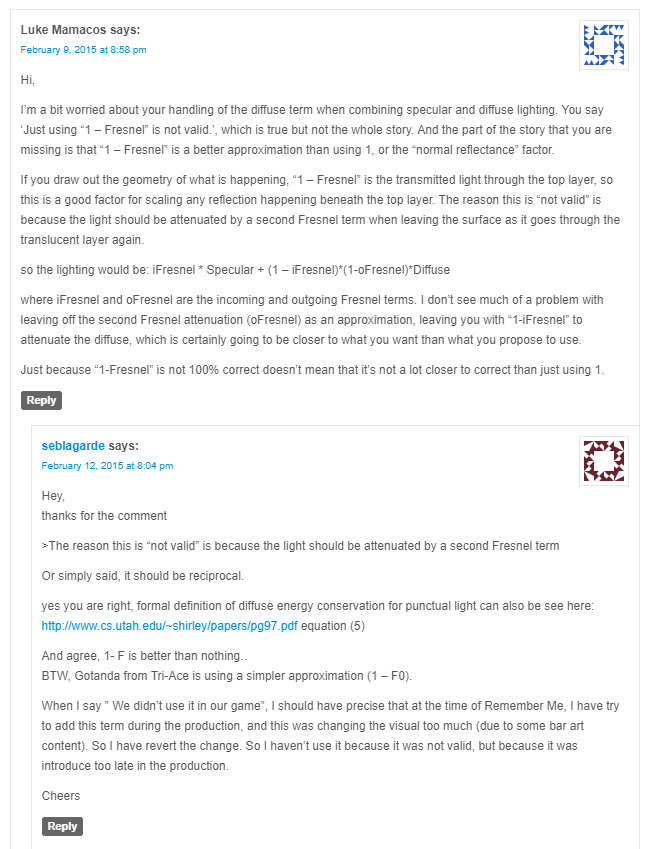
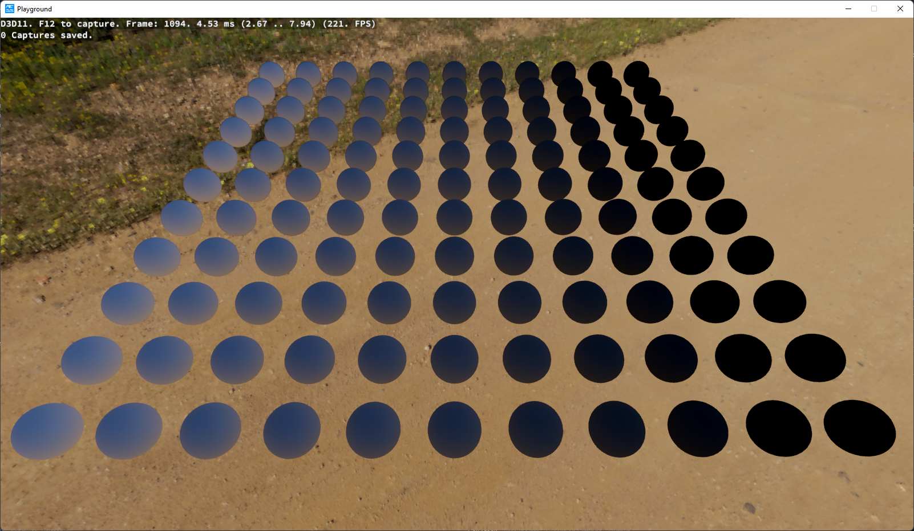
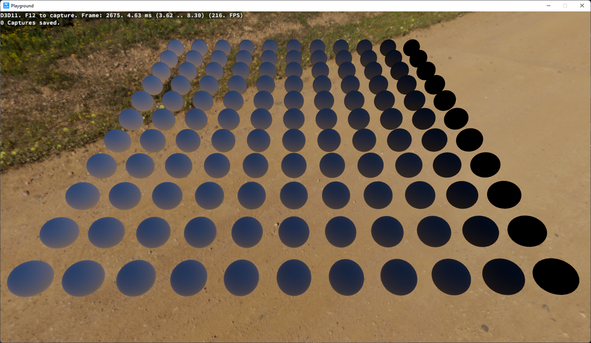
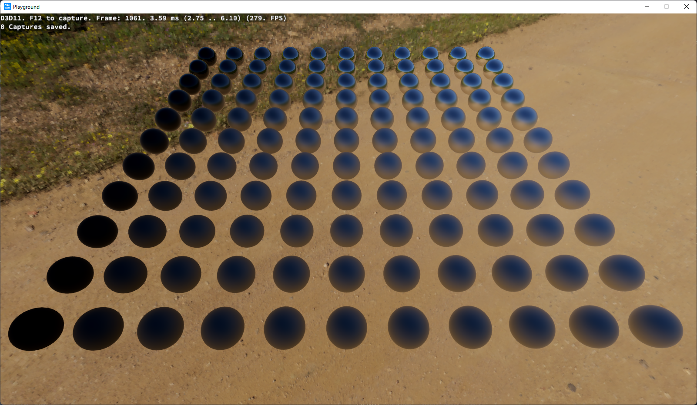
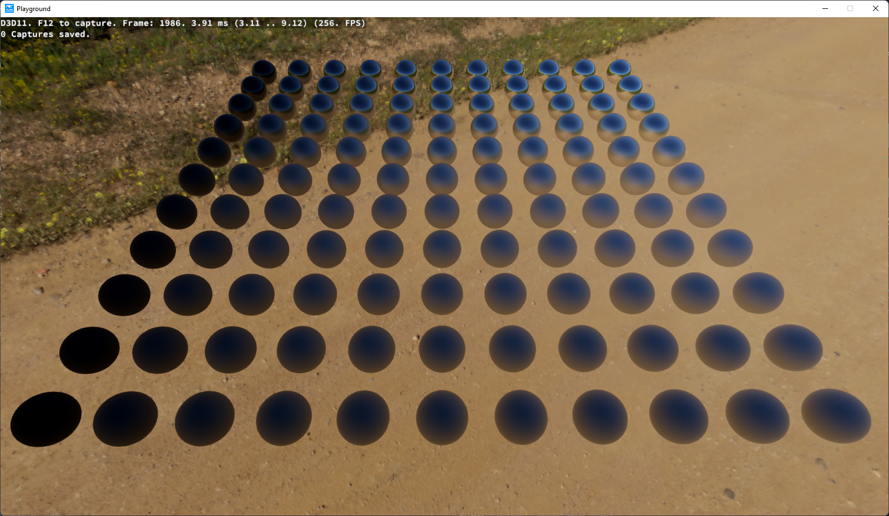
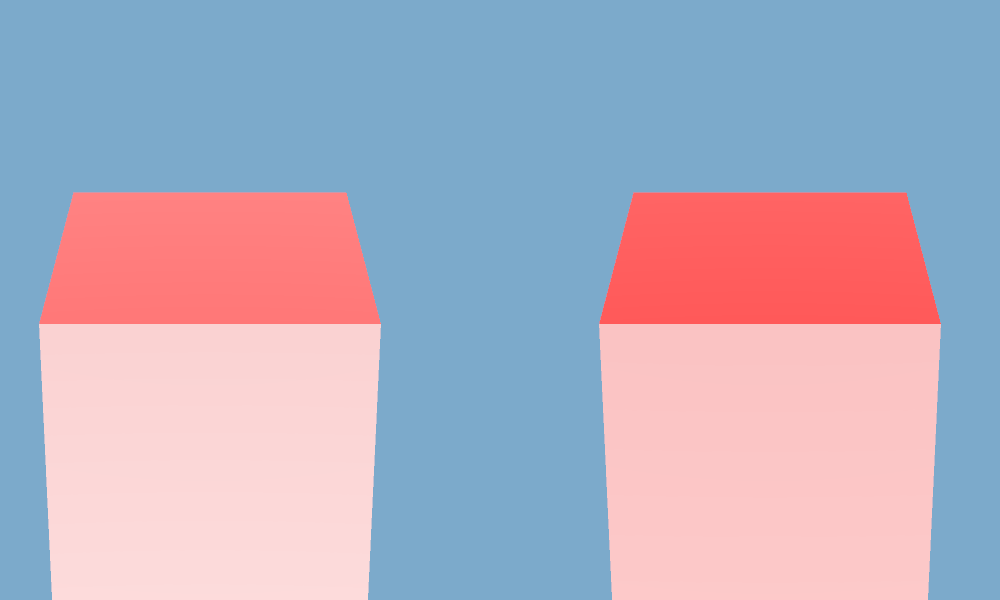

# PBR / PBS Changes in 3.0 {#PBSChangesIn30}

@tableofcontents

Raffaele Bratta, aka TaaTT4, made [a lot of PBR](https://forums.ogre3d.org/viewtopic.php?p=553900#p553900) research to ensure OgreNext's PBR workflow matches that of standard DCC (Digital Content Creation) tools such as Marmoset.

But this also means that materials written against OgreNext 2.3 or older will look different in 3.0

# Short version

**OgreNext 2.3 looked like this:**



**OgreNext 3.0 out of the box now looks like this (same settings):**



In order to get very close to the 2.3 look, you can use Ogre::HlmsPbsDatablock::setBrdf with Ogre::PbsBrdf::DefaultHasDiffuseFresnel (and use Ogre::HlmsPbs::setDefaultBrdfWithDiffuseFresnel to set defaults)

**With DefaultHasDiffuseFresnel OgreNext 3.0 will look like this:**


```cpp
hlmsPbs->setDefaultBrdfWithDiffuseFresnel( true );


// Or per datablock
pbsDatablock->setBrdf( Ogre::PbsBrdf::DefaultHasDiffuseFresnel );
```

Which is a very close look to the version in 2.3

The reason for these changes is to align with external tools that are standard in the industry.

# Long version

## Direct Lighting

### Fresnel Diffuse is no longer considered

Originally OgreNext diffuse component was multiplied against the inverse of the specular's fresnel to maintain energy conservation.

In math terms this boils down to:

```cpp
fresnelD = 1.0f - fresnelS;
```

This has the nice side effect that to achieve a perfect mirror effect, you just need to raise the fresnel term to 1.

However other engines don't do this, so the default no longer uses it.

Therefore the BRDF equivalences are:

| Old OgreNext 2.3 | New OgreNext 3.0              |
|------------------|-------------------------------|
| Default          | DefaultHasDiffuseFresnel      |
| CookTorrance     | CookTorranceHasDiffuseFresnel |
| BlinnPhong       | BlinnPhongHasDiffuseFresnel   |


#### Raffaele's comments:

OGRE "weights" the diffuse lighting contribution by a factor of `1 - fresnelS`.

None of the rendering engines I've reviewed do this; all use the diffuse lighting contribution as-is, without any weighting factors.

Based on a response Sébastien Lagarde gave to a user who commented on a post on his blog, it appears that `1 - fresnelS` is a better approximation, mathematically speaking, than doing nothing:



#### Default-enable to diffuse fresnel

Materials written gainst old OgreNext will look very differently due to this change.

We introduced Ogre::HlmsPbs::setDefaultBrdfWithDiffuseFresnel which, when set to false, will default materials loaded from scripts (simple scripts and JSON materials) to `DefaultHasDiffuseFresnel`, `CookTorranceHasDiffuseFresnel` & `BlinnPhongHasDiffuseFresnel`.

This should ease porting forward.

### Geometric Term change

The `Default` BRDF [had a change in the parametrization](https://github.com/OGRECave/ogre-next/commit/ecf174d8aff2236fbb261692b2efeb6b56383305) of the term `k` in the computation of the geometric shadowing (specular `G`).

- OgreNext 2.3 used `k = roughness⁴`
- Marmoset uses `k = roughness² / 2`
- For OgreNext 3.0, the "standard" (or at least, the most used value) seems to be `k = (roughness + 1)² / 8` (see [s2013_pbs_epic_notes_v2.pdf](https://blog.selfshadow.com/publications/s2013-shading-course/karis/s2013_pbs_epic_notes_v2.pdf) page 3).


### Metalness change

The [default reflectance value](https://github.com/OGRECave/ogre-next/commit/51e487d2a5cc725154cdd3fbcf06babb5789061c) for fully dielectric surfaces was 3%, now it is 4%.

See [course_notes_moving_frostbite_to_pbr_v32.pdf](https://seblagarde.files.wordpress.com/2015/07/course_notes_moving_frostbite_to_pbr_v32.pdf) page 13.

This only affects to users who set Ogre::HlmsPbsDatablock::setWorkflow to Ogre::HlmsPbsDatablock::MetallicWorkflow.

## IBL

### IBL Diffuse

**Raffaele's comments:**

Unlike Filament and UE4 (which use the Lambertian model for diffuse lighting), OgreNext uses the Disney model. Sébastien Lagarde paper states that, as is done for the specular part, the DFG term must also be considered in diffuse preintegration (see: pag 58-73; especially pag. 67 and listing 18, 24). Similarly to the specular part, also in this case the DFG term depends only on the viewing angle and the roughness and therefore can be precalculated.

I then modified Filament cmgen (the program used by OgreNext to generate its BRDF LUT map) to also insert the diffuse DFG term into the map (blue channel) containing the precalculated DFG terms. The application of the diffuse DFG term then becomes straightforward.

As a result brtfLutDfg.dds has been updated with the Smith variant.

Ideally, you should use the same GGX formulation in geometric shadowing (specular `G`) calculation, for both direct lighting and IBL.

The DFG_Smith.dds file was generated using the Smith GGX formulation which, in OgreNext terms, corresponds to the default BRDF; on the contrary, the DFG_Schlick.dds file was generated using the Schlick approximation of the Smith GGX formulation which, in OgreNext terms, is the default BRDF with no height correlation. I haven't checked if there's any difference (and how big) in being consistent vs mixing GGX formulations; I've attached both files just for completeness.

> **NOTE:** The Schlick version is not included in OgreNext

**Old IBL Diffuse using DefaultHasDiffuseFresnel:**


**New IBL Diffuse (Smith DFG) using DefaultHasDiffuseFresnel:**


**New IBL Diffuse (Smith DFG) using Default:**


#### Multiplication by PI

IBL Diffuse was missing a multiplication by PI, as a result the IBL may look brighter.

### IBL Specular

There was a [bug](https://github.com/OGRECave/ogre-next/commit/58dfd9bbef17326592169fdf2c613aa714889843) in the computation of the normal distribution function (specular `D`) during prefilter convolution.

If you compare the [theory](https://google.github.io/filament/Filament.html#materialsystem/specularbrdf/normaldistributionfunction%28speculard%29) with OgreNext code, you can clearly see that a PI is missing in the denominator.

Also, OgreNext still use linear roughness while in the theory perceptual roughness (alpha = roughness²) is used.

I replaced linear roughness with perceptual roughness as the latter seems to be the de facto standard.

Finally, the probability distribution function can be simplified as pdf = specular_d / 4 (see: [course_notes_moving_frostbite_to_pbr_v32.pdf](https://seblagarde.files.wordpress.com/2015/07/course_notes_moving_frostbite_to_pbr_v32.pdf), listing 19).

Another problem with roughness is that in get(Diffuse|Specular)FresnelWithRoughness pieces OgreNext always uses linear roughness (ignoring if perceptual roughness is enabled).

The last quirk is that Schlick fresnel (`fresnelS`) is used instead of `f0` (amount of light reflected back at normal incidence). I have no idea of the reasons behind this choice; my guess is that it's taken from Learn OpenGL since it's the only rendering engine that does the same thing.

Besides all this, I made two more cosmetic changes both taken from Filament. They don't fix any bugs, but our artists prefer the way Filament works over the behaviour of OgreNext. The first modification is to use a different perceptual roughness to LOD mapping. Filament describes it as:

> The mapping below is a quadratic fit for log2(perceptualRoughness) + iblRoughnessOneLevel when iblRoughnessOneLevel is 4. We found empirically that this mapping works very well for a 256 cubemap with 5 levels used. But also scales well for other iblRoughnessOneLevel values.

The [second change](https://github.com/OGRECave/ogre-next/commit/4859a0a6cc622a1df680f571465d2262c226b79a) is to allow some overlap between samples when convoluting the environment map.

**Old IBL Specular:**


**With NDF Fixed:**


**With Perceptual Roughness Fixed:**


**With Perceptual Roughness to LOD mapping:**


**With samples overlapping:**


**With Schlick Fresnel using F0:**



# Hemisphere Ambient Lighting changes

If you were using one of the following settings:

 - Ogre::SceneManager::setAmbientLight() (mandatory)
 - Ogre::HlmsPbs::setAmbientLightMode( Ogre::HlmsPbs::AmbientAuto ) (the default setting)
 - Ogre::HlmsPbs::setAmbientLightMode( Ogre::HlmsPbs::AmbientHemisphere )
 
Then you are affected.

[Hemisphere Ambient Lighting](Ogre::HlmsPbs::AmbientLightMode::AmbientHemisphereNormal) is a cheap trick.

Therefore there is no true "right way" of doing it.

Nonetheless user Th3V1kt0r [spotted we had swapped diffuse & specular calculations](https://github.com/OGRECave/ogre-next/pull/444).

In some cases the difference may be negligible, but depending on how strong your ambient lighting is (controlled via Ogre::SceneManager::setAmbientLight), this can result in visible changes:



Due to how considerable the differences are, and how visually pleasant the old method was; **we are keeping both models but default to the new one**.

| Old Value (<= 2.3)| New Value (>= 3.0)        | Description                                                                                                     |
|-------------------|---------------------------|-----------------------------------------------------------------------------------------------------------------|
| #N / A            | AmbientAutoNormal         | Did not exist. Default                                                                                          |
| AmbientAuto       | AmbientAutoInverted       | Inverts diffuse & specular calculations. This was the default value in OgreNext 2.3                             |
| #N / A            | AmbientHemisphereNormal   | Did not exist.                                                                                                  |
| AmbientHemisphere | AmbientHemisphereInverted | Inverts diffuse & specular calculations. This is how hemisphere ambient lighting was calculated in OgreNext 2.3 |

Thus if you wish ambient lighting to look how it was before, simply call:

```cpp
hlmsPbs->setAmbientLightMode( Ogre::HlmsPbs::AmbientAutoInverted );
```

The most simple explanation of why the old method may be more pleasant is that ambient hemisphere lighting
is a very cheap trick to simulate Global Illumination.

Given how simple it was (it's just the blending of two colours across two hemispheres), this mistake made
lighting look more rich and dynamic, even if wrong.

Thus the correct calculations look more dull unless the data is sourced from something more accurate like
a cubemap, spherical harmonics, or true path/raytracing.
