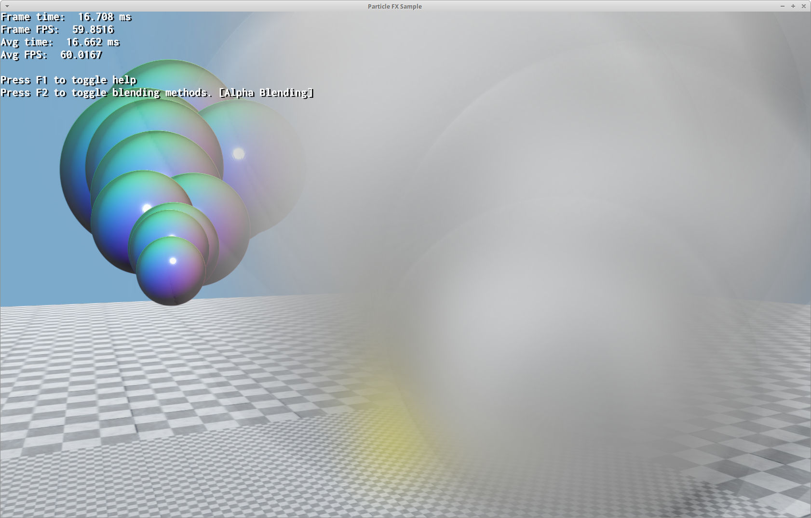
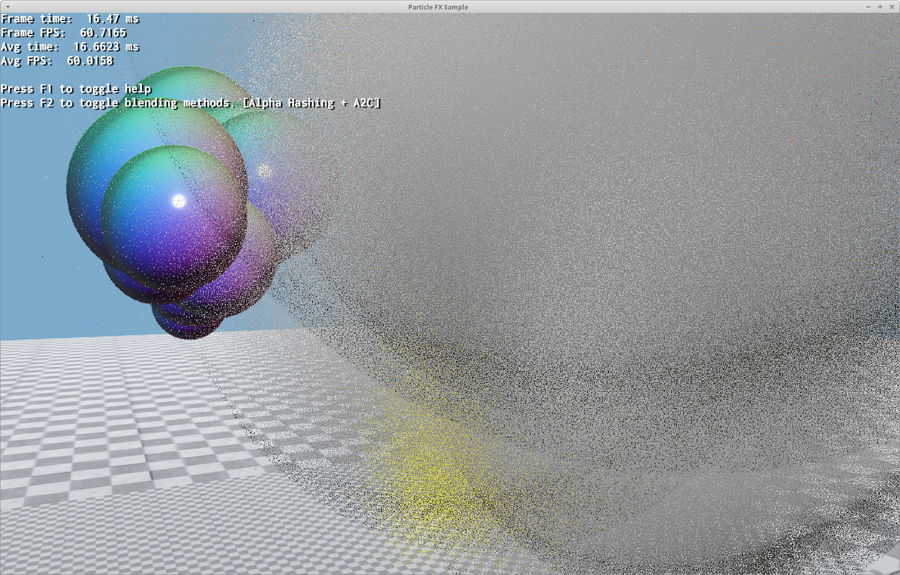
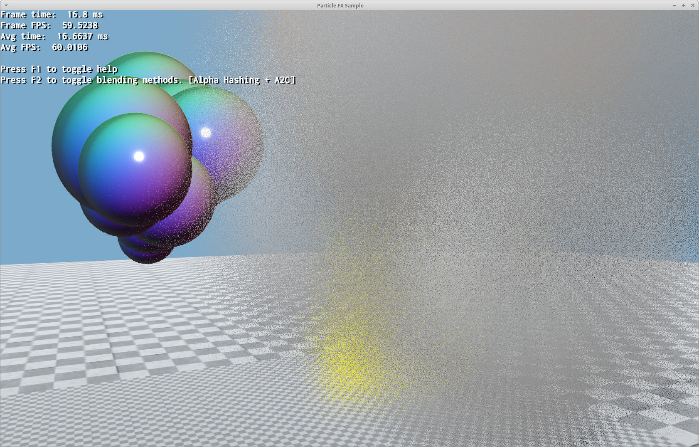

# ParticleFX2 / Particle System 2 Documentation {#ParticleSystem2}

@tableofcontents

A new plugin called ParticleFX2 was built based on ParticleFX (from now on we'll refer to the latter as ParticleFX1).

In many ways it is backwards compatible with scripts written for ParticleFX, but there are a few differences. **It is not meant to be a complete replacement, therefore it does not deprecate the older ParticleFX plugin**.

**Note that it is possible to use both ParticleFX1 & ParticleFX2 plugins at the same time**.

## Reasons to use ParticleFX2 {#ParticleSystem2ReasonsPFX2}

- Code is SIMD & Cache friendly.
- Particle simulation is multithreaded.
- Requires lower CPU to GPU Bandwidth when rendered from multiple camera angles.
- Performance is paramount.
- You want to have a lot of ParticleSystem2 instances and or...
- You want to simulate a large number of particles (whether it's one instance with many particles, or many instances with few or many particles).
- Uses the v2 buffer interface which guarantees no stalls.
- You want particles that can cast shadows or use PBS lighting and normal maps.
   - Note that due to the nature of point sprites, PBS lighting/normal maps may not always look good unless extra care is given to the normal map.

## Reasons not to use ParticleFX2 {#ParticleSystem2ReasonsNotPFX2}

- Particle Render order is very important.
   - PFX2 does not sort particles.
- The particle system uses `local_space`.
- The particle system emits emitters.
- The particle system uses `billboard_origin`.
   - Only `center` origin is currently supported. Although this can be improved in the future.
- You are using low level materials to render the particle.
   - PFX2 uses advanced modern rendering techniques to generate geometry procedurally in the Vertex Shader. There are no vertex buffers involved.
- You need to alter the instance's parameter often. e.g. you want to add/remove emitters or affectors for a particular instance.
   - In PFX2 all instances share the same set of emitters and affectors.
   - You can use `ParticleSystemDef::clone` to clone the system definition and alter the definition.
- When a particle system dies, you absolutely need its particles to suddenly disappear
   - PFX2 particles are ***not*** linked to the instance that created them. Therefore if an instance is destroyed, the particles it emitted will eventually fade when their `time_to_live` expires.

## Differences with ParticleFX2 {#ParticleSystem2DiffWithPFX2}

- Quota is shared by all instances
   - In PFX1, a quota of 100 means each instance is not allowed to emit more than 100 particles. Thus if you had 500 instances, you could have up to 100 * 500 = 50.000 particles.
   - In PFX2, a quota of 100 means all instances are not allowed to emit more than 100 particles in total. Thus regardless of the number of instances, you could never have more than 100 particles.
- ParticleFX2 does not sort particles.
   - You can use OIT (Order Independent Transparency) algorithms to workaround this limitation.
   - All instances sharing the same `ParticleSystemDef` can use `ParticleSystemDef::setRenderQueueGroup` & `ParticleSystemDef::setRenderQueueSubGroup` though.
- Distance to camera, controlled by `ParticleSystemManager2::setCameraPosition`, is very important for the simulation and the quota.

Quota values need to be adjusted. The rationale is that the quota should reflect the maximum amount of particles the system supports and still maintain a reasonable framerate.

In PFX1, the particle count could blow out of proportions as the number of instances is potentially infinite. In PFX2, if the system can only simulate up to 10.000 particles before tanking performance, then the quota should be 10.000.

This also allows scaling to difference systems by having an Option presented to the user (e.g. Particle Count: Low, Medium, High)

### Distance to Camera {#ParticleSystem2DistToCamera}

Because **the shared quota is a precious resource**, every frame all instances are sorted by distance to camera.

The ones closer are given priority to emit. If the shared quota is exhausted, that means that far away instances won't be able to emit more. If they had emitted any particles in the past, those particles will eventually die when their `time_to_live` expires.

Every frame you must call:

```cpp
Ogre::Camera *camera = /*...*/;
Ogre::SceneManager *sceneManager = /*...*/;
sceneManager->getParticleSystemManager2()->setCameraPosition( camera->getDerivedPosition() );
```

Only one camera position per SceneManager is supported.
If rendering from multiple camera positions, consider using the most relevant position for the simulation.

This value does not control rendering. It's not instantaneous. It merely tells the simulation which systems should be prioritized for emission for this frame.

## Using OIT (Order Independent Transparency) {#ParticleSystem2Oit}

OgreNext currently supports [alpha hashing](https://casual-effects.com/research/Wyman2017Hashed/index.html) to render transparents without having to care about render order.

Combined with [alpha to coverage (A2C)](https://bgolus.medium.com/anti-aliased-alpha-test-the-esoteric-alpha-to-coverage-8b177335ae4f) it can produce very good results.

An advantage of alpha hashing + A2C is that it works fine with depth writes on.

The main downside however, is the "grainy" or "noisy" effect due to the nature of the effect.

The basic layman version is that when the alpha is 0.25, that means we simply (on average) render 1 pixel at 100% opacity and skip the rendering the next 3 pixels.

The material definition looks like this:

```
hlms Particle/SmokeUnlit unlit
{
	depth_write	on    // Note: It's on by default
	cull_mode	none
	diffuse_map smoke.png

	alpha_hash        yes
	alpha_to_coverage msaa_only
}
```

The key settings are:

 - `alpha_hash`: Enables the setting in question
 - `alpha_to_coverage`: Enables A2C only if the render target we're rendering to is MSAA. A2C will be combined with alpha hashing for a better quality. The Render Target must be MSAA to make use of this. Best results are with 4x MSAA.
 - `depth_write`: Normally transparents are recommended to disable depth writes. Thus an old material using alpha or additive blending may have it disabled. Remember to enable it back if you use alpha hashing.


**Alpha Blending (wrong sort):**



**Alpha Hashing:**



**Alpha Hashing + A2C (4x MSAA):**



Note that the noise may look terrible but it quite different in motion. See `Samples/2.0/ApiUsage/ParticleFX2` sample.

## Thread Safe RandomValueProvider

PFX2 relies on `Math::UnitRandom` being thread safe.

If you've registered a custom random provider via `Math::SetRandomValueProvider`, then make sure `RandomValueProvider::getRandomUnit` is thread safe (e.g. use TLS).

## New settings

scaler TBD