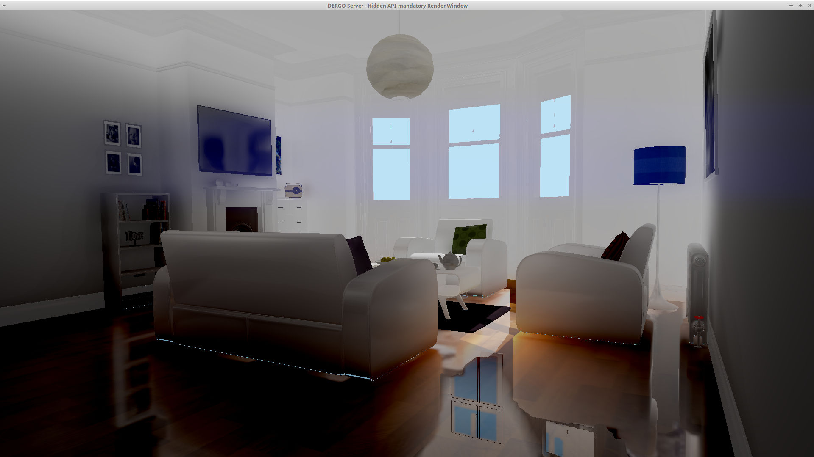

# Global Illumination Methods {#GiMethods}

Ogre offers various GI techniques and it can be overwhelming which one to choose.

@tableofcontents

# Ambient Lighting {#GiAmbientLighting}

The simplest and fastest solution there is.

It can be:

## Flat {#GiAmbientLightingFlat}

Use `SceneManager::setAmbientLight` and set `upperHemisphere` and `lowerHemisphere` to the same value or set `HlmsPbs::setAmbientLightMode` to `AmbientFixed`.

This is just a solid colour applied uniformly to the entire scene. Very basic

## Hemisphere {#GiAmbientLightingHemisphere}

Use `SceneManager::setAmbientLight` and set `upperHemisphere` and `lowerHemisphere` to the different values and set `HlmsPbs::setAmbientLightMode` to either `AmbientAuto*` or `AmbientHemisphere*`.

Hemisphere lighting is supposed to be set to the colour of the sky or sun in upperHemisphere, and the colour of the ground in lower hemisphere to mimic a single bounce coming from the ground.

Good enough for simple outdoor scenes.

## Spherical Harmonics {#GiAmbientLightingSH}

If Spherical Harmonics have been calculated elsewhere, 3rd-order SH coefficients can be provided to `SceneManager::setSphericalHarmonics` and set `HlmsPbs::setAmbientLightMode` to either `AmbientSh` or `AmbientShMonochrome`.

If `AmbientShMonochrome`, the red channel of the SH components will be used.

> **Note:** [Filament's cmgen](https://github.com/google/filament/releases/tag/v1.10.1) tool can generate SH coefficients out of cubemaps
>
> **Note:** SH lighting is best understood if seen like a single 16x16 cubemap lossy-compressed into 27 floats (if coloured, 9 floats if monochrome)

# Parallax Corrected Cubemaps (PCC) {#GiPCC}

The oldest technique we have. PCC is mostly for getting good-looking (but often incorrect) specular reflections, but we also use it as a poor-man replacement of diffuse GI by sampling the highest mip.

It consists in generating a cubemap and using simple math to assume the room is reflecting a rectangular room, therefore distortions happen when this assumption is broken e.g. room is round or has a trapezoidal shape, large furniture is placed in the middle of the room, furniture is not thin and glued to the walls, ceiling or floor.

Notice non-rectangular rooms will have incorrect reflections


The reflection of the red wall on the white wall appears to be much bigger and higher than it should


For reference the red wall when viewed directly:


> **Note:** Faking Diffuse GI from PCC can be disabled via `envFeatures` param in `SceneManager::setAmbientLight`
>
> **Note:** To improve diffuse GI lighting quality, you can either use `ibl_specular` pass to generate mipmaps (see `Samples/Media/2.0/scripts/Compositors/Tutorial_DynamicCubemap.compositor` or `LocalCubemaps.compositor`) or you can use [Filament's cmgen](https://github.com/google/filament/releases/tag/v1.10.1) in combination with our OgreCmgenToCubemap tool

> How to use cmgen + OgreCmgenToCubemap:
> 
> ```
> # Step 1: Launch cmgen
> cmgen -f png -x out --no-mirror panorama_map.hdr
> 
> # Output data is stored in output/panorama_map/m0*.png to m8*.png
> 
> # Step 2: Convert the filtered cubemaps to OITD (Ogre internal format):
> OgreCmgenToCubemap d:\hdri\out\panorama_map png 8 panorama_map.oitd
> ```
> 
> Then load the oitd in Ogre at runtime (You need to explicitly use the prefer-loading-as-sRGB flag) and set it to PBSM_REFLECTION of the datablock.

## Auto PCC {#GiPCCAuto}

Cubemaps are blended automatically based on close probes and camera location. Results are usually poor.

> - See `Samples/2.0/ApiUsage/LocalCubemaps`

## Manual PCC {#GiPCCManual}

Each cubemap probe must be set to each HlmsPbsDatablock by hand. This achieves much better results but requires a lot of manual setting.

It is also problematic if two probes should be applied to the same mesh with the same material because that is impossible. The mesh must be split into two with different materials.

> - See `Samples/2.0/ApiUsage/LocalCubemapsManualProbes`

# Per Pixel PCC {#GiPPPCC}

Can run on old Hardware (if using lower quality dual-paraboloid maps) or on modern hardware (if using higher quality cubemap arrays).

Per Pixel PCC is always automatic and combines the results of multiple probes at per pixel granularity. This is extremely convenient because 'it just works' with no further intervention required. It looks as good or better than manual and it's automatic.

But it has a higher performance cost, which is often not a problem for Desktop systems but may be a problem on Mobile.

Requires Forward+ to be enabled.

> - See `Samples/2.0/ApiUsage/LocalCubemaps`
> - See `Samples/2.0/ApiUsage/LocalCubemapsManualProbes`

## PCC Per Pixel Grid Placement {#GiPPGridPlacement}

Strictly speaking this is not a GI technique.

It's merely an automated process to decide the placement of a grid of per pixel PCC probes. Once the probes are set artists can further tweak it.

**The main use case is procedurally generated scenes**, but can also be useful for artists as a starting point.

> - See `Samples/2.0/ApiUsage/PccPerPixelGridPlacement`

# Instant Radiosity {#GiInstantRadiosity}

For starters, this technique is a fake. It's not meant to achieve hyper realistic GI, but rather give "good enough" results.

It is based on an old [gamedev.net article](https://www.gamedev.net/blogs/entry/1925299-deferred-lighting-and-instant-radiosity/).

The technique consist in doing raytracing from the light points of view into all directions. And whenever there is a hit place a 'virtual point light' which is literally a basic point that emits light, mimicking a light bounce

Another way to see this technique is that it's just placing an arbitrary amount of point lights until the scene is lit enough from many locations. But instead of the lights being placed by artists, it's done automatically.

### Pros

1. Lots of parameter to tune. The more VPLs you have, the more accurate the solution will be but higher the performance cost
2. After some tuning can get decent performance even in old cards
3. VPLs can later be tweaked manually for artistic control
4. Bounces affect dynamic and static objects
5. Camera independent
6. Can be enabled at the same time as PCC, and PCC can provide information about specular reflections and sky

### Cons

1. Requires Forward+ to be active
2. Light leaking
3. Not very accurate unless VPL count is insanely high, tanking performance
4. Only static objects participate in bounce evaluation
5. Changing lighting position/direction requires rebuilding
6. Changing static objects requires rebuilding

> - See `Samples/2.0/ApiUsage/InstantRadiosity`

Instant Radiosity's virtual light points visualized for 0 and 1 bounce (intensity exaggerated)


# Irradiance Volume  {#GiIrradianceVolume}

Irradiance Volume uses a 3D volume to store lighting information.
Currently this IV is generated from Instant Radiosity data.
But once generated the 3D texture can be saved to disk as is and be loaded directly which should be very fast (only limitation is IO bandwidth)

Each voxel contains lighting information from all 6 directions.

Another way to look at this solution is like a 3D grid of lots of 1x1 cubemaps.

### Pros

1. Extremely fast
2. Runs on old HW
3. Bounces affect dynamic and static objects
4. Camera independent
5. Can be enabled at the same time as PCC, and PCC can provide information about specular reflections and sky

### Cons

1. Quality/accuracy depends on how dense the grid is. Big scenes may need very large resolution. 3D volume textures quickly grow in VRAM usage. e.g. a 16x16x16 needs only 16kb of VRAM, whereas a 128x128x128 volume needs 8MB and 256x256x256 needs 64MB
2. Light leaks
3. Changing lighting position/direction requires rebuilding
4. Changing static objects requires rebuilding
5. Not much artistic control
6. Accuracy depends on the input data, and currently it's based on Instant Radiosity so it is not very accurate

> - See `Samples/2.0/ApiUsage/InstantRadiosity`

# Voxel Cone Tracing (aka VCT) {#GiVCT}

VCT is ray marching but instead of rays, cones are used. Hence **cone** tracing or cone marching.

As of 2021 this technique is state of the art and is *very* accurate and can even generate specular glossy reflections, although low roughness reflections will not look as good as high roughness reflections.

This technique works by voxelizing the entire scene (i.e. turning the whole scene into a Minecraft-like world representation) and then at runtime cone tracing against this voxel world to gather bounce data.


### Pros

1. Extremely accurate
2. Decent performance on modern hardware
3. Supports emissive textured materials being light sources
4. Bounces affect dynamic and static objects
5. Quality can be lowered for much higher performance
    1. Via `HlmsPbs::setVctFullConeCount`
	2. Via `VctLighting::setAnisotropic`
	3. Via `VctLighting::mSpecularSdfQuality`
    4. Lower resolution
6. Light leaking is still a problem, but less so than other techniques
    1. Use `thinWallCounter` in `VctLighting::update` to tweak this
7. Supports changing lighting position/direction with a small performance cost
    1. This ability can be sacrificed by destroying VctVoxelizer to free up VRAM
8. Camera independent
9. Specular rough reflections supported

### Cons

1. Massive amounts of VRAM required
2. Like any volumetric solution (e.g. Irradiance Volume), bigger scenes requires larger resolution to keep quality. And this technique uses up to 4 3D volumetric textures. It eats a lot of VRAM.
3. Requires DX11/GL4 level hardware
4. Performance can vary wildly depending on what you're currently looking at
5. Low roughness (i.e. mirror-like) reflections, voxelization becomes noticeable (e.g. reflection looks minecraft-like)
6. Only static objects participate in bounce evaluation
7. Voxelization process is currently very slow. Although results could be saved to disk (not implemented, shouldn't be hard).
8. Voxelization process can cause a temporary spike of VRAM usage.
9. In its current implementation, sky does not participate as a GI source and `VctLighting::setAmbient` can be used to fake sky lighting information

> - See `Samples/2.0/Tests/Voxelizer`

## VCT + Per Pixel PCC Hybrid {#GiVCTPlusPPPCC}

Ogre supports combining Per-Pixel Parallax Corrected Cubemaps (PCC) with VCT when both techniques are enabled at the same time.

The idea is to use PCC to support much better low roughness (e.g. mirror-like) reflections and when PCC data is not available fallback to VCT.

Details are in our [News Announcement](https://www.ogre3d.org/2019/08/14/pcc-vct-hybrid-progress).

Parameters `pccVctMinDistance` and `pccVctMaxDistance` from `HlmsPbs::setParallaxCorrectedCubemap` control how PCC and VCT data is combined.



# Irradiance Field with Depth (IFD) {#GiIFD}

This is a more generic term for what NVIDIA calls [Dynamic Diffuse Global Illumination](https://developer.nvidia.com/blog/an-engineers-guide-to-integrating-ddgi/), but instead of generating it out of Raytracing, we generated it from any source of data available (in Ogre's case, from VCT's Voxel data or via Rasterization).

IFD only supports diffuse GI.

As of 2021 this technique is also state of the art and can be very accurate.

This technique is extremely similar to `Irradiance Volume` before (e.g. can be thought of a 3D grid of 1x1 cubemaps), but it is combined with depth information to fight leaking.

Additionally, instead of 3D textures, a 2D texture is used and octahedral maps are used to store information. The use of 2D textures instead of 3D opens up unexplored possibilities such as streaming 2D data using MPEG video compression, or GPU-friendly compression formats such as BC7 or ASTC.

### Pros

1. Very accurate
2. Very good performance
3. Very decent VRAM usage
4. Performance does not vary depending on what you're looking at
5. Can be combined with VCT so that IFD handles diffuse and VCT specular. The overall VRAM consumption is higher than VCT alone, but performance is better.
6. Supports emissive textured materials being light sources
7. Bounces affect dynamic and static objects
8. Multiple bounces look very good
    1. More bounces take small performance impact when lights are changed (if lights don't change there is no cost)
	2. Disabling light bounces entirely allows saving VRAM (via `VctLighting::setAllowMultipleBounces`)
9. Light leaking is still a problem, but less so than other techniques
10. Supports changing lighting position/direction with a small performance cost.
    1. User must kept voxelized world in VRAM for this to happen (unless rasterization is being used as source)
    2. Update is distributed over time to avoid a large performance cost and is barely noticeable unless light changes too abruptly.
	3. Slower systems can distribute the update over a larger time than fast system to keep a minimum target framerate (via `probesPerFrame` argument in `IrradianceField::update`)
11. Camera independent
12. Data could be saved to disk (not implemented, shouldn't be hard) if the scene and lighting are not meant to change
13. Can be enabled at the same time as per pixel PCC, and PCC can provide information about specular reflections and sky. If VCT is also enabled, See VCT + PCC hybrid section.
14. When generated off rasterization, sky information is included.

### Cons

1. Some artifacts may appear
    1. This is often solved by slightly padding `fieldSize` and `fieldOrigin`
	2. Changing params in IrradianceFieldSettings may also fix it
2. Like any volumetric solution, bigger scenes require bigger `IrradianceFieldSettings::mNumProbes` which consumes more VRAM and makes lighting updates to take longer
3. Requires DX11/GL4 level hardware, although it could be retrofit to support older GPUs if the IFD result is baked to disk
4. Updating IFD requires either Voxelization or Rasterization as source
    1. Voxelization consumes considerable amount of VRAM
	2. Rasterization is very slow, but very accurate
5. When generated off Voxelization, sky information is currently not included.

> - See `Samples/2.0/Tests/Voxelizer`

# Cascaded Image Voxel Cone Tracing (CIVCT) {#GiCIVCT}

Image Voxel Cone Tracing is like regular VCT except it bakes every mesh into voxels, and then copies those voxels into the scene.

This makes rebuilding the scene *much* faster at the cost of higher VRAM usage and slightly lower quality.

By being able to revoxelize scenes very fast we can:

 - Support arbitrary scenes (indoor, outdoors)
 - Support static objects
 - Optionally support dynamic objects (e.g. revoxelize every frame)

This would make it the best overall GI implementation.

The details are described in @subpage ImageVoxelConeTracing

Cascaded IVCT extends the concept with cascades of varying quality to cover large distances around the camera but at lower resolutions.

Currently CIVCT is in alpha state which means:

 - Vulkan works great, but on low VRAM GPUs you may run out of VRAM and things will become super slow. Specially with e.g. 4 cascades
 - OpenGL works, same issues as Vulkan. But needs a few workarounds and may run into issues due to the 32 texture unit limit. Also the way OGL calculates mipmaps makes the GI darker and that needs fixing.
 - D3D11 works with low cascade count (e.g. 2), but breaks at 4 cascades. That's because D3D11 runs out of the 16 samplers because Hlms implementations are currently wasting a lot instead of reusing
 - Metal does not work because it runs out of UAV texture units (this is an Ogre limitation, not Metal)

Ogre 2.4 will fix most of these issues

> - See `Samples/2.0/ApiUsage/ImageVoxelizer`

# What technique should I choose? {#GiWhatTechniqueChoose}

PCC is what most games use because it's fast, easy to understand, and has predictable results. If the scene is mostly composed of rectangular rooms with little furniture, PCC will also be extremely accurate.

If all you want is a solution that pretends to have GI regardless of accuracy, `Instant Radiosity` can be an interesting choice, specially if you already needed to enable Forward+.

`Irradiance Volume` is also even faster and for small indoor scenes it can get very reasonable results, specially if supporting old HW is needed.

If you want something accurate, pretty and runs reasonably fast with reasonably memory consumption then go for `IFD`. This one has the best balance of quality, usability and performance.

If you need the best possible quality or require to change lighting at runtime, then VCT (or IFD + VCT) is the best solution.

Please note that many of these techniques can be combined together (e.g. PCC and per-pixel PCC usually can be paired with anything) but they won't necessarily end up in pleasant-looking results,
and certain combinations may cause shaders to compile (it could be an Ogre bug so if you find it please report it [in the forums](https://forums.ogre3d.org/viewforum.php?f=25) or in [Github](https://github.com/OGRECave/ogre-next/issues))
