Ogre Next Samples (Feature demonstrations) {#Samples}
==========================================

Here is a list of all the samples provided with Ogre Next and the features that they demonstrate. They are seperated into three categories: Showcases, API usage & Tutorials. The samples can be downloaded as a binary package from [github.](https://github.com/OGRECave/ogre-next/releases)

@tableofcontents

# Showcase: Forward3D {#forward3d}
This sample demonstrates Forward3D & Clustered techniques. These techniques are capable of rendering many non shadow casting lights.

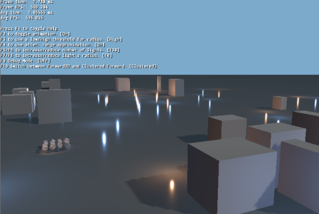

# Showcase: HDR {#hdr}
This sample demonstrates the HDR (High Dynamic Range) pipeline in action. HDR combined with PBR let us use real world values as input for our lighting and a real world scale such as lumen, lux and EV Stops.

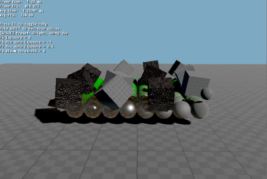

# Showcase: HDR/SMAA {#hdrsmaa}
This sample demonstrates HDR in combination with SMAA.

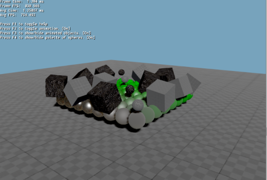

# Showcase: PBS Materials {#pbsmaterials}
This sample demonstrates the PBS material system.

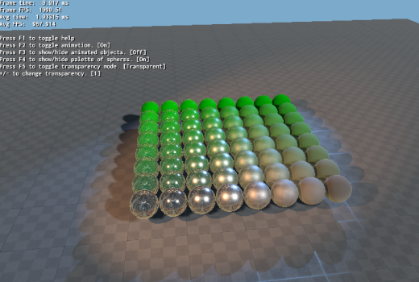

# Showcase: Post Processing {#postprocessing}
This sample demonstrates using the compositor for postprocessing effects.

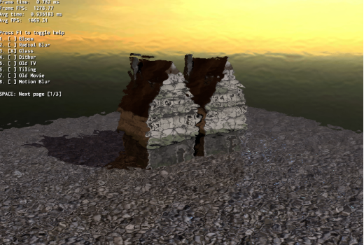

# API Usage: Animation tag points {#animationtagpoints}
This sample demonstrates multiple ways in which TagPoints are used to attach to bones.

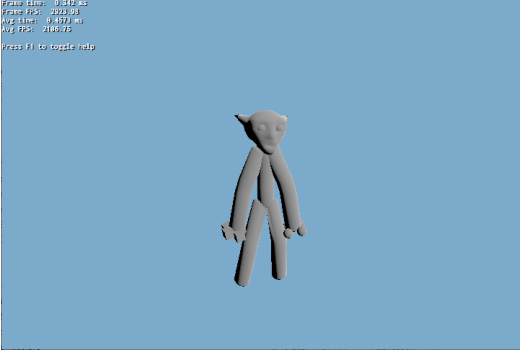

# API Usage: Area Light Approximation {#arealighapprox}
This sample demonstrates area light approximation methods.

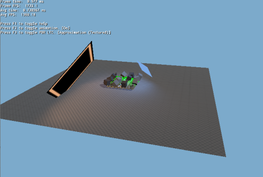

# API Usage: Custom Renderable {#customrenderable}
This sample demonstrates creating a custom class derived from both MovableObject and Renderable for fine control over rendering. Also see related DynamicGeometry sample.

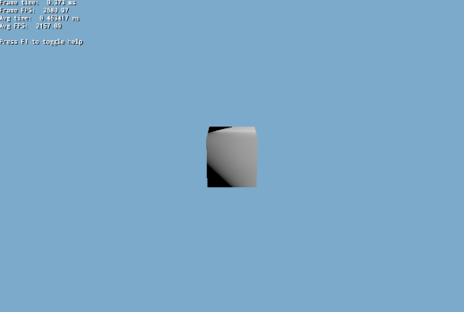

# API Usage: Decals {#decals}
This sample demonstrates screen space decals.

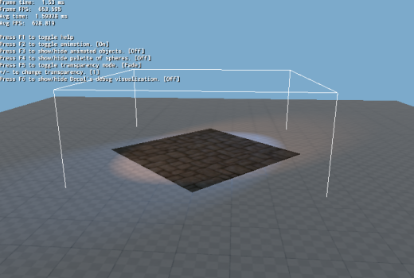

# API Usage: Dynamic Geometry {#dynamicgeometry}
This sample demonstrates creating a Mesh programmatically from code and updating it.

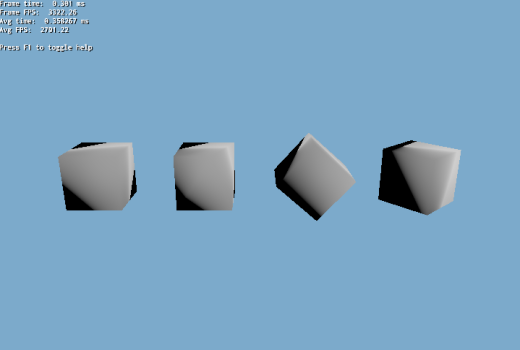

# API Usage: IES Photometric Profiles {#iesprofiles}
This sample demonstrates the use of IES photometric profiles.

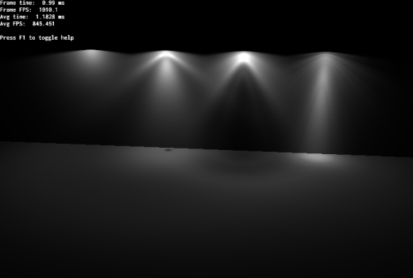

# API Usage: Shared Skeleton {#sharedskeleton}
This sample demonstrates the importing of animation clips from multiple .skeleton files directly into a single skeleton from a v2Mesh and also how to share the same skeleton instance between components of the same actor/character. For example, an RPG player wearing armour, boots, helmets, etc. In this sample, the feet, hands, head, legs and torso are all separate items using the same skeleton.

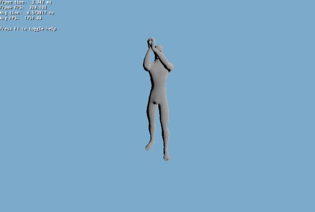

# API Usage: Instanced Stereo {#instancedstero}
This sample demonstrates instanced stereo rendering. Related to VR.

# API Usage: Instant Radiosity {#instantradiosity}
This sample demonstrates the use of 'Instant Radiosity' (IR). IR traces rays in CPU and creates a VPL (Virtual Point Light) at every hit point to mimic the effect of Global Illumination.

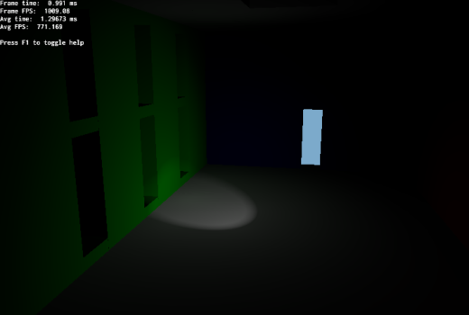

# API Usage: Local Reflections Using Parallax Corrected Cubemaps {#localcubemaps}
This sample demonstrates using parallax reflect cubemaps for accurate local reflections.

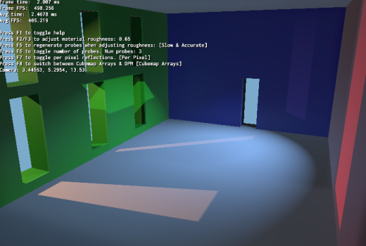

# API Usage: Local Reflections Using Parallax Corrected Cubemaps With Manual Probes {#localcubemapsmp}
This sample demonstrates using parallax reflect cubemaps for accurate local reflections. This time, we showcase the differences between manual and automatic modes. Manual probes are camera independent and work best for static objects.

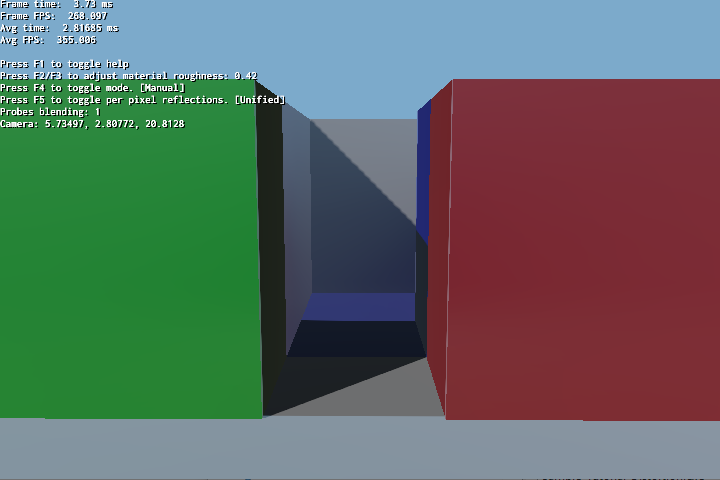

# API Usage: Automatic LOD Generation {#autolod}
This sample demonstrates the automatic generation of LODs from an existing mesh.

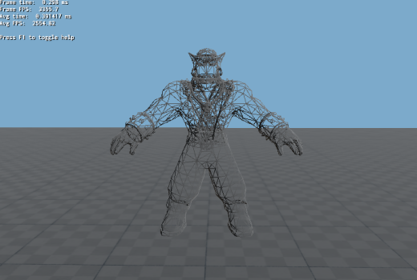

# API Usage: Morph Animations {#morphanimation}
This sample demonstrates morph animations.

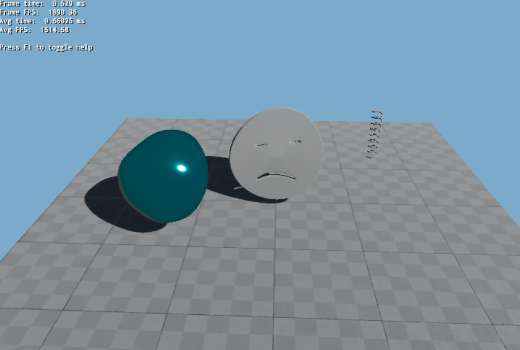

# API Usage: Automatically Placed Parallax Corrected Cubemap Probes Via PccPerPixelGridPlacement {#autopcc}
This sample demonstrates placing multiple PCC probes automatically.

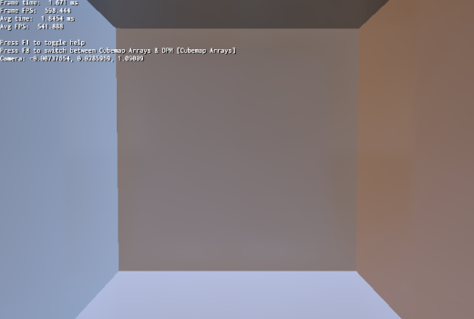

# API Usage: Planar Reflections {#planarreflections}
This sample demonstrates planar reflections.

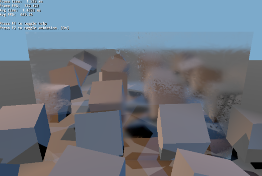

# API Usage: Refractions {#refractions}
This sample demonstrates refractions.

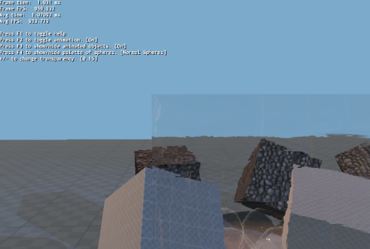

# API Usage: SceneFormat Export / Import Sample {#sceneformat}
This sample demonstrates exporting/importing of a scene to JSON format. Includes the exporting of meshes and textures to a binary format.

# API Usage: Screen Space Reflections {#ssreflections}
This sample demonstrates screen space reflections

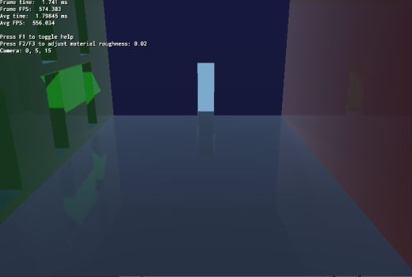

# API Usage: Shadow Map Debugging {#shadowdebug}
This sample demonstrates rendering the shadow map textures from a shadow node (compositor).

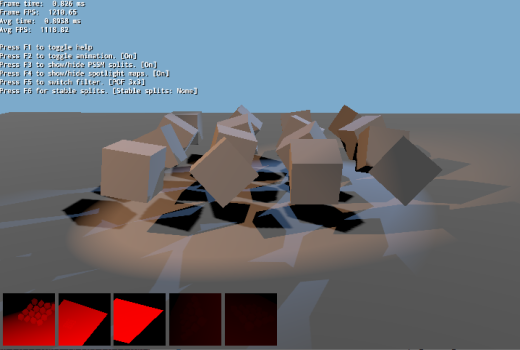

# API Usage: Shadow Map From Code {#shadowfromcode}
This is similar to 'Shadow Map Debugging' sample. The main difference is that the shadow nodes are being generated programmatically via ShadowNodeHelper::createShadowNodeWithSettings instead of relying on Compositor scripts.

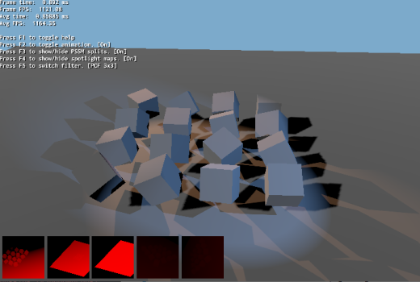

# API Usage: Static Shadow Map {#staticshadowmap}
This sample demonstrates the use of static/fixed shadow maps to increase performance.

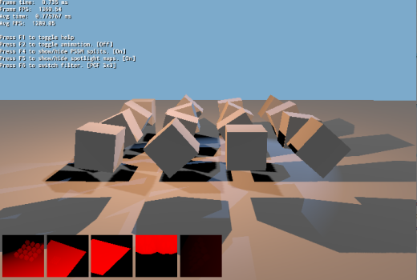

# API Usage: Stencil Test {#stenciltest}
This sample demonstrates the use of stencil test. A sphere is drawn in one pass, filling the stencil with 1s. The next pass a cube is drawn, only drawing when stencil == 1.

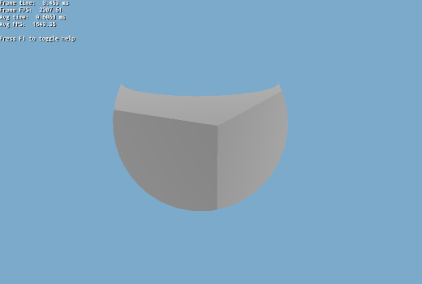

# API Usage: Stereo Rendering {#stereorendering}
This sample demonstrates stereo rendering.

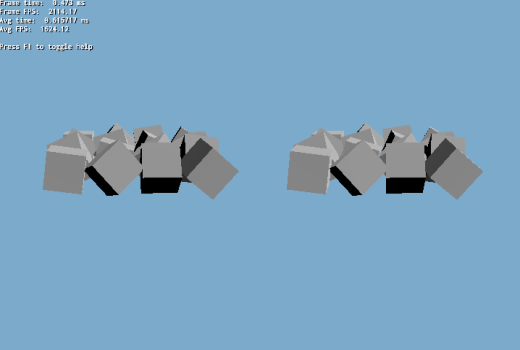

# API Usage: Updating Decals And Area Lights' Textures {#updatedecal}
This sample demonstrates the creation of area light textures dynamically and individually. This can also be used for decals texture use.

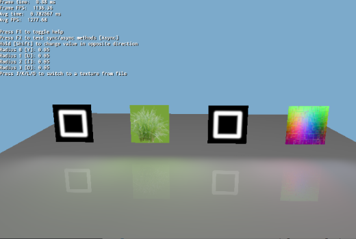

# API Usage: Ogre V1 Interfaces {#v1interface}
This sample demonstrates the use of Ogre V1 objects (e.g. Entity) in Ogre Next.

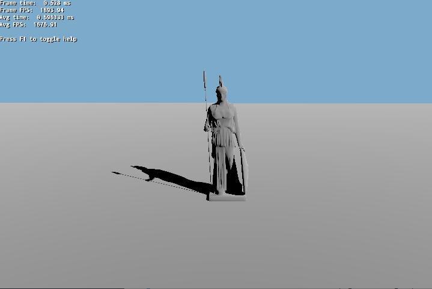

# API Usage: Ogre Next Manual Object {#onmanualobject}
This sample demonstrates the use of Ogre Next manual objects. This eases porting code from Ogre V1. For increased speed, see sample: 'Dynamic Geometry'.

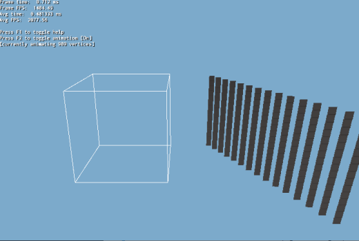

# API Usage: Ogre Next V2 Meshes {#v2Mesh}
This sample demonstrates converting Ogre V1 meshes to Ogre Next V2 format.

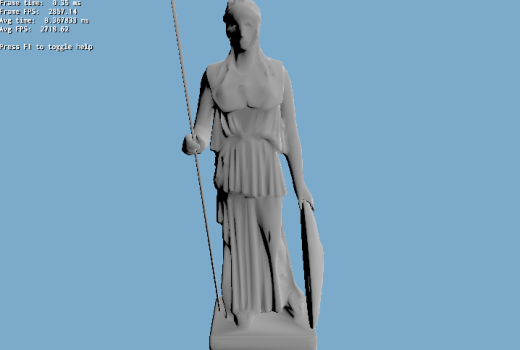

# Tutorial: Tutorial 00 - Basic {#tutorial00}
This tutorial demonstrates the basic setup of Ogre Next to render to a window. Uses hardcoded paths. See next tutorial to properly handle all OS's setup a render loop.

# Tutorial: Tutorial 01 - Initialisation  {#tutorial01}
This tutorial demonstrates the setup of Ogre Next in a basis framework.

# Tutorial: Tutorial 02 - Variable Framerate {#tutorial02}
This tutorial demonstrates the most basic rendering loop: Variable framerate. Variable framerate means the application adapts to the current frame rendering performance and boosts or decreases the movement speed of objects to maintain the appearance that objects are moving at a constant velocity. Despite what it seems, this is the most basic form of updating. Progress through the tutorials for superior methods of updating the rendering loop. Note: The cube is black because there is no lighting.

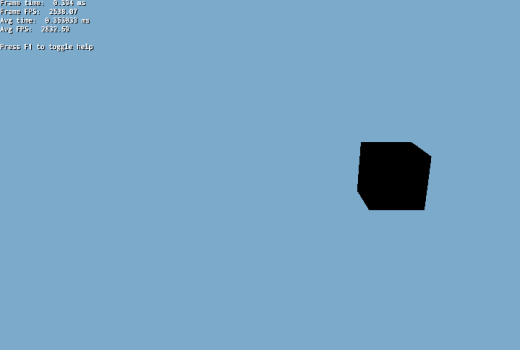

# Tutorial: Tutorial 03 - Deterministic Loop {#tutorial03}
This is very similar to Tutorial 02, however it uses a fixed framerate instead of a variable one. There are many reasons to using a fixed framerate instead of a variable one:
 - It is more stable. High framerates (i.e. 10000 fps) cause floating point precision issues in 'timeSinceLast' as it becomes very small. The value may even round to 0!
 - Physics stability, physics and logic simulations don't like variable framerate.
 - Determinism: given the same input, every run of the program will always return the same output. Variable framerate and determinism don't play together.
For more information, see [Fix Your TimeStep!](http://gafferongames.com/game-physics/fix-your-timestep/")

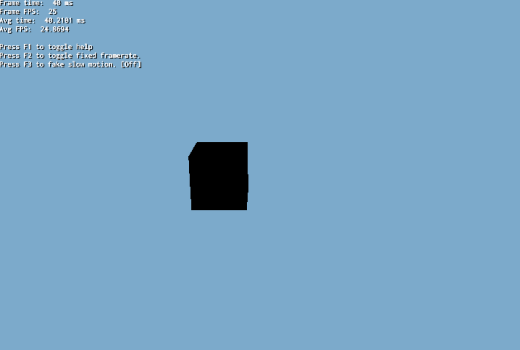

# Tutorial: Tutorial 04 - Interpolation Loop {#tutorial04}
This tutorial demonstrates combined fixed and variable framerate: Logic is executed at 25hz, while graphics are being rendered at a variable rate, interpolating between frames to achieve a smooth result. When OGRE or the GPU is taking too long, you will see a 'frame skip' effect, when the CPU is taking too long to process the Logic code, you will see a 'slow motion' effect. This combines the best of both worlds and is the recommended approach for serious game development. The only two disadvantages from this technique are:
- We introduce 1 frame of latency.
- Teleporting may be shown as very fast movement; as the graphics state will try to blend between the last and current position. This can be solved though, by writing to both the previous and current position in case of teleportation. We purposely don't do this to show the effect/'glitch'.

# Tutorial: Tutorial 05 - Multithreading Basics {#tutorial05}
This tutorial demonstrates how to setup two update loops: One for graphics, another for logic, each in its own thread. We don't render anything because we will now need to do a robust synchronization for creating, destroying and updating Entities. This is potentially too complex to show in just one tutorial step.

# Tutorial: Tutorial 06 - Multithreading {#tutorial06}
This tutorial demonstrates advanced multithreadingl. We introduce the 'GameEntity' structure which encapsulates a game object data. It contains its graphics (i.e. Entity and SceneNode) and its physics/logic data (a transform, the hkpEntity/btRigidBody pointers, etc). The GameEntityManager is responsible for telling the render thread to create the graphics and delays deleting the GameEntity until all threads are done using it.

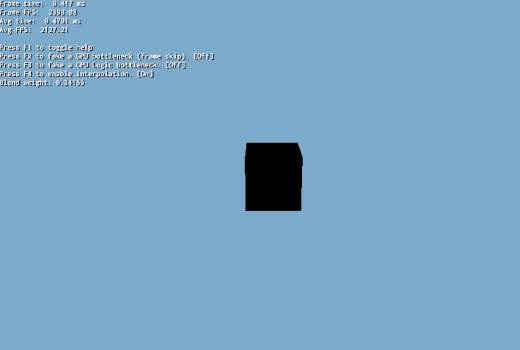

# Tutorial: Compute 01 - UAV Textures {#compute01}
This tutorial demonstrates how to setup and use UAV textures with compute shaders.

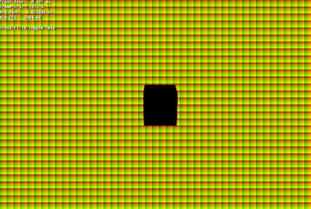

# Tutorial: Compute 02 - UAV Buffers {#compute02}
This tutorial demonstrates how to setup and use UAV buffers with compute shaders.

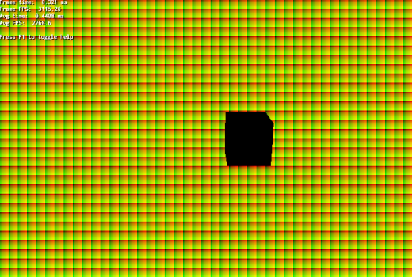

# Tutorial: Distortion {#tut_distortion}
This tutorial demonstrates how to make compositing setup that renders different parts of the scene to different textures. Here we will render distortion pass to its own texture and use shader to compose the scene and distortion pass. Distortion setup can be used to create blastwave effects, mix with fire particle effects to get heat distortion etc. You can use this setup with all kind of objects but in this example we are using only textured simple spheres. For proper use, you should use particle systems to get better results.

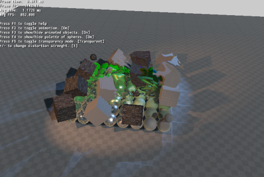

# Tutorial: Dynamic Cube Map {#dyncubemap}
This tutorial demonstrates how to setup dynamic cubemapping via the compositor, so that it can be used for dynamic reflections. 

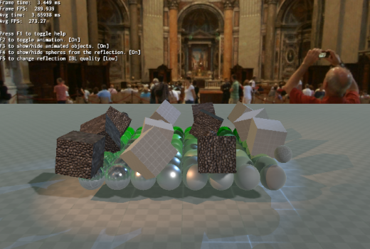

# Tutorial: EGL Headless {#eglheadless}
This tutorial demonstrates how to run Ogre in EGL headless, which can be useful for running in a VM or in the Cloud.

# Tutorial: Open VR {#openVR}
This tutorial demonstrates the use of Open VR.

# Tutorial: Reconstructing Position From Depth {#reconpfromd}
This tutorial demonstrates how to reconstruct the position from only the depth buffer in a very efficient way. This is very useful for Deferred Shading, SSAO, etc.

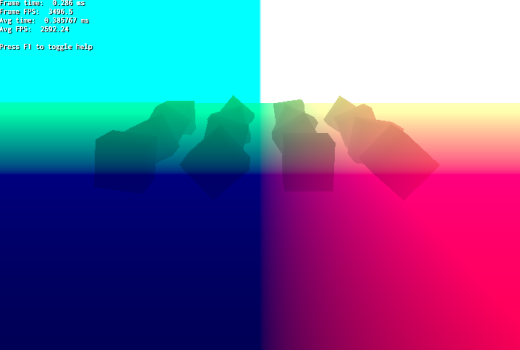

# Tutorial: Rendering Sky As A Postprocess With A Single Shader {#skypost}
This tutorial demonstrates how to create a sky as simple postprocess effect.

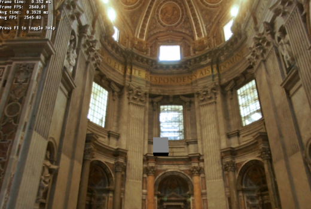

# Tutorial: SMAA {#SMAA}
This tutorial demonstrates SMAA.

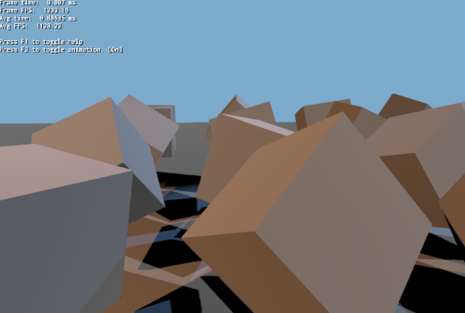

# Tutorial: SSAO {#ssao}
This tutorial demonstrates SSAO.

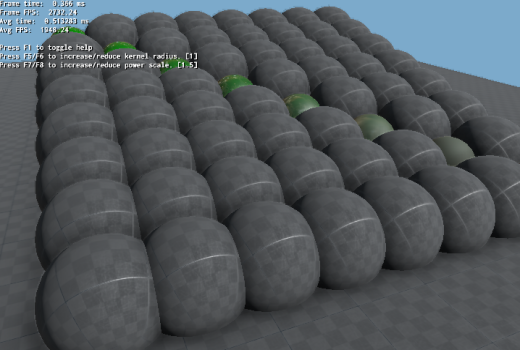

# Tutorial: Terra Terrain {#terrain}
This tutorial is advanced and shows several things working together:
 - Own Hlms implementation to render the terrain
 - Vertex buffer-less rendering: The terrain is generated purely using SV_VertexID tricks and a heightmap texture.
 - Hlms customizations to PBS to make terrain shadows affect regular objects
 - Compute Shaders to generate terrain shadows every frame
 - Common terrain functionality such as loading the heightmap, generating normals, LOD.

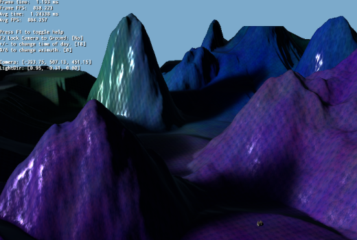

# Tutorial: Texture Baking {#texturebaking}
This tutorial demonstrates how to bake the render result of Ogre into a texture (e.g. for lightmaps).

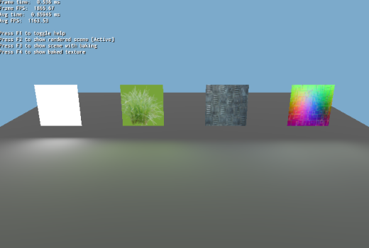

# Tutorial: UAV Setup 1 Example {#uav1}
This tutorial demonstrates how to setup an UAV (Unordered Access View). UAVs are complex and for advanced users, but they're very powerful and enable a whole new level of features and possibilities. This sample first fills an UAV with some data, then renders to screen sampling from it as a texture.

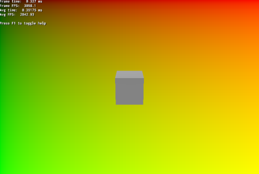

# Tutorial: UAV Setup 2 Example {#uav2}
This sample is exactly as 'UAV Setup 1 Example', except that it shows reading from the UAVs as an UAV (e.g. use imageLoad) instead of using it as a texture for reading.

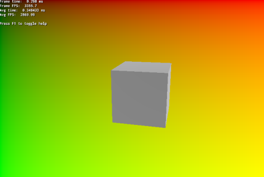
