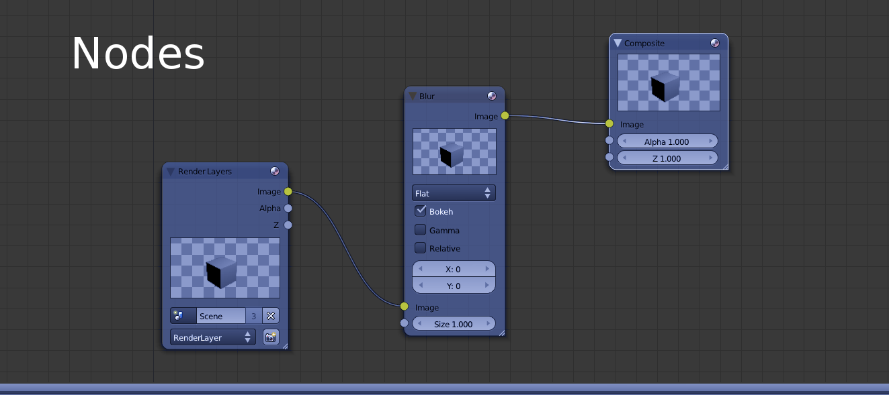
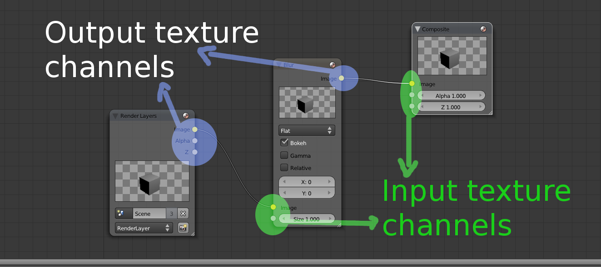

Compositor {#compositor}
==========

The Compositor is a Core and key component in Ogre 2.0. In 1.x, it was
just used for fancy post-processing effects. In 2.0, it's the way to
tell Ogre how you want to render the scene. Without setting it up, Ogre
won't render to screen.

With the Compositor, the user stops having to deal with setting
Viewports, RenderTargets, updating these RenderTargets every frame, etc.

Instead the user has now to setup Nodes and a Workspace. The workspace
is the top level system where the user indicates which Nodes he wants to
use, how they will be connected, which global render textures will be
declared (which can be seen by all nodes from the same workspace), where
to render the final output (i.e. RenderWindow, an offscreen
RenderTexture) and which SceneManager to use. The user can have multiple
workspaces active at the same time.

The new Compositor system was heavily inspired by Blender's Compositor
system. Picture from Blender:




Compositor script syntax hasn't changed much, which
should make porting them quite easy. Internally though, the new system
was written from scratch (while reusing & reviewing some of the existing
code); as the previous Compositor was stack-based, while the new one is
node-based.

So, if you used to manipulate the Compositor directly from C++; porting
efforts could be considerably bigger.

@tableofcontents

# Nodes {#CompositorNodes}

A compositor node most likely resembles what used to be "a compositor"
in 1.x

The following node clears the RT and draws everything that is in the
render queue \#50

```cpp
compositor_node MyNode
{
	in 0 Input_as_MyLocaName // Take input texture #0 and use the local name "Input_as_MyLocaName" for reference
	
	target Input_as_MyLocaName
	{
		//Clear to violet
		pass clear
		{
			colour_value 1 0 1 1
		}
		pass render_scene
		{
			visibility_mask	0xffffffff	 //Viewport's visibility mask

			rq_first		50		//Inclusive
			rq_last		51		//Not inclusive
		}
	}

	out 0 Input_as_MyLocaName
}
```

Where is `Input_as_MyLocaName` defined? What is its resolution? Its
bit depth? The RT comes from the input channel, so the answer is that it
depends on how the Workspace will connect this node. The Workspace may
pass a local RTT declared in a previous node or it could pass
RenderWindow.

## Input & output channels and RTTs {#CompositorNodesChannelsAndRTTs}

A node's texture may come from three different sources:

1.  It was [locally declared](@ref CompositorNodesChannelsAndRTTsLocalTextures).
2.  It comes from an [input channel](@ref CompositorNodesChannelsAndRTTsFromInputChannel).
3.  It is a [global texture](@ref CompositorNodesChannelsAndRTTsGlobal) declared in the Workspace. Global textures must use the ***global\_*** prefix

### Locally declared textures {#CompositorNodesChannelsAndRTTsLocalTextures}

The following script declares a local texture of resolution 800x600,
clears it to violet, and puts it in the output channel \#0 (so other
compositor nodes can use it as input):

```cpp
compositor_node MyNode
{
	texture rt0 800 600 PFG_RGBA8_UNORM_SRGB
	
	target Input_as_MyLocaName
	{
		//Clear to violet
		pass clear
		{
			colour_value 1 0 1 1
		}
	}

	out 0 rt0
}
```

You may have noticed the syntax for declaring the RTT is similar as it was in Ogre 1.x

For more information on the syntax see [texture](@ref CompositorNodesTextures).


### Textures coming from input channels {#CompositorNodesChannelsAndRTTsFromInputChannel}

Input channels are numbered. An input channel must be given a name so
that they can be referenced locally at node scope by all target passes.
There can't be any gaps (i.e. you can't use channels 0 & 2 but not 1).

Output channels are also numbered and must be assigned an RTT. This
number will be later used by the Workspace to perform the connections.

The workspace will be responsible for connecting node A's output
channels with node B's input channels. In **other words, channels are a
way to send, receive and share RTTs between nodes.**

The only restriction is that global textures can't be used neither as
input or output (global textures are referenced directly). There can be
more input channels than output channels, viceversa, and there may be no
input nor output channels (i.e. when working with global textures
alone).

The following node definition (which does no rendering):
 1. Takes input channel \#0 and sends it to output channel \#1
 2. Takes input channel \#1 and sends it through output channel \#0 (in other words it flips the channels \#0 & \#1).
 3. Takes an uninitialized texture created locally to channel \#2

```cpp
compositor_node MyNode
{
	in 0 myFirstInput
	in 1 mySecondInput
	
	texture rt0 target_width_scaled 0.25 target_height_scaled 0.25 PFG_RGBA8_UNORM_SRGB

	out 0 mySecondInput
	out 1 myFirstInput
	out 2 rt0
}
```

Drawing inspiration from Blender's compositor system, the little dots on
the left would be the input channels, while the dots on right would be
the output texture channels:



### Global Textures {#CompositorNodesChannelsAndRTTsGlobal}

Global textures are declared **at workspace scope** and have the same syntax
as local textures. There are a few restrictions:

1.  Global texture names must contain the ***global\_*** prefix.
    Inversely, any local texture or input channel trying to use a name
    that starts with `global_` is illegal.
2.  They can't be used in input or output channels.
3.  Global textures can be seen by any node belonging to the same
    workspace, but they can't see a global texture that belongs to a
    different workspace.
4.  If a Node uses a global texture that the Workspace didn't declare,
    execution of the workspace will fail.

Global textures are as powerful/dangerous as global variables are in
C++. The main reason of their existence is that many nodes may use
temporary rtts to perform their work, and it's *very* wasteful to
declare these intermediate rtts on every node when they can be shared
and reused.

Sharing and reusage can also be achieved through input & output
channels, however for temporary rtts (or rtts that are accessed very
frequently, i.e. a deferred shader's G Buffer) it would lead to
connection hell; and hence global textures are a much better fit.

### compositor\_node parameters

- [in](@ref CompositorNode_in)
- [out](@ref CompositorNode_out)
- [in_buffer](@ref CompositorNode_in_buffer)
- [out_buffer](@ref CompositorNode_out_buffer)
- [custom_id](@ref CompositorNode_custom_id)

#### in {#CompositorNode_in}

The input(s) to this node. This clause may be repeated.
A node definition may have no inputs.

@par
Format:
```cpp
in <channel_id> <local_texture_name>
```

@param channel_id
channel\_id is a number in range \[0; inf) but must be consecutive and
continuous (no gaps, i.e. define channel 0, 2, but not 1).

@param local_texture_name
An arbitrary & unique name, cannot start with `global_`.

#### out {#CompositorNode_out}

The input(s) from this node. This clause may be repeated.
A node definition may have no outputs.

@par
Format:
```cpp
out <channel_id> <local_texture_name>
```

@param channel_id
channel\_id is a number in range \[0; inf) but must be consecutive and
continuous (no gaps, i.e. define channel 0, 2, but not 1).

@param local_texture_name
An arbitrary & unique name, cannot start with `global_`.

#### in\_buffer {#CompositorNode_in_buffer}

For UAV buffers. Same as with regular input textures, except you can reference
global buffers, and global buffers don't have to start with `global_`.

If a local buffer and a global buffer have the same name, the local
buffer takes precedence.

@par
Format:
```cpp
in_buffer <channel_id> <buffer_name>
```

@param channel_id
channel\_id is a number in range \[0; inf) but must be consecutive and
continuous (no gaps, i.e. define channel 0, 2, but not 1).

@param local_texture_name
An arbitrary & unique name.

#### out\_buffer {#CompositorNode_out_buffer}

For UAV buffers. Same as with regular output textures, except you can reference
global buffers, and global buffers don't have to start with `global_`.

If a local buffer and a global buffer have the same name, the local
buffer takes precedence.

@par
Format:
```cpp
out_buffer <channel_id> <buffer_name>
```

For parameters, see [in_buffer](@ref CompositorNode_in_buffer)

#### custom\_id {#CompositorNode_custom_id}

Custom string that will be hashed to identify this Node definition.
Useful for classifying nodes into categories.

Multiple nodes can have the same custom\_id.

@par
Format:
```cpp
custom_id <string>
```

From C++ you can use:

```cpp
class MyListener : Ogre::CompositorWorkspaceListener
{
  void passPreExecute( Ogre::CompositorPass *pass ) override
  {
    if( pass->getParentNode()->getDefinition()->mCustomIdentifier == "CustomString" )
    {
      // This is our node
    }
  }
}
```

### Main RenderTarget {#CompositorNodesChannelsAndRTTsMainRenderTarget}

When creating the Workspace instance, the C++ code will ask for the RT
which should be the ultimate target (i.e. the RenderWindow). This RT is
very important as keywords like `target_width_scaled` and settings
like default msaa & pixel format will be based on the attributes from this main RT.
This feature will be seen in more detail in the Workspace section.

@note
By default you cannot use the main RenderTarget as a texture (because it's usually the RenderWindow and D3D and OpenGL don't allow it), and doing it may result in a crash.<br/><br/>
It is possible to manually call `node->connectFinalRT` and supply a texture pointer (i.e. if the final RenderTarget is a RenderTexture) that can be bound. An automated way of doing this is not yet implemented.

## Target {#CompositorNodesTarget}

Targets include multiple passes. Their main purpose is define to which
RenderTarget the passes will render to.

What's worth noting is that targets accept an optional parameter
'*slice*'.

The slice parameter is optional and refers to which slice or face from a
3D texture (or cubemap or 2D array) to use from the given texture. Valid
values can be numeric or the hint '+X'. '-X', '+Y', '-Y', '+Z', and
'-Z'.

@note The word 'slice' must not be written. Just write 'target myTexture
+X' to work.

@note When the target is a 3D/Cubemap/array texture, if the slice goes
out of bounds, an exception will be raised. If the target is a 2D or 1D
texture, this value is silently ignored. Default: slice = 0

### target parameters

 - [target_level_barrier](@ref CompositorTarget_target_level_barrier)

#### target\_level\_barrier {#CompositorTarget_target_level_barrier}

@par
Format:
```cpp
target_level_barrier [yes|no]
```

Default value is no.

When yes, this setting is meant to be used with `skip_load_store_semantics` for
optimization on mobile/TBDR targets, but should be used with care.

`skip_load_store_semantics` allows OgreNext to execute multiple consecutive passes
as if they were only one.

An obstacle for this is that barriers from all theses passes must be issued
*before* the first pass executes; otherwise the passes need to be internally
broken up and OgreNext will complain if `skip_load_store_semantics on` but we can't
merge the passes.

`target_level_barrier yes` means that an extra hidden pass will be inserted at
the beginning of the target and issue all necessary barriers from subsequent passes:

```cpp
target rt_renderwindow
{
    // By having this set to true or yes, a barrier will be issued
    // to cover all 4 passes in this target, which happens
    // before the first render_quad
    target_level_barrier true

    pass render_quad
    {
        load
        {
            all		dont_care
        }
        store
        {
            all		dont_care
            colour	store
        }

        material MyMaterial
    }

    pass render_scene
    {
        skip_load_store_semantics true

        rq_first	0
        rq_last		5

        shadows		MainCharacter reuse
    }

    pass render_quad
    {
        skip_load_store_semantics true
        material Compositor/UpsampleDepth
        input 0 worldRt_depth
    }

    pass render_scene
    {
        skip_load_store_semantics true

        rq_first	14
        rq_last		249

        shadows		NormalShadows reuse
    }
}
```

**Note that not always `target_level_barrier yes` can be successful.**

For example if pass `A` needs texture `X` to be in state `Texture` for sampling
but pass `C` needs that same texture in state `Uav` then we have a contradiction
as we can't transition to two states at the same time.

The only solution is to break up the passes and issue two barriers.
Note that you can however issue break ups manually:

```cpp
target rt_renderwindow
{
    target_level_barrier true
    // Pass A
    pass render_quad {}
    // Pass B
    pass render_quad {skip_load_store_semantics true}
}

target rt_renderwindow
{
    target_level_barrier true
    // Pass C
    pass render_quad {}
    // Pass D
    pass render_quad {skip_load_store_semantics true}
}
```


## Passes {#CompositorNodesPasses}

Types of passes:

- [clear](@ref CompositorNodesPassesClear) (PASS\_CLEAR)
- [generate_mipmaps](@ref CompositorNodesPassesGenerateMipmaps) (PASS\_MIPMAP)
- [render_quad](@ref CompositorNodesPassesQuad) (PASS\_QUAD)
- [render_scene](@ref CompositorNodesPassesRenderScene) (PASS\_SCENE)
- shadows (PASS\_SHADOWS)
- stencil (PASS\_STENCIL)
- [uav_queue](@ref CompositorNodesPassesUavQueue) (PASS\_UAV)
- [compute](@ref CompositorNodesPassesCompute) (PASS\_COMPUTE)
- [texture_copy] / [depth_copy] (@ref CompositorNodesPassesDepthCopy) (PASS\_DEPTHCOPY)
- custom (PASS\_CUSTOM)


### pass parameters

All passes share the following script parameters:

 - [pass](@ref CompositorPass_pass)
 - [num_initial](@ref CompositorPass_num_initial)
 - [flush_command_buffers](@ref CompositorPass_flush_command_buffers)
 - [identifier](@ref CompositorPass_identifier)
 - [execution_mask](@ref CompositorPass_execution_mask)
 - [viewport_modifier_mask](@ref CompositorPass_viewport_modifier_mask)
 - [colour_write](@ref CompositorPass_colour_write)
 - [profiling_id](@ref CompositorPass_profiling_id)
 - [expose](@ref CompositorPass_expose)
 - [skip_load_store_semantics](@ref CompositorPass_skip_load_store_semantics)
 - [load](@ref CompositorPass_load)
 - [store](@ref CompositorPass_store)

#### pass {#CompositorPass_pass}

@par
Format:
```cpp
pass <type> [customId]
{
}
```

@param type must be one of the [supported types](@ref CompositorNodesPasses): clear, quad, resolve,
render\_scene, stencil, custom, etc.

@param customId Optional. It is used by custom passes to give the registered custom pass provider the means to identify multiple types, in case there are more than one type of custom passes.

#### num\_initial {#CompositorPass_num_initial}

Number of times this pass will be executed. Default is -1, which means always execute.

When the execution count hits that value, it won't executed again until a d3d device reset, resize or workspace recreation (the execution count is reset and executed N times again)

@par
Format:
```cpp
num_initial <number>
```

This parameter replaces the `only_initial` parameter in Ogre 1.x.

#### flush\_command\_buffers {#CompositorPass_flush_command_buffers}

Whether to flush the command buffer at the end of the pass.

This can incur in a performance overhead (see OpenGL's glFlush and
D3D11' ID3D11DeviceContext::Flush) for info.

Usually you want to leave this off. However for VR applications that
must meet VSync, profiling may show your workload benefits from
submitting earlier so the GPU can start right away executing
rendering commands.

The main reason to use this is in CPU-bound scenarios where
the GPU starts too late after sitting idle.

@par
Format:
```cpp
flush_command_buffers <off|on>
```

#### identifier {#CompositorPass_identifier}

An arbitrary user-defined numeric ID used for identifying individual
passes in the C++ code.

@par
Format:
```cpp
identifier <number>
```

From C++ you can access it via:

```cpp
class MyListener : Ogre::CompositorWorkspaceListener
{
  void passPreExecute( Ogre::CompositorPass *pass ) override
  {
    if( pass->getDefinition()->mIdentifier == 1234u )
    {
      // This is our pass
    }
  }
}
```

#### execution\_mask {#CompositorPass_execution_mask}

8-bit hex value. Specifies the execution mask. For more information see
[Stereo and Split-Screen Rendering for more information](@ref StereoAndSplitScreenRendering). Default is
0xFF except for clear passes, which default to 0x01.

@par
Format:
```cpp
execution_mask <hex number>
```

#### viewport\_modifier\_mask {#CompositorPass_viewport_modifier_mask}

8-bit hex value. Specifies the viewport modifier mask. For more
information see [Stereo and Split-Screen Rendering for more
[Stereo and Split-Screen Rendering for more information](@ref StereoAndSplitScreenRendering). Default is
0xFF except for clear passes, which default to 0x00.

@par
Format:
```cpp
viewport_modifier_mask <hex number>
```

#### colour\_write {#CompositorPass_colour_write}

Disables colour writes. Useful for Z prepass passes; or pixel shaders
that output to an UAV instead of a regular RenderTarget (like a Render Texture).

Default: on.

@par
Format:
```cpp
colour_write <off|on>
```

#### profiling\_id {#CompositorPass_profiling_id}

User defined text for identifying this pass by name in profilers and GPU debuggers such as [RenderDoc](https://renderdoc.org/).

@par
Format:
```cpp
profiling_id "name"
```

#### viewport {#CompositorPass_viewport}

Specifies the viewport. Supported by many other passes (e.g. render\_quad, render\_scene).
The default is `0 0 1 1` which covers the entire screen.
Values should be between 0 and 1.

@par
Format:
```cpp
viewport [idx] <left> <top> <width> <height>
    [<scissor_left> <scissor_top> <scissor_width> <scissor_height>]
```

When 4 parameters are suplied, the scissor box will match the
viewport's. All 8 parameters allow to set a custom scissor box.

@note Scissor testing must be enabled by Ogre::HlmsMacroblock::mScissorTestEnabled for it to work,
we just set the size here.

When the optional 'idx' parameter is supplied at the beginning there will be
either 5 or 9 parameters instead of 4 or 8 respectively.

This index allows you to set multiple viewports for e.g. [instanced_stereo](@ref CompositorNodesPassesRenderScene_instanced_stereo) or
for shaders that make use of gl\_ViewportIndex/SV\_ViewportArrayIndex.
When not provided, this value defaults to 0. The value is in range \[0; 16\)

The Compositor will automatically share Viewport pointers between
different passes to the same RenderTarget (even for different nodes) as
long as they share the exact same parameters.

#### expose {#CompositorPass_expose}

Tells OgreNext that you plan on using `texture_name` for sampling during this pass.

Usually this can be inferred (e.g. render_quad's input parameter).

@par
Format:
```cpp
expose <texture_name>
```

Reasons for using `expose`:

1. You plan on using an exposed texture from C++, e.g. via Ogre::SceneManager::getCompositorTextures.
2. You set a low level material texture directly to that texture (either via name or pointer) and the Compositor isn't aware of it.

OgreNext must know which textures may or will be used during the pass so resource transitions and barriers can be issued in explicit APIs like DX12 and Vulkan (also OpenGL has rudimentary memory barriers that are needed if Compute Shaders are involved).

Without it, you may get exceptions when using the Vulkan RenderSystem, or Vulkan Validation Errors (when debug validation layers are active).

#### skip\_load\_store\_semantics {#CompositorPass_skip_load_store_semantics}

When yes, the load and store semantics will be ignored. Use with care
as improper usage may lead to rendering bugs or crashes.

Normally OgreNext tries to merge passes when possible but certain advanced
uses are impossible or difficult to get automatically merged, thus this
flag indicates we want.

@par
Format:
```cpp
skip_load_store_semantics [yes|no]
```

e.g.

```cpp
compositor_node MyNode
{
	in 0 rtt

	target rtt
	{
		pass render_quad
		{
			load
			{
				// Do not load or clear anything to colour, this pass will overwrite everything
				all		clear
				colour	dont_care
			}
			store
			{
				// Only save colour, don't care about depth/stencil
				all		dont_care
				colour	store
			}

			material MaterialThatWritesToEveryColourPixel
		}

		pass render_scene
		{
			// Inherit the same semantics of the previous pass
			skip_load_store_semantics true

			rq_first 0
			rq_last max

			// We can NOT use recalculate or first, because
			// doing so will end the pass, and we're explicitly
			// asking Ogre to not close the pass.
			shadows		MyShadowNode reuse
		}
	}
}
```

The reason you should be careful is that we assume you know where you're drawing.
Consider the following example:

```cpp
target TargetA
{
    pass render_quad {}
}

target UnrelatedTargetB
{
    pass render_quad { skip_load_store_semantics true }
}
```

This script will *not* behave as expected because **both render\_quad passes
will draw to TargetA!**

This is because with `skip_load_store_semantics` you're telling Ogre not to
set `UnrelatedTargetB` as the current target *because OgreNext should assume it already
is* the current target.

Likewise there should be no barriers to execute because barriers force the pass
to 'close' which means store semantics must be executed; and to open another
pass we must execute load semantics again (see [target_level_barrier](@ref CompositorTarget_target_level_barrier) to
solve this problem).

We try to perform validation checks in Debug mode to avoid these type of errors,
but we can't cover them all.

This setting is an optimization specifically aimed at mobile and you
should pay attention to errors, the Ogre.log, Vulkan Validation Layers, and tools
like [RenderDoc](https://renderdoc.org/) to be sure rendering is happening as intended.

#### load {#CompositorPass_load}

This is often referred as "Load Actions".
To understand their relevancy please read [Load Store semantics]({#Ogre22LoadStoreSemantics}).

@par
Format:
```cpp
load
{
    all				clear
    clear_colour	0.2 0.4 0.6 1
}
```

 - [all](@ref CompositorPass_load_all)
 - [colour](@ref CompositorPass_load_colour)
 - [depth](@ref CompositorPass_load_depth)
 - [stencil](@ref CompositorPass_load_stencil)
 - [clear_colour](@ref CompositorPass_load_clear_colour)
 - [colour_value](@ref CompositorPass_load_clear_colour)
 - [clear_colour_reverse_depth_aware](@ref CompositorPass_load_clear_colour_reverse_depth_aware)
 - [clear_depth](@ref CompositorPass_load_clear_depth)
 - [clear_stencil](@ref CompositorPass_load_clear_stencil)
 - [warn_if_rtv_was_flushed](@ref CompositorPass_load_warn_if_rtv_was_flushed)


#### all (load) {#CompositorPass_load_all}

Sets all RTV parameters (all colour targets in MRT + depth + stencil) to the same load action.

@par
Format:
```cpp
load
{
    all [dont_care|clear|clear_on_tilers|load]
}
```

@param dont_care
Assume uninitialized values are present and will be completely overwritten.
This is discouraged on depth & stencil buffers because it precludes optimizations (e.g. Hi-Z, Early Z, Depth Compression, etc.). See [LoadAction::DontCare](@ref Ogre::LoadAction::LoadAction).
@param clear
Clear the whole texture to the set clear\_colour/clear\_depth/clear\_stencil values. See [LoadAction::Clear](@ref Ogre::LoadAction::LoadAction).
@param clear_on_tilers
See [LoadAction::ClearOnTilers](@ref Ogre::LoadAction::LoadAction).
@param load
Load the contents that were stored in the texture. See [LoadAction::Load](@ref Ogre::LoadAction::LoadAction).

#### colour (load) {#CompositorPass_load_colour}

Sets the load action for each and/or all the colour textures. Does nothing if there are no colour textures.

@par
Format:
```cpp
load
{
    colour [dont_care|clear|clear_on_tilers|load]
    colour [N] [dont_care|clear|clear_on_tilers|load]
}
```

@param N
Value in range [0; num_mrt) to reference the colour target in an MRT. For non-MRT RTVs, use 0 or skip this parameter.

@param dont_care|clear|clear_on_tilers|load
See Load Actions in [all](@ref CompositorPass_load_all).

#### depth (load) {#CompositorPass_load_depth}

Sets the load action for the Depth Buffer. Does nothing if there is no depth buffer.

@par
Format:
```cpp
load
{
    depth [dont_care|clear|clear_on_tilers|load]
}
```

@param dont_care|etc
See Load Actions in [all](@ref CompositorPass_load_all).

@note For performance reasons, the load action of the depth buffer should be the same as the stencil one.

#### stencil (load) {#CompositorPass_load_stencil}

Sets the load action for the Stencil Buffer. Does nothing if there is no stencil buffer.

@par
Format:
```cpp
load
{
    stencil [dont_care|clear|clear_on_tilers|load]
}
```

@param dont_care|etc
See Load Actions in [all](@ref CompositorPass_load_all).

@note For performance reasons, the load action of the depth buffer should be the same as the stencil one.

#### clear\_colour / colour\_value (load) {#CompositorPass_load_clear_colour}

Sets the colour to set the texture to. The kayword colour\_value is the same, and retained due to old naming conventions.

@note **IMPORTANT:** The load action for this colour target **must** be set to clear or clear\_on\_tilers. Otherwise this value is ignored.

@par
Format:
```cpp
load
{
    clear_colour [N] <r g b a>
}
```

@param N
Value in range [0; num_mrt) to reference the colour target in an MRT. When absent, it sets all colour targets in the MRT to the same value.

@param rgba
Four float values to set the colour target to. e.g. `clear_colour 0.2 0.4 0.5 1.0`.

#### clear\_colour\_reverse\_depth\_aware (load) {#CompositorPass_load_clear_colour_reverse_depth_aware}

Sets the colour texture to either the `clear_colour` or `White - clear_colour` depending on whether OgreNext is configured to use reverse depth. See Ogre::RenderSystem::isReverseDepth.

This setting is useful when storing depth data into colour textures such as `PFG_R32_FLOAT`.

@note **IMPORTANT:** The load action for this colour target **must** be set to clear or clear\_on\_tilers. Otherwise this value is ignored.

@par
Format:
```cpp
load
{
    clear_colour_reverse_depth_aware [N] <r g b a>
}
```

@param N
Value in range [0; num_mrt) to reference the colour target in an MRT. When absent, it sets all colour targets in the MRT to the same value.

@param rgba
Four float values to set the colour target to. e.g. `0.2 0.4 0.5 1.0`. When using reverse Z, the final colour value will be `0.8 0.6 0.5 0.0`.

#### clear\_depth (load) {#CompositorPass_load_clear_depth}

Sets the value to set the depth buffer to.

@note **IMPORTANT:** The load action for depth **must** be set to clear or clear\_on\_tilers. Otherwise this value is ignored.

@par
Format:
```cpp
load
{
    clear_depth <value>
}
```

@param value
Floating point value to set the depth to. Usually in range [0; 1], but not necessarily (depends on API support).
@note If OgreNext is using reverse depth, the depth value will be set to 1.0 - value.

#### clear\_stencil (load) {#CompositorPass_load_clear_stencil}

Sets the value to set the stencil buffer to.

@note **IMPORTANT:** The load action for stencil **must** be set to clear or clear\_on\_tilers. Otherwise this value is ignored.

@par
Format:
```cpp
load
{
    clear_stencil <value>
}
```

@param value
Integer value to set the depth to. Usually in range [0; 255] since to date all known stencil formats are 8-bit.

#### warn\_if\_rtv\_was\_flushed (load) {#CompositorPass_load_warn_if_rtv_was_flushed}

See Ogre::CompositorPassDef::mWarnIfRtvWasFlushed

Default: False.

@par
Format:
```cpp
load
{
    warn_if_rtv_was_flushed [on|off]
}
```

#### store {#CompositorPass_store}

This is often referred as "Store Actions".
To understand their relevancy please read [Load Store semantics]({#Ogre22LoadStoreSemantics}).

@par
Format:
```cpp
store
{
    // These are the optimum settings unless you need to reuse more data
    // (e.g. you need the depth buffer, or you want access to MSAA data before resolving).
    colour	store_or_resolve
	depth	dont_care
    stencil	dont_care
}
```

 - [all](@ref CompositorPass_store_all)
 - [colour](@ref CompositorPass_store_colour)
 - [depth](@ref CompositorPass_store_depth)
 - [stencil](@ref CompositorPass_store_stencil)

#### all (store) {#CompositorPass_store_all}

Sets all RTV parameters (all colour targets in MRT + depth + stencil) to the same store action.

@par
Format:
```cpp
store
{
    all [dont_care|store|resolve|store_and_resolve|store_or_resolve]
}
```

@param dont_care
Discard, leaving the texture contents in an undefined state. You should not attempt to read from it after this.
See [StoreAction::DontCare](@ref Ogre::StoreAction::StoreAction).
@param store
Do not resolve. Useful if you have to interrupt rendering to a RenderTarget, switch to another RenderTarget, and come back to continue rendering; asuming you didn't need to sample from this texture (to fetch what has been rendered so far).
<br/>
See [StoreAction::Store](@ref Ogre::StoreAction::StoreAction).
@param resolve
Always resolve the texture once we're done rendering, and we do not care about the contents of the MSAA surface. This flag won't work on non-MSAA textures and will raise an exception. You should not continue rendering to this texture after this, unless you clear it.
<br/>
See [StoreAction::MultisampleResolve](@ref Ogre::StoreAction::MultisampleResolve).
@param store_and_resolve
Always resolve the texture once we're done rendering, and we do care about the contents of the MSAA surface.
It is valid to use this flag without an MSAA texture.
This flag is mostly meant for explicit-resolve textures as Ogre users have no way of accessing MSAA contents. However it may be useful if you need to interrupt rendering to a RenderTarget, switch to another RenderTarget while also sampling what has been rendered so far, and then come back to continue rendering to MSAA.
<br/>
See [StoreAction::StoreAndMultisampleResolve](@ref Ogre::StoreAction::StoreAndMultisampleResolve).
@param store_or_resolve
This is the compositor's default. It behaves like 'Store' if the texture is not MSAA. It behaves like 'MultisampleResolve' if the texture is MSAA.
<br/>
See [StoreAction::StoreOrResolve](@ref Ogre::StoreAction::StoreOrResolve). This is the default value.

#### colour (store) {#CompositorPass_store_colour}

@par
Format:
```cpp
store
{
    colour [dont_care|store|resolve|store_and_resolve|store_or_resolve]
    colour [N] [dont_care|store|resolve|store_and_resolve|store_or_resolve]
}
```

@param N
Value in range [0; num_mrt) to reference the colour target in an MRT. For non-MRT RTVs, use 0 or skip this parameter.

@param dont_care|etc
See Store Actions in [all](@ref CompositorPass_store_all).

#### depth (store) {#CompositorPass_store_depth}

Sets the store action for the Depth Buffer.

@par
Format:
```cpp
store
{
    depth [dont_care|store|resolve|store_and_resolve|store_or_resolve]
}
```

@param dont_care|etc
See Store Actions in [all](@ref CompositorPass_store_all).

#### stencil (store) {#CompositorPass_store_stencil}

Sets the store action for the Stencil Buffer.

@par
Format:
```cpp
store
{
    stencil [dont_care|store|resolve|store_and_resolve|store_or_resolve]
}
```

@param dont_care|etc
See store Actions in [all](@ref CompositorPass_store_all).

### clear {#CompositorNodesPassesClear}

- [non_tilers_only](@ref CompositorPass_clear_non_tilers_only)
- [buffers](@ref CompositorPass_clear_buffers)
- [colour_value](@ref CompositorPass_load_clear_colour)
- [clear_colour_reverse_depth_aware](@ref CompositorPass_load_clear_colour_reverse_depth_aware)
- [depth_value](@ref CompositorPass_load_clear_depth)
- [stencil_value](@ref CompositorPass_load_clear_stencil)

#### non\_tilers\_only {#CompositorPass_clear_non_tilers_only}

When true, this pass must only execute if the current GPU is not a TBDR GPU.
When false, this pass always executes. Default: false.

This setting is tightly related to [Load Action clear_on_tilers](@ref CompositorPass_load_all).

@par
Format:
```cpp
non_tilers_only [yes|no]
```

#### buffers {#CompositorPass_clear_buffers}

Tells the pass which buffers to clear.

@par
Format:
```cpp
buffers [colour] [depth] [stencil]
```

@param colour
Tells the pass to clear all colour target Does nothing if there is no colour buffer(s).
@param depth
Tells the pass to clear the depth buffer. Does nothing if there is no depth buffer.
@param stencil
Tells the pass to clear the stencil buffer. Does nothing if there is no stencil buffer.

@note For performance reasons, if you clear the depth buffer you should also clear the stencil buffer.

### generate\_mipmaps {#CompositorNodesPassesGenerateMipmaps}

generate\_mipmaps doesn't have special parameters other than the shared
ones that are still relevant (i.e. identifier). They're useful for
explicitly populating the lower mip levels after you've done rendering.

- [mipmap_method](@ref CompositorNodesPassesGenerateMipmaps_mipmap_method)
- [kernel_radius](@ref CompositorNodesPassesGenerateMipmaps_kernel_radius)
- [gauss_deviation](@ref CompositorNodesPassesGenerateMipmaps_gauss_deviation)

#### mipmap\_method {#CompositorNodesPassesGenerateMipmaps_mipmap_method}

Default is `api_default` which will ask the API or driver to generate
them for you. If the API does not support it (e.g. DX12) then Compute
will be used.

@par
Format:
```cpp
mipmap_method [api_default|compute|compute_hq]
```

@param api_default
Uses whatever the API provides. Which is usually a bilinear downscale.

@param compute
At the moment, it is the same as compute_hq.

@param compute_hq
Uses a high quality gaussian filter. Useful for fast & high quality mipmap generation. Uses a compute shader.

@note generate\_mipmaps works at texture level. If you pass a Cubemap, it will generate mipmaps for all the faces. If you pass a 3D or a 2D array texture, it will generate mipmaps for all slices.
@par
@note In order for compute-based mipmap generation to work, OgreNext must be compiled with JSON support, and the user must include the resources included in OgreNext's repository at Samples/Media/2.0/scripts/materials/Common

#### kernel\_radius {#CompositorNodesPassesGenerateMipmaps_kernel_radius}

Integer value. Default is 8. Must be positive, even number. Defines the
kernel radius of the `compute_hq` gaussian filter.

@par
Format:
```cpp
kernel_radius <8>
```

#### gauss\_deviation {#CompositorNodesPassesGenerateMipmaps_gauss_deviation}

The standard deviation of the `compute_hq` gaussian filter. The default is 0.5.

@par
Format:
```cpp
gauss_deviation <0.5>
```

### render_quad {#CompositorNodesPassesQuad}

Quad passes have the same syntax as 1.x; plus the following keywords
have been added:

- [use_quad](@ref CompositorNodesPassesQuad_use_quad)
- [material](@ref CompositorNodesPassesQuad_material)
- [hlms](@ref CompositorNodesPassesQuad_hlms)
- [input](@ref CompositorNodesPassesQuad_input)
- [quad_normals](@ref CompositorNodesPassesQuad_quad_normals)
- [camera](@ref CompositorNodesPassesQuad_camera)
- [camera_cubemap_reorient](@ref CompositorNodesPassesQuad_camera_cubemap_reorient)

#### use\_quad {#CompositorNodesPassesQuad_use_quad}

@par
Format:
```cpp
use_quad [yes|no]
```

Default is *no*. When *no*; the compositor will draw a fullscreen
*triangle*. Due to how modern GPUs work, using two rectangles wastes GPU
processing power in the diagonal borders because pixels are processed
*at least* in 2x2 blocks; and the results from the pixels out of the
triangle have to be discarded. A single triangle is more efficient as
all blocks are fill the viewport area, and when the rectangle goes out
of the viewport, the gpu efficiently clips it.

When the viewport is not `0 0 1 1`; this value is forced to *yes*. The
following picture illustrates a fullscreen triangle:


Interpolation will cause that the effective UV
coordinates will be in the \[0; 1\] range while inside the viewport
area.

Using `camera_far_corners_world_space` will also force to use a quad
instead of a tri (but `camera_far_corners_view_space` works with tris)

For an explanation of why this is a performance optimization, refer to
[Optimizing the basic rasterizer](http://fgiesen.wordpress.com/2013/02/10/optimizing-the-basic-rasterizer/)
by Fabien Giesen.

#### material {#CompositorNodesPassesQuad_material}

Name of the low level material to use.

@par
Format:
```cpp
material <material_name>
```

#### hlms {#CompositorNodesPassesQuad_hlms}

Name of the Hlms datablock to use.

@par
Format:
```cpp
hlms <datablock_name>
```

@note The datablock must be visible to the HlmsManager. See Ogre::HlmsManager::getDatablock.


#### input {#CompositorNodesPassesQuad_input}

Texture to bind to the material or datablock.

@par
Format:
```cpp
input <N> <texture_name>
```

@param N
Material's Texture Unit to set.
@param texture_name
Name of the texture. **Must** be a local, input or global texture.

#### quad\_normals {#CompositorNodesPassesQuad_quad_normals}

Sends to the vertex shaderthe camera's frustum corners in
either world space or view space through the `NORMALS` semantic.

This is particularly useful for efficiently reconstructing position using only the depth and the
corners (see Samples/2.0/Tutorials/Tutorial_ReconstructPosFromDepth).

@par
Format:
```cpp
quad_normals
    [camera_far_corners_view_space|camera_far_corners_view_space_normalized|camera_far_corners_view_space_normalized_lh|camera_far_corners_world_space|camera_far_corners_world_space_centered|camera_direction]
```

@param camera\_far\_corners\_view\_space
Sends camera frustum corners in view space.
@param camera\_far\_corners\_view\_space\_normalized
Sends camera frustum corners in view space. See Ogre::CompositorPassQuadDef::VIEW_SPACE_CORNERS_NORMALIZED.
Note: It divides the whole vector by the far plane; causing dir.z to be always -1 (but the vector itself isn't
unit-length).
@param camera\_far\_corners\_view\_space\_normalized\_lh
Same as camera\_far\_corners\_view\_space\_normalized but left-handed.
Note: dir.z is always 1.
@param camera\_far\_corners\_world\_space
Sends camera frustum corners in world space.
@param camera\_far\_corners\_world\_space\_centered
Sends camera frustum corners direction, but it is centered around origin (0, 0, 0).
@param camera\_direction
Same as camera\_far\_corners\_world\_space\_centered but normalized (values are in range \[0;1\]) which is useful for sky rendering & atmospheric scattering. See `TutorialSky_Postprocess` sample.

**Interesting read:** Reconstructing Position From Depth [Part
I](http://mynameismjp.wordpress.com/2009/03/10/reconstructing-position-from-depth/),
[Part
II](http://mynameismjp.wordpress.com/2009/05/05/reconstructing-position-from-depth-continued/),
[Part
III](http://mynameismjp.wordpress.com/2010/09/05/position-from-depth-3/)

@note In OgreNext you need to apply the **world-view-proj matrix** so that the pass being drawn compensates for texel-to-pixel aligning reads in Direct3D9. Failing to do so will not only cause the aforementioned alignment issue, but also will cause glitches when the viewport is not 0 0 1 1<br/><br/>
In Ogre 1.x, only the proj matrix was necessary to fix texture flipping issues when rendering to FBOs in OpenGL.

#### camera {#CompositorNodesPassesQuad_camera}

Sets the current camera to use if you want to use a different one from the default one.

```cpp
camera <camera_name>
```

#### camera\_cubemap\_reorient {#CompositorNodesPassesQuad_camera_cubemap_reorient}

Rotates the camera 90°, -90° or 180° depending on the value of the slice index.
See Ogre::CompositorPassQuadDef::mCameraCubemapReorient.

@par
Format:
```cpp
camera_cubemap_reorient [yes|no]
```

### render_scene {#CompositorNodesPassesRenderScene}

This is the main pass to render most of the scene.

- [rq_first](@ref CompositorNodesPassesRenderScene_rq_first)
- [rq_last](@ref CompositorNodesPassesRenderScene_rq_last)
- [lod_bias](@ref CompositorNodesPassesRenderScene_lod_bias)
- [lod_update_list](@ref CompositorNodesPassesRenderScene_lod_update_list)
- [cull_reuse_data](@ref CompositorNodesPassesRenderScene_cull_reuse_data)
- [visibility_mask](@ref CompositorNodesPassesRenderScene_visibility_mask)
- [light_visibility_mask](@ref CompositorNodesPassesRenderScene_light_visibility_mask)
- [shadows](@ref CompositorNodesPassesRenderScene_shadows)
- [overlays](@ref CompositorNodesPassesRenderScene_overlays)
- [camera](@ref CompositorNodesPassesRenderScene_camera)
- [lod_camera](@ref CompositorNodesPassesRenderScene_lod_camera)
- [cull_camera](@ref CompositorNodesPassesRenderScene_cull_camera)
- [camera_cubemap_reorient](@ref CompositorNodesPassesRenderScene_camera_cubemap_reorient)
- [enable_forwardplus](@ref CompositorNodesPassesRenderScene_enable_forwardplus)
- [flush_command_buffers_after_shadow_node](@ref CompositorNodesPassesRenderScene_flush_command_buffers_after_shadow_node)
- [is_prepass](@ref CompositorNodesPassesRenderScene_is_prepass)
- [use_prepass](@ref CompositorNodesPassesRenderScene_use_prepass)
- [gen_normals_gbuffer](@ref CompositorNodesPassesRenderScene_gen_normals_gbuffer)
- [use_refractions](@ref CompositorNodesPassesRenderScene_use_refractions)
- [uv_baking](@ref CompositorNodesPassesRenderScene_uv_baking)
- [uv_baking_offset](@ref CompositorNodesPassesRenderScene_uv_baking_offset)
- [bake_lighting_only](@ref CompositorNodesPassesRenderScene_bake_lighting_only)
- [instanced_stereo](@ref CompositorNodesPassesRenderScene_instanced_stereo)

#### rq\_first {#CompositorNodesPassesRenderScene_rq_first}

Sets the first render queue ID to start rendering from.
The default is 0. Must be a value in range [0 and 255].

The value is inclusive (Objects in ID = rq\_first get rendered).

@par
Format:
```cpp
rq_first <id>
```

#### rq\_last {#CompositorNodesPassesRenderScene_rq_last}

The default is `max` which is a special parameter that implies the last active render queue ID.
If numeric, value must be between 0 and 255.

The value is **not** inclusive (Objects in ID = rq\_last do not get rendered).

@par
Format:
```cpp
rq_last <id>
```

#### lod\_bias {#CompositorNodesPassesRenderScene_lod_bias}

Applies a bias multiplier to the lod. Valid values are in range \[0; Inf).

A higher lod bias causes LODs to pop up sooner and should be preferred on slower devices.

Default: 1.0

@par
Format:
```cpp
lod_bias <bias>
```

#### lod\_update\_list {#CompositorNodesPassesRenderScene_lod_update_list}

When `no`, the LOD list won't be updated, and will use the LOD
lists of calculated by a previous pass. This saves valuable CPU time.

Useful for multiple passes using the same lod\_camera (without a pass in
the middle with a different lod\_camera that would override the cached
LOD lists).

If your application is extremely CPU bound, and hence you
don't need LOD, turning this setting to false in all passes will
effectively turn lodding off (and alleviate the CPU).

Default: yes; except for passes belonging to shadow nodes, which is forced to false
unless lod\_camera is a non-empty string.

@par
Format:
```cpp
lod_update_list [yes|no]
```

See Ogre::CompositorPassSceneDef::mUpdateLodLists.

#### cull\_reuse\_data {#CompositorNodesPassesRenderScene_cull_reuse_data}

When true, the frustum culling is skipped in this pass.
Data from the previous frustum culling execution is used instead.

This is useful if you execute two render\_scene passes in a row that are almost identical (e.g. early depth pre-pass followed by a normal render); thus saving lots of valuable CPU time.

@par
Format:
```cpp
cull_reuse_data [yes|no]
```

#### visibility\_mask {#CompositorNodesPassesRenderScene_visibility_mask}

Visibility mask to be used by the pass' viewport. Those entities that
fail the test '*entityMask & visibility\_mask*' will not be rendered.

There are no significant changes to Ogre 1.x, except that the script
compiler now accepts hexadecimal values with the 0x prefix instead of
decimal values.

@par
Format:
```cpp
visibility_mask <hex number> // e.g. visibility_mask 0xffff0000
```

#### light\_visibility\_mask {#CompositorNodesPassesRenderScene_light_visibility_mask}

Visibility mask to be used by the pass for culling lights in Forward+.

Those entities that fail the test '*entityMask & light\_visibility\_mask*'
will not be used as non-shadow-casting lights during this pass.

This will give you a relatively efficient way to control with **coarse**
granularity which lights affect which objects.

Note that this uses the mask set via light->setVisibilityMask, not
the one set via light->setLightMask.

@par
Format:
```cpp
light_visibility_mask <hex number> // e.g. light_visibility_mask 0xffff0000
```

#### shadows {#CompositorNodesPassesRenderScene_shadows}

Specifies the shadow node to use for rendering with
shadow maps. See section about [*Shadow Nodes*](@ref CompositorShadowNodesReuseEtc) for more information.
When a shadow node's name is provided, the second parameter defaults to
*first*.

Off by default.

@par
Format:
```cpp
shadows <off|shadow_node_name> [first|reuse|recalculate]
```

@param off
Set to `off` if it should not use shadows.
@param shadow_node_name
The name of the shadow node to use. Mutually exclusive with `off`.
@param first
Optional. Default. Automatically calculates whether we should reuse or recalculate, based on whether this is the first node. Mutually exclusive with reuse & recalculate.
@param reuse
Optional. Reuses existing rendered shadow map data, regardless of whether it's valid or if OgreNext believes it should be redrawn. Mutually exclusive with first & recalculate.
@param recalculate
Optional. Forces to redraw the shadow map, even if OgreNext believes it should not. This is useful if you've modified the scene via listeners or rendering in a complex way that OgreNext has no way to know the shadow node should be redrawn. Mutually exclusive with first & reuse.

#### overlays {#CompositorNodesPassesRenderScene_overlays}

Whether to render Overlays from the OverlaySystem component. On by default for
regular nodes, Off by default on shadow nodes. The goal is that
eventually Overlays obey RenderQueue IDs like everything else, but it
was too hard to port (Overlay system is tad bit complex...) so this
hack/flag was created. It will be eventually removed.

@par
Format:
```cpp
overlays <off|on>
```

See [Overlays](@ref v1_Overlays) for more info.

#### camera {#CompositorNodesPassesRenderScene_camera}

When not specified, the default camera is used for rendering the pass
(this default camera is specified when instantiating the workspace from
C++).

When a name is given, the Compositor will look for this camera and use
it. Very useful for reflection passes (mirrors, water) where the user
wants to be in control of the camera, while the Compositor is associated
with it. The Camera **must** be created by the user before the workspace is
instantiated and remain valid until the workspace is destroyed.

@par
Format:
```cpp
camera <camera_name>
```

#### lod\_camera {#CompositorNodesPassesRenderScene_lod_camera}

The camera point of view from which the LOD calculations will be based
from (i.e. useful for shadow mapping, which needs the LOD to match that
of the user camera). When an empty string is provided, OgreNext will assume
the lod camera is the same as the current camera, except for shadow
nodes in which it will assume it's the lod\_camera from the normal pass
the shadow node is attached to. Default: Empty string.

@par
Format:
```cpp
lod_camera <camera_name>
```

#### cull\_camera {#CompositorNodesPassesRenderScene_cull_camera}

In VR we want to reuse the same cull list for both eyes. Additionally we'd like
to calculate shadows for both eyes once, rather than once per eye.
This setting allows setting a cull camera different from the rendering
camera that should be placed in such a way that the cull camera's frustum encompases
both left and right eye. When this string is empty, the regular camera is used.
Default: Empty string.

@par
Format:
```cpp
cull_camera <camera_name>
```

#### camera\_cubemap\_reorient {#CompositorNodesPassesRenderScene_camera_cubemap_reorient}

When Yes, the camera will be reoriented for rendering cubemaps,
depending on which slice of the render target we're rendering to (3D,
Cubemaps and 2D-array textures only). Its original orientation is
restored after the pass finishes. The rotations are relative to its
original orientation, which can produce counter-intuitive results if the
Camera wasn't set to identity (unless that's the desired effect). See
[Target](#CompositorNodesTarget) section on how to indicate which slice
should we render to. Default: No.

**Note:** if the target is not a cubemap, Ogre will still try to rotate
the camera, often to unintended angles.

@par
Format:
```cpp
camera_cubemap_reorient [yes|no]
```

#### enable\_forwardplus {#CompositorNodesPassesRenderScene_enable_forwardplus}

When yes, this pass will use Forward3D/ForwardClustered (must be enabled first
by the developer via C++, see Forward3D sample). When No, Forward3D will not be
used for this pass, which can improve performance both CPU and GPU side
(but many lights are likely not going to be drawn or used).

Default:
Yes.

**Details:** CPU side, lights won't be culled against the camera (only a
saving if F3D didn't already have a cache from a previous pass during
the same frame, with the exact same camera and angle). GPU side, the
pixel shaders will be lighter.

@par
Format:
```cpp
enable_forwardplus [yes|no]
```

#### flush\_command\_buffers\_after\_shadow\_node {#CompositorNodesPassesRenderScene_flush_command_buffers_after_shadow_node}

Very similar to [flush_command_buffers](@ref CompositorPass_flush_command_buffers). Does not do anything if 'shadows' is set to 'reuse' (or was set to 'first' and this node is not the first).

See Ogre::CompositorPassSceneDef::mFlushCommandBuffersAfterShadowNode.

@par
Format:
```cpp
flush_command_buffers_after_shadow_node [yes|no]
```

#### is\_prepass {#CompositorNodesPassesRenderScene_is_prepass}

Indicates this is a prepass render. HlmsPbs implementation will render a GBuffer
with normals and shadow mapping information.
See ScreenSpaceReflections sample for an example on how to use it.

@par
Format:
```cpp
is_prepass [yes|no]
```

#### use\_prepass {#CompositorNodesPassesRenderScene_use_prepass}

Indicates this pass will take advantage of the data generated during the prepass,
which means depth buffer writes may be forced to off; normals will be sourced
for the GBuffer. And if present, a reflection texture will be used for calculating
SSR (Screen Space Reflections).

 @par
Format:
```cpp
use_prepass <GBuffer> [reflectionBuffer]
```

#### gen\_normals\_gbuffer {#CompositorNodesPassesRenderScene_gen_normals_gbuffer}

See Ogre::CompositorPassSceneDef::mGenNormalsGBuf.

@par
Format:
```cpp
gen_normals_gbuffer [yes|no]
```

### use\_refractions {#CompositorNodesPassesRenderScene_use_refractions}

Tells the HlmsPbs implementation the necessary data to perform refractions.

See sample Samples/2.0/ApiUsage/Refractions on how to set it up.

@par
Format:
```cpp
use_refractions <depth_texture> <refractions_texture>
```

@param depth_texture
Name of the depth texture used for rendering the scene without refractive objects.
@param refractions_texture
Name of the colour texture used for rendering the scene without refractive objects.

@note If the depth_texture is the same as the depth buffer being rendered to, then the current RTV in the target pass **must** have the depth buffer to `read_only`.<br/><br/>
By default use_refractions will always force-enable `read_only`, which means the current `render_scene` cannot write to the depth or the stencil buffers.<br/><br/>
Due to this, trying to use skip\_load\_store\_semantics for this pass (or the next one) may cause problems unless read-only depth buffers are desired.

#### uv\_baking {#CompositorNodesPassesRenderScene_uv_baking}

Value in range [0; 254]. When set to 255, it is disabled.

See Samples/2.0/Tutorials/Tutorial_TextureBaking
See Ogre::CompositorPassSceneDef::mUvBakingSet.

@par
Format:
```cpp
uv_baking <value>
```

#### uv\_baking\_offset {#CompositorNodesPassesRenderScene_uv_baking_offset}

Float value in for offsetting U & V values, in pixels.

See Samples/2.0/Tutorials/Tutorial_TextureBaking
See Ogre::CompositorPassSceneDef::mUvBakingOffset.

@par
Format:
```cpp
uv_baking_offset <offset_x> <offset_y>
```

#### bake\_lighting\_only {#CompositorNodesPassesRenderScene_bake_lighting_only}

See Samples/2.0/Tutorials/Tutorial_TextureBaking
See Ogre::CompositorPassSceneDef::mBakeLightingOnly.

@par
Format:
```cpp
bake_lighting_only [yes|no]
```

#### instanced\_stereo {#CompositorNodesPassesRenderScene_instanced_stereo}

Whether to use instanced stereo, for VR rendering. See InstancedStereo and OpenVR samples.
You will probably want to also set multiple viewports, at the very least viewports 0 and 1

@par
Format:
```cpp
instanced_stereo [yes|no]
```

### shadows {#CompositorNodesPassesShadows}

This pass enables force-updating multiple shadow nodes in batch in its own pass

This is useful because shadow nodes may "break" a render pass in 3:

 - Normal rendering to RT
 - Shadow node update
 - Continue Normal rendering to the same RT

This is an unnecessary performance hit on mobile (TBDR) thus executing them
earlier allows for a smooth:

 - Shadow node update (all of them? Up to you)
 - Normal rendering to RT

Don't forget to set shadow nodes to reuse in the pass scene passes or
else you may overwrite them unnecessarily

Usage is simple:

```cpp
// This pass supports being part of a nameless target
target
{
	pass shadows
	{
		// We can update multiple shadow nodes
		shadows	MyShadowNode_0
		shadows	MyShadowNode_1
		shadows	MyShadowNode_2

		// These 4 parameters are the same as in pass_scene
		camera		CameraName
		lod_camera	CameraName
		cull_camera	CameraName
		visibility_mask	0xffffffff
	}
}
```

### stencil {#CompositorNodesPassesStencil}

Stencil passes are little more flexible than in Ogre 1.x; always
remember to restore the stencil passes before leaving the node otherwise
next nodes that will be executed may use unexpected stencil settings.

Most relevant changes are that two sided stencil can now be definted
with more flexibility (it's not a boolean anymore), and that syntax has
slightly changed to accomodate for this change:

```cpp
pass stencil
{
	check		true
	mask		0xff
	read_mask	0xff
	
	both
	{
		fail_op		keep
		depth_fail_op	increment
		pass_op		decrement_wrap
	}
}
```

The `read mask` is new, and now the `fail_op`, `depth_fail_op` & `pass_op`
must be enclosed between brackets.

Valid values are 'both' 'front' and 'back'. 'both' is just a shortcut
for defining front and back at the same time with less typing.

### uav_queue {#CompositorNodesPassesUavQueue}

This is a new feature introduced in Ogre 2.1. s stands for <b>U</b>nordered
<b>A</b>ccess <b>V</b>iews, in D3D's jargon. OpenGL users know UAVs as the
feature combination of *image* textures (imageLoad, imageStore) and
SSBOs (Shader Storage Buffer Object). UAVs are powerful beasts because
they allow random read and write access from a shader, and even support
atomic operations. Proper use of them can achieve incredible results
that couldn't be done without UAVs, but improper use can severely hurt
performance.

There's quite a discrepancy between D3D11 & OpenGL in how they treat
UAVs from API interface perspective. D3D11 equals UAVs to RenderTargets;
while OpenGL equals them more like textures.

In fact, the D3D11 API call to bind UAVs must set RenderTargets at the
same time. There is no API call to only set UAVs. To make things harder,
D3D11 forces UAVs to share slots with RenderTargets; and there are up to
8 slots in total (64 when using D3D11.1 on Windows 8.1). Which means if
you're using an MRT with 3 targets, you only have 5 slots left for UAVs.

We can guess for performance improvements: this way D3D11 can check for
hazards when setting RTs and UAVs (i.e. make sure you don't bind the
same resource as both RT and UAV) while they still use the same hazard
checking they do for textures to check that you're not binding a texture
at the same time it is bound as an RT/UAV.

If the UAV equals a texture, as in OpenGL; they would have to check
textures against textures every time a texture changes, which is O( N! )
complexity; and also a very common operation. Considering past
experiences, we're guessing OpenGL just simply skips the check and lets
the hazard happen (which is cool when there are hardware extensions that
allow you to read/write from these resources at the same time as long as
you abide to certain rules).

Because D3D11 is more restrictive than OpenGL, our interface resemble's
D3D11.

- [starting_slot](@ref CompositorNodesPassesUavQueue_starting_slot)
- [uav](@ref CompositorNodesPassesUavQueue_uav)
- [uav_external](@ref CompositorNodesPassesUavQueue_uav_external)
- [uav_buffer](@ref CompositorNodesPassesUavQueue_uav_buffer)
- [keep_previous_uavs](@ref CompositorNodesPassesUavQueue_keep_previous_uavs)

#### starting\_slot {#CompositorNodesPassesUavQueue_starting_slot}

Offset for all UAV slots. For example if you bind an uav to slot 3 and
the starting slot is 2; the uav will actually be bound to uav slot 5.
When set to 255, the slot offset is ignore and leaves the last setting
made.

Default: 255 (by default Ogre sets it to 1).

@par
Format:
```cpp
starting_slot <number>
```

#### uav {#CompositorNodesPassesUavQueue_uav}

Sets a texture visible in the current compositor scope (i.e. global
textures, input textures, local textures).

@par
Format:
```cpp
uav <slot> <texture_name> <read> <write> [pixel_format] [mipmap #]
```

@param slot 0-based index to bind to.
@param texture_name Name of the texture. Must be global, input or local texture.
@param read If present, it states you want to read from this UAV in the next vertex/pixel shaders. If absent, you don't intend to read.
@param write If present, it states you want to write into this UAV in the next vertex/pixel shaders. If absent, you don't intend to write.
@param pixel_format Optional. The pixel format to bind as. If absent, it uses the original pixel format. Note: the texture must have been declared with `reinterpretable` if reinterpreting as a different pixel format.
@param mipmap The mipmap value must be following by a number (0-based). If not present, default value is 0.

| Flag Combination | Status  |
|------------------|---------|
| read             | valid   |
| Read + write     | valid   |
| write            | valid   |
| \<nothing\>      | invalid |


Example:

```cpp
starting_slot 1
uav 2 global_myTexture read write mipmap 5
```

Will bind the global texture 'global\_myTexture' to
slot 3, will have both read & write access, and use mipmap level 5.

@note starting\_slot + slot = 1 + 2 = 3

If only the slot is specified, the slot will be cleared.

#### uav\_external {#CompositorNodesPassesUavQueue_uav_external}

Exactly the same as [uav](@ref CompositorNodesPassesUavQueue_uav). But instead of sourcing the texture by name
from the Compositor scope, the name is referencing a texture that can be
accessed via `TextureGpuManager::findTextureNoThrow`.

#### uav\_buffer {#CompositorNodesPassesUavQueue_uav_buffer}

Sets an UAV buffer visible in the current compositor scope (i.e. global
buffers, input buffers, local buffers).

@par
Format:
```cpp
uav__buffer <slot> <buffer_name> <read> <write> [offset_bytes] [size_bytes]
```

@param slot Same as [uav](@ref CompositorNodesPassesUavQueue_uav)
@param read Same as [uav](@ref CompositorNodesPassesUavQueue_uav)
@param write Same as [uav](@ref CompositorNodesPassesUavQueue_uav)
@param offset_bytes Default: 0. Optional. Offset in bytes to bind.
@param size_bytes Default: 0. Optional. Size in bytes to bind. When size_bytes = 0, we assume you want to bind from the offset until the end of the buffer.

```cpp
starting_slot 1
uav_buffer 3 myUavBuffer read write 256 512
```

Note there may be HW alignment restriction on which offset you specify.
Multiples of 256 bytes are a safe bet.

Note that uav\_buffer slots are shared with uav texture's. Binding both
to the same slot index will only result in one of them being available.

If only the slot is specified, the slot will be cleared.

#### keep\_previous\_uavs {#CompositorNodesPassesUavQueue_keep_previous_uavs}

When false, all previous UAVs in all slot will be cleared. When true,
only the UAV slots modified by this pass will be affected. Default:
true.

@par
Format:
```cpp
keep_previous_uavs [true|false]
```

### compute {#CompositorNodesPassesCompute}

Compute passes let you run a compute job. It can read textures,
read/write to UAV textures, and read/write to UAV buffers.

 - [job](#CompositorPassCompute_job)
 - [uav](#CompositorPassCompute_uav)
 - [uav_buffer](#CompositorPassCompute_uav_buffer)
 - [input](#CompositorPassCompute_input)

#### job {#CompositorPassCompute_job}

Sets the name of the compute job to run (an HlmsComputeJob).

@par
Format:
```cpp
job <job_name>
```

#### uav {#CompositorPassCompute_uav}

@par
Format:
```cpp
uav <slot> <texture_name> [mrt #] <read> <write> [pixel_format] [<mipmap> #] [allow_write_after_write]
```

See [uav_queue](#CompositorNodesPassesUavQueue) description. The presence of `allow_write_after_write`
means the compositor will not insert a barrier between to consecutive
passes that writes to the UAV without reading.

#### uav_buffer {#CompositorPassCompute_uav_buffer}

@par
Format:
```cpp
uav_buffer <slot> <bufferName> <read> <write> [offsetBytes] [sizeBytes] [allow_write_after_write]
```

See [uav_queue](#CompositorNodesPassesUavQueue) description. The presence of `allow_write_after_write`
means the compositor will not insert a barrier between to consecutive
passes that writes to the UAV without reading.

#### input {#CompositorPassCompute_input}

@par
Format:
```cpp
input <slot> <texture_name>
```

Binds a texture to the texture unit. Syntax is the same as render_quad's [input](@ref CompositorNodesPassesQuad_input).
The slot is not shared with the uav's.

Compute passes don't really belong to a render target. However due to
the Compositor's design, they must be specified within a render target.
You may do so within a valid render target:

```cpp
compositor_node MyNode
{
	in 0 rt_renderwindow
	texture myUavTexture target_width target_height PFG_RGBA8_UNORM depth_pool 0 uav
	buffer myUavBuffer 1024 4
	
	target rt_renderwindow
	{
		//Run compute job with myUavTexture & myUavBuffer bound.
		pass compute
		{
			job myComputeJobName
			uav 0 myUavTexture read write
			uav_buffer 1 myUavBuffer read write
		}
		//Clear  rt_renderwindow to violet
		pass clear
		{
			colour_value 1 0 1 1
		}
	}

	out 0 myUavTexture
	out_buffer 0 myUavBuffer
}
```

Or to a null dummy render target, which occupies almost no memory:

```cpp
compositor_node MyNode
{
	texture nullDummy target_width target_height PFG_NULL
	texture myUavTexture target_width target_height PFG_RGBA8_UNORM depth_pool 0 uav
	buffer myUavBuffer 1024 4
	
	target  nullDummy
	{
		//Run compute job with myUavTexture bound.
		pass compute
		{
			job myComputeJobName
			uav 0 myUavTexture read write
			uav_buffer 1 myUavBuffer read write
		}
	}

	out 0 myUavTexture
	out_buffer 0 myUavBuffer
}
```

@note Do NOT set UAV buffers to the compute job directly via C++ (the class [HlmsComputeJob](@ref Ogre::HlmsComputeJob)) bypassing the Compositor. The Compositor needs to evaluate memory barriers and resource transitions. Leaving inconsistent memory barriers can result in hazards/race conditions in some APIs. If in doubt, change the [CompositorPassComputeDef](@ref Ogre::CompositorPassComputeDef) instead.
<br/>
Also setting Textures that are RenderTargets is dangerous. For RenderTargets, change the [CompositorPassComputeDef](@ref Ogre::CompositorPassComputeDef) instead.
@par
@note Don't interleave compute and graphics passes. For optimum performance, try to batch everything of the same type together.

### texture_copy / depth_copy {#CompositorNodesPassesDepthCopy}

This pass lets you perform a raw copy between textures. You can think of it as a literal mempcy.

@note The pass is called "depth" copy because originally it only supported copying depth buffers in OgreNext 2.1. However it was later expanded in 2.2 to be able to copy any arbitrary texture. For historical reasons it carries the "depth" name. **But in this context "texture" and "depth" copy are synonyms**.
@par
@note Both src and dst texture must have the same resolution and pixel formats.

 - [in](#CompositorPassDepthCopy_in)
 - [out](#CompositorPassDepthCopy_out)
 - [mip_range](#CompositorPassDepthCopy_mip_range)

This pass does not require a named target and thus can be left blank, e.g.

@par
```cpp
target  // <-- target does not specify a texture name.
{
    pass texture_copy
    {
        in	src_tex
        out	dst_tex

        // Copy all mipmaps.
        mip_range 0 0

        profiling_id "Final Copy to Texture"
    }
}
```

#### in {#CompositorPassDepthCopy_in}

@par
Format:
```cpp
in <src_texture>
```

The name of the texture to copy.

#### out {#CompositorPassDepthCopy_out}

@par
Format:
```cpp
out <dst_texture>
```

The name of the texture that will hold the copy.

#### mip\_range {#CompositorPassDepthCopy_mip_range}

@par
Format:
```cpp
mip_range <first_mip> <num_mipmaps>

// Default:
mip_range 0 1
```

Sets which mipmaps to copy. Mipmaps to copy are in range `[first_mip; first_mip + num_mipmaps)`.

If `num_mipmaps` is the special value 0, then all mipmaps starting from `first_mip` until the end are copied.

## texture {#CompositorNodesTextures}

```cpp
texture <name> <width> <height> [depth] <pixel_format> [msaa <N>] [msaa_auto]
[depth_texture] [depth_pool <poolId>] [uav] [2d_array|3d|cubemap] [mipmaps <numMips>] [no_automipmaps] [reinterpretable]
[explicit_resolve] [not_texture]
```

@param name

A locally unique name must be assigned (and cannot start with *global\_* prefix).

@param width
@param height
@parblock
The dimensions of the render texture. You can either specify a fixed width and height,
or you can request that the texture is based on the physical dimensions of the viewport
to which the compositor is attached. The options for the latter are either of
<ul>
<li> @c target_width and @c target_height
<li> @c target_width_scaled \<factor\> and @c target_height_scaled \<factor\>
</ul>
where \<factor\> is the amount by which you wish to multiply the size of the main target to derive the dimensions.
@endparblock

@param depth

Used by 2d\_array and 3d textures. Specifies their depth / number of
slices. It's automatically forced to 1 for 2d textures and 6 for
cubemaps.

@param pixel_format

The pixel format of the render texture. This affects how much memory it will take,
what colour channels will be available, and what precision you will have within those channels.
Most common options are `PFG_RGBA8_UNORM_SRGB`, `PFG_RGBA8_UNORM`, `PFG_RGBA16_FLOAT`, `PFG_R16_FLOAT`, `PFG_RGBA16_FLOAT`, `PFG_R32_FLOAT`. See Ogre::PixelFormatGpu for all options.

@param msaa

Explicitly specifies the MSAA count. Valid values are: `1`, `2`, `4`, `8`, `16`.<br/>
Note that this is subject to GPU support (e.g. some mobile GPUs don't support MSAA 2x and most consumer desktop GPUs don't support values \> 8).

@param msaa_auto

Uses the same MSAA setting as the global setting for the workspace.

@param depth_pool

When present, this directive has to be followed by an integer. This one sets from
which Depth buffer pool the depth buffer will be chosen from. All RTs from all compositors
with the same pool ID share the same depth buffers as long as it's possible
(must have the same resolution, must have the same depth_texture setting).
RenderWindows can**not** share their depth buffers due to API limitations on some RenderSystems.
When the pool ID is 0, no depth buffer is used. This can be helpful for passes that don’t
require a Depth buffer at all, potentially saving performance and memory. Default value is 1.

@param depth\_texture

When present, the RTT indicates you want to later access the depth buffer's contents
as a texture in a shader.
This feature is discouraged starting OgreNext \>= 2.2 because using RTVs gives you better control.

@param uav

When present, the texture can be used as an UAV (also called "STORAGE" in Vulkan lingo).

@param 2d\_array|3d|cubemap

When present, the texture will be created as a 2d\_array, 3d or cubemap.
Mostly relevant for UAVs but is also useful for rendering. See
[Target](#4.1.2.Target|outline) slice parameter.

@param mipmaps

Default: 1; Indicates how many mipmaps to use. 1 for none. Use 0 to
fill all mipmaps until 1x1

@param no\_automipmaps

When absent (default) and mipmaps are != 1, OgreNext will assume you may eventually use [generate_mipmaps](#CompositorNodesPassesGenerateMipmaps) (not the Compute version) on this texture or call Ogre::TextureGpu::_autogenerateMipmaps from C++.<br/>
When present, it is not valid to use generate\_mipmaps on this texture (except for the Compute version).

@param reinterpretable

When present, it indicates the texture may be reinterpreted to a different pixel format.
e.g. PFG\_RGBA8\_UNORM as PFG\_RGBA8\_UNORM\_SRGB, PFG\_RGBA8\_UNORM as PFG\_R32\_UINT, etc.

Not all formats can be reinterpreted into any format. The bpp must be the same. Compressed blocks (e.g. BCn) [have specific rules](https://learn.microsoft.com/en-us/windows/win32/direct3d10/d3d10-graphics-programming-guide-resources-block-compression#format-conversion-using-direct3d-101).
The reinterpretation must be supported by the GPU and API.

@param explicit\_resolve

When absent (default), MSAA textures will have an extra non-MSAA copy where the contents are always resolved (unless store actions are not set to resolve).<br/>
When present, there is no extra copy; and you must setup the RTV manually with a different non-MSAA texture where to resolve to. See [MSAA with Explicit Resolves](@ref MSAAExplicitResolves).

@param not\_texture

When absent (default), the texture can be bound as a regular texture for sampling (e.g. with point/bilinear filtering).
When present, you can't sample from this texture. This flag is useful if you intend to use it together with uav or explicit\_resolve.

### MSAA: Explicit vs Implicit resolves {#CompositorNodesTexturesMsaa}

Not long ago, MSAA support was automatic, and worked flawlessly with
forward renderers and no postprocessing. Direct3D 9 and OpenGL were not
able to access the individual MSAA subsamples from shaders at all.

Fast forward to the present, MSAA resolving should be performed after
HDR to avoid halos around edges, and deferred shading can't resolve the
G-Buffer otherwise aliasing only gets worse.

Direct3D10 and GL 3.2 introduced the ability of access the MSAA
subsamples from within a shader, also giving the ability to write custom
resolves.

For those unaware what "resolving MSAA" means; a very brief explanation
is that when rendering using 4xMSAA, we're actually rendering to a RT
that is twice the resolution.

"Resolving" is the act of scaling down the resolution into the real RT
(i.e. think of Photoshop or Gimp's downscale filter modes).
See the Resources section at the end for links to
detailed explanations of how MSAA works.

To cleanly deal with this new feature without breaking compatibility
with D3D9 & older GL render systems while at the same time being able to
effortlessly switch MSAA on and off; the notion of "Explicit" and
"Implicit" resolves were added.

#### Implicit resolves {#CompositorNodesTexturesMsaaImplicit}

By default all RTTs are implicitly resolved. The behavior of implicitly
resolved textures mimics Ogre 1.x (except for implementation and design
issues in Ogre 1.x that could cause an RTT to resolve multiple times per
frame unnecessarily).

When you render and store actions are set to `store_or_resolve`, we will automatically
resolve to the internal texture.

@note Cubemaps can't be implicitly resolved. They must use explicit resolves. See [RTV Examples](@ref CompositorRtv_Examples).

#### Explicit resolves {#CompositorNodesTexturesMsaaExplicit}

To perform explicit resolves you need to setup an RTV, see [Advanced MSAA](@ref AdvancedMSAA)

### Depth Textures {#CompositorNodesTexturesDepth}

Since Ogre 2.1; depth textures are supported. It has been a feature
missing from Ogre since a long time by now.

Depth textures are a bit particular because they may not "own" the depth
buffer. They're just a null render target with a "view" on an already
existing depth buffer. But... what does this mean?

Depth Buffers can be tricky. Suppose the following example:

```cpp
compositor_node Example
{
        texture myDepthTexture 512 512 PF_D32_FLOAT
        texture finalSSAO 512 512 PF_R8G8B8
        //Draw the depth
        target myDepthTexture
        {
                pass clear {}
                pass render_scene
                {
                }
        }
        
        target finalSSAO
        {
                pass clear {}
                pass render_quad
                {
                        material DepthAnalysis
                        input 0 myDepthTexture
                }
        }
        
        out 0 finalSSAO
}
```

Which simply does "Render a depth only pass to myDepthTexture; and read
the depth buffer contents with a render quad, and store the results in a
coloured RTT called 'finalSSAO' ".

That one was easy. But what about this one?

```cpp
compositor_node Example2
{
        texture firstPass 512 512 PF_R8G8B8
        texture finalColour 512 512 PF_R8G8B8
        //Draw everything, colour and depth
        target firstPass
        {
                pass clear {}
                pass render_scene
                {
                }
        }
        
        target finalColour
        {
                pass clear {}
                pass render_quad
                {
                        material SSAO
                        input 0 ??? // Depth, firstPass' depth texture?
                        input 1 firstPass
                }
        }
        
        out 0 finalColour
}
```

The first pass is a pass that includes both colour and depth. The second
one, we want to just take the depth and colour buffers separately as
input textures to the SSAO material pass.

But how do we take the depth buffer? For that, we need to do two steps:

1.  Request the original RTT that it wants to use a depth texture.
2.  Create a depth texture that will be a "view" to the depth buffer.
    Depth buffer sharing system should assign the same depth buffer to
    the RTT and the depth texture "view".

The solution is the following:

```cpp
compositor_node Example2_fixed
{
        //Instruct we want to use a depth texture (32-bit float). The "depth_texture" keyword is necessary.
        //Specifying The depth format is optional and so is the depth pool. However recommended to specify
        //them to avoid surprises.
        texture firstPass 512 512 PF_R8G8B8 depth_format PF_D32_FLOAT depth_texture depth_pool 1
        //Declare the depth texture view (which becomes so by using PF_D32_FLOAT as format).
        //Settings MUST match (depth format, pools, resolution). Specifying the depth pool is necessary,
        //otherwise the depth texture will get its own depth buffer, instead of becoming a view.
        texture firstPassDepthTexture 512 512 PF_D32_FLOAT depth_pool 1
        texture finalColour 512 512 PF_R8G8B8
        //Draw everything, colour and depth
        target firstPass
        {
                pass clear {}
                pass render_scene
                {
                }
        }
        
        target finalColour
        {
                pass clear {}
                pass render_quad
                {
                        material SSAO
                        input 0 firstPassDepthTexture
                        input 1 firstPass
                }
        }
        
        out 0 finalColour
}
```

@note On a lot of Hardware, depth buffers are compressed (see [Depth In Depth](https://archive.org/details/depth-in-depth) and [ATI Radeon HD 2000 Programming Guide](https://archive.org/details/ati-radeon-hd-2000-programming-guide)). Before AMD's GCN Taihiti hardware (AMD Radeon R9 280), **depth buffers need to be decompressed when bound for sampling as a depth texture.** Trying to use the depth texture as a depth buffer again without clearing it will degrade due to the lack of compression.
<br/>
<br/>
It is suggested to copy the depth texture to another depth texture if you desire to use one for sampling and another to keep rendering, in order to maximize performance.
<br/>
<br/>
The specifics of depth (de)compression for NVIDIA and Intel aren't known but it's probable they're bound to similar issues.
<br/>
<br/>
TODO: Compositor interface to copy depth texture to another depth texture automatically.

# Shadow Nodes {#CompositorShadowNodes}

The only way to have shadows in Ogre is through shadow nodes.

Stencil shadows and "textured shadows" have been removed from Ogre 2.0;
only depth shadow maps are supported.

A shadow node is a special type of Node (in fact, the class inherits
from CompositorNode) that is executed inside a regular node (normally, a
render\_scene pass) instead of being connected to other nodes.

It is possible however, to connect the output from a Shadow Node to a
regular Node for further postprocessing (i.e. reflective shadow maps for
real time Global Illumination), but Shadow Nodes cannot have input.
*This particular feature (output to regular nodes) is still a work in
progress at the time of writing since ensuring the regular node is
executed after the shadow node has been executed can be a bit tricky*.

## Setting up shadow nodes {#CompositorShadowNodesSetup}

Shadow nodes work very similar to regular nodes. Perhaps their most
noticeable difference is how are RTTs defined. The following keywords
are supposed at shadow node scope:

- [technique](@ref CompositorShadowNodesSetup_technique)
- [num_splits](@ref CompositorShadowNodesSetup_num_splits)
- [num_stable_splits](@ref CompositorShadowNodesSetup_num_stable_splits)
- [normal_offset_bias](@ref CompositorShadowNodesSetup_normal_offset_bias)
- [constant_bias_scale](@ref CompositorShadowNodesSetup_constant_bias_scale)
- [pssm_lambda](@ref CompositorShadowNodesSetup_pssm_lambda)
- [pssm_split_blend](@ref CompositorShadowNodesSetup_pssm_split_blend)
- [pssm_split_fade](@ref CompositorShadowNodesSetup_pssm_split_fade)
- [shadow_map](@ref CompositorShadowNodesSetup_shadow_map)

#### technique {#CompositorShadowNodesSetup_technique}

Specifies which shadow technique to use for the subsequent shadow map
declarations. The default is uniform.

@note planeoptimal has also not been implemented yet.

@par
Format:
```cpp
technique <uniform|planeoptimal|focused|pssm>
```

#### num_splits {#CompositorShadowNodesSetup_num_splits}

Only used by PSSM techniques. Specifies the number of splits per light.
Can vary per shadow map. The number of splits must be greater than 2.
Default is 3.

@par
Format:
```cpp
num_splits <num_splits>
```

#### num\_stable\_splits {#CompositorShadowNodesSetup_num_stable_splits}

PSSM tends to be very unstable to camera rotation changes. Just rotate the camera around
without changing its position and the shadow mapping artifacts keep flickering.

Ogre::PSSMShadowCameraSetup::setNumStableSplits allows you to fix that problem
by switching to [ConcentricShadowCamera](@ref Ogre::ConcentricShadowCamera) for the first N splits you specify while the remaining splits will use FocusedShadowCameraSetup.

**We achieve rotation stability by sacrificing overall quality.** Using ConcentricShadowCamera
on higher splits means exponentially sacrificing a lot more quality (and even performance);
thus the recommended values are num\_stable\_splits = 1 or num\_stable\_splits = 2.

The default is num\_stable\_splits = 0 which disables the feature.

@par
Format:
```cpp
num_stable_splits <num_stable_splits>
```

#### normal\_offset\_bias {#CompositorShadowNodesSetup_normal_offset_bias}

Normal-offset bias is per cascade / shadow map to fight shadow acne and self shadowing artifacts.
Very large values can cause misalignments between the objects and their shadows (if they're touching).

Default is 168.0.

@par
Format:
```cpp
normal_offset_bias <value>
```

#### constant\_bias\_scale {#CompositorShadowNodesSetup_constant_bias_scale}

Constant bias is normally per material (tweak [HlmsDatablock::mShadowConstantBias](@ref Ogre::HlmsDatablock::mShadowConstantBias)).
This value lets you multiply it 'mShadowConstantBias * constantBiasScale' per cascade / shadow map

Large values cause peter-panning.

Default is 1.0.

```cpp
constant_bias_scale <value>
```

#### pssm\_lambda {#CompositorShadowNodesSetup_pssm_lambda}

Used only by PSSM techniques. Value should be in range \[0; 1\]. The default
is 0.95. PSSM's lambda is a weight value for a linear interpolation
between exponential and linear separation between each split. A higher
lambda will use exponential distribution, thus closer shadows will
improve quality. A lower lambda will use a linear distribution, pushing
the splits further, improving the quality of shadows in the distance.

```cpp
pssm_lambda <value>
```

| Lambda | Close Shadows | Far Shadows  |
|--------|---------------|--------------|
| 0.0    | Low Quality   | High Quality |
| 1.0    | High Quality  | Low Quality  |

#### pssm\_split\_blend {#CompositorShadowNodesSetup_pssm_split_blend}

Used only by PSSM techniques. Value in range \[0; 1\]. The default
is 0.125; use 0 to disable it. PSSM's blend defines, in the closest N-1
splits, the blend band size. E.g., a value of 0.1 means that the
farthest 10% of the first split is blended with the second split (and
so on for the other splits). A higher blend reduces visible seams
between splits at a cost of a slightly less defined shadow. See
[Blend between Cascades]
(https://msdn.microsoft.com/en-us/library/windows/desktop/ee416307(v=vs.85).aspx)
for additional info.

```cpp
pssm_split_blend <value>
```

#### pssm\_split\_fade {#CompositorShadowNodesSetup_pssm_split_fade} 
-   pssm\_split\_fade \<fade\>

Used only by PSSM techniques. Value in range \[0; 1\]. The default
is 0.313; use 0 to disable it. PSSM's fade defines how much of the last
split will fade out. E.g., a value of 0.1 means that the farthest 10% of
the last split will fade out. A higher fade makes the transition from
shadowed to non shadowed areas (and viceversa) smoother at a cost of a
less visible distant shadow.

```cpp
pssm_split_fade <value>
```

#### shadow_map {#CompositorShadowNodesSetup_shadow_map}

```cpp
shadow_map <number> <texture_name> [uv <left> <top> <width> <height>] light <light_index> [split <index>]
```

@param number
The number of the shadow map being defined.

@param texture_name
What texture to use which must have already been declared, where the shadow map contents will be stored.

@param uv
Optional. After this keyword, 4 more numbers must follow (left, top, width, height).
<br/>
An atlas allows you to use a region of a texture. Instead of using the whole atlas content, you can use a region of it. This allows you to have multiple shadow maps in the same texture.

@param left
@param top
Specifies the left & top origin of the shadow map inside the atlas. In UV space. in range \[0; 1\].

@param width
@param height
Specifies the width & height of the shadow map inside the atlas. In UV space. in range \[0; 1\].

@param light
After `light` must follow the number for the light.
Indicates which light index will be associated with this shadow map.
This is useful for PSSM because multiple shadow maps may refer to the same light.

@param split
Optional. After `split` must follow the split index.
Used by PSSM, indicates which split does this shadow map handle.


## Example {#CompositorShadowNodesExample}

Declaring a shadow map is not enough. You need to tell OgreNext what do you
want to render to it and how. And for that you need [render_scene](@ref CompositorNodesPassesRenderScene) passes.

Shadow nodes can be written with the regular `target { pass
render_scene {} }` syntax. However when you have 6 shadow maps with the
same exact pass settings, it's cumbersome to write the pass six times.
Instead the `shadow_map` keyword repeats the passes for you.

The following is a basic script that will set a single shadow map with a
focused setup:

```cpp
compositor_node_shadow myShadowNode
{
	technique focused
    texture focusedTex 2048 2048 PFG_D32_FLOAT
    shadow_map 0 focusedTex light 0
	// Render shadow map "0"
    shadow_map_target_type directional spot
    {
        shadow_map 0
        {
            pass render_scene
            {
                load
                {
                    all	clear
                }
                rq_first 0
                rq_last max
            }
        }
    }
}
```

The typical setup is to have one directional light for the sun. And then
multiple point or spot lights.

This means directional light should use a PSSM setting for best quality
while point & spot lights shadow maps could use focused or uniform.

The following script creates 3 shadow maps for 3 PSSM splits, and 3
additional ones for the remaining lights (which can be either directional or spot):

```cpp
compositor_node_shadow myShadowNode
{
    technique pssm

    texture tex_for_pssm0 2048 2048 PFG_D32_FLOAT
    texture tex_for_pssm1 1024 1024 PFG_D32_FLOAT
    texture tex_for_pssm2 1024 1024 PFG_D32_FLOAT

    texture tex_for_spot0 2048 2048 PFG_D32_FLOAT
    texture tex_for_spot1 2048 2048 PFG_D32_FLOAT

    num_splits		3
    pssm_lambda		0.95
    // Store 1st closest light, splits 0 1 & 2
    shadow_map 0 tex_for_pssm0 light 0 split 0
    shadow_map 1 tex_for_pssm1 light 0 split 1
    shadow_map 2 tex_for_pssm2 light 0 split 2

    // Change to focused from now on
    technique focused
    shadow_map 3 tex_for_spot0 light 1
    shadow_map 4 tex_for_spot1 light 2

    shadow_map_target_type directional
    {
        // Render shadow maps 0, 1 and 2.
        // Can only be used by directional lights.
        shadow_map 0 1 2
        {
            pass render_scene
            {
                load
                {
                    all	clear
                }
            }
        }
    }

    shadow_map_target_type directional spot
    {
        // Render shadow maps 3 and 4
        // Can only be used by either directional lights or spot lights.
        shadow_map 3 4
        {
            pass render_scene
            {
                load
                {
                    all	clear
                }
            }
        }
    }
}
```

## Shadow map atlas & Point Lights {#CompositorShadowNodesAtlasAndPointLights}

Instead of rendering each PSSM split into a different texture, you can use an atlas:

```cpp
compositor_node_shadow PssmWithAtlas
{
    technique pssm

    texture atlas 3072 2048 PFG_D32_FLOAT

    //The splits are distributed in the atlas like this:
    //  -------------
    //  |     |  2  |
    //  |  1  |-----|
    //  |     |  3  |
    //  -------------
    num_splits		3
    pssm_lambda		0.95
    shadow_map 0 atlas uv 0.000000000000000 0.0 0.666666666666667 1.0 light 0 split 0
    shadow_map 1 atlas uv 0.666666666666667 0.0 0.333333333333333 0.5 light 0 split 1
    shadow_map 2 atlas uv 0.666666666666667 0.5 0.333333333333333 0.5 light 0 split 2

    // Before doing anything, clear the whole atlas in one go. This is not
    // ideal on iOS & Android though; but recommended on Desktop.
    target atlas
    {
        pass clear
        {
            colour_value 1 1 1 1
        }
    }

    shadow_map_target_type directional
    {
        shadow_map 0 1 2
        {
            pass render_scene
            {
                // The viewport settings will be automatically
                // adjusted to constrain to the atlas regions.
            }
        }
    }
}
```

Point light shadow mapping must exploit the powerful compositor scripting
capabilities: OgreNext uses DPSM (Dual Paraboloid Shadow Maps).

Please note we will be rendering to cubemaps, then converting to DPSM.

We won't be rendering directly as DPSM because testing shows it deforms too much when
tessellation is low. We could support it, but it's not a priority.
Thus OgreNext first needs to render to a cubemap, which can be shared by all shadow maps,
and then a converter transforms it to DPSM.

The reason to use scene -> Cubemap -> DPSM is so that we keep a reasonable memory
footprint and be atlas-friendly. If we use cubemaps directly and want to support
8 point lights at 1024x1024, then we would need 1024x1024x6x8 = 192MB.

However with DPSM it would be 8 DPSM and 1 cubemap: 1024x1024x4x8 + 1024x1024x4x6 = 56MB.

The following example setups a script to support two point lights (and **only** two point lights):

```cpp
abstract target cubemap_target_shadow
{
    pass render_scene
    {
        load
        {
            all									clear
            clear_colour_reverse_depth_aware	1 1 1 1
        }
        store
        {
            //We only care about the contents of the colour target with point shadows
            depth			dont_care
            stencil			dont_care
        }
        camera_cubemap_reorient true
    }
}

compositor_node_shadow PointLight
{
    technique pssm

    texture pointLightTex0 2048 2048 PFG_D32_FLOAT
    texture pointLightTex1 2048 2048 PFG_D32_FLOAT
    texture tmpCubemap 1024 1024 PFG_R32_FLOAT cubemap depth_format PFG_D32_FLOAT

    technique focused
    shadow_map 0 pointLightTex0 light 0
    shadow_map 1 pointLightTex1 light 1

    shadow_map_target_type point
    {
        //shadow_map_repeat tells to repeat what's inside its body for shadow map 0 & 1
        shadow_map_repeat 0 1
        {
            // Render to the cubemap with the camera settings of
            // the currently iterated point light shadow map
            target tmpCubemap +X : cubemap_target_shadow {}
            target tmpCubemap -X : cubemap_target_shadow {}
            target tmpCubemap +Y : cubemap_target_shadow {}
            target tmpCubemap -Y : cubemap_target_shadow {}
            target tmpCubemap +Z : cubemap_target_shadow {}
            target tmpCubemap -Z : cubemap_target_shadow {}

            // Render to the current shadow map being iterated.
            shadow_map
            {
                pass render_quad
                {
                    // This material can be found in Samples/Media/2.0/materials/Common
                    material Ogre/DPSM/CubeToDpsm
                    input 0 tmpCubemap
                }
            }
        }
    }
}
```

See Samples/Media/2.0/scripts/Compositors/ShadowMapDebugging.compositor for an
example of a full script that can support directional, spot & point lights all
in one, in a single atlas.


## Reuse, recalculate and first {#CompositorShadowNodesReuseEtc}

Each `PASS_SCENE` from regular nodes have three settings:

1.  `SHADOW_NODE_REUSE`
2.  `SHADOW_NODE_RECALCULATE`
3.  `SHADOW_NODE_FIRST_ONLY`

This affect when shadow nodes are executed and how they cache their
results. The default value is `SHADOW_NODE_FIRST_ONLY`; in which
means Ogre should manage this automatically; however there are times
when `SHADOW_NODE_REUSE` could be useful.

It's easier to explain what they do with examples.

Suppose the user has two `render_scene` passes, both have the same shadow
node associated:

1.  One for opaque geometry.
2.  Another for transparent geometry,

If using `SHADOW_NODE_FIRST_ONLY`, when the first pass is executed
(opaque geometry), Ogre will first execute the shadow nodes, updating
the shadow maps; then render the opaque geometry.

When the second pass is executed (transparent geometry), the shadow node
won't be executed as the shadow maps are supposed to be up to date;
hence the transparent geometry will reuse the results.

Another example: Suppose the user has three passes:

1.  One for opaque geometry.
2.  Another for reflections, seen from a different camera.
3.  The last pass for transparent geometry, rendered using the same
    camera as opaque geometry.

If using `SHADOW_NODE_FIRST_ONLY`; the shadow node will be executed
before the opaque geometry pass.

Then the reflections' pass comes. It uses a different camera, which
means there could be a different set of lights that will be used for
shadow casting (since some techniques set shadow cameras relative to the
rendering camera for optimum quality, pssm splits become obsolete, some
lights are closer to this camera than they were to the player's camera,
etc). ***Ogre has no choice but to recalculate and execute the shadow
node again, updating the shadow maps***.

When the third pass kicks in, the camera has changed again; thus we need
to execute the shadow node... again!

Ogre will log a warning when it detects a suboptimal compositor setup
such as this one. To be more specific, Ogre detects that the 3rd pass
uses the same results as the 1st pass, but the shadow node is being
forced to recalculate in the third one, instead of reusing.

There are several ways to solve this problem:

1.  Render reflections first: This is perhaps the most obvious one. If
    there are no data dependencies; first perform the reflection pass,
    and then the opaque & transparent passes; so the shadow node is
    executed twice instead of three times.
2.  Use two shadow nodes: When the first option isn't viable (i.e.
    there's a data dependency) using two shadow nodes will guarantee the
    results don't get overwritten. This option needs more VRAM though.
3.  **Use SHADOW\_NODE\_REUSE in the reflection render\_scene pass:**
    This will force Ogre not to execute the shadow node. This assumes
    you know what you're doing or else you may experience glitches (i.e.
    pssm splits aren't fully usable from a camera with a different
    position). This is useful though, if you wish to maintain
    consistency in the light list being used (since recalculation may
    cause a different set of lights to be used for shadow maps, since it
    depends on proximity to the active camera). Another reason to force
    reusage could be performance: The shadow node is only being executed
    once.

The setting `SHADOW_NODE_RECALCULATE` forces Ogre to always
recalculate. Ogre will not issue a warning if it detects your node setup
is suboptimal because of passes using `SHADOW_NODE_RECALCULATE`.

Forcing recalculation only makes sense when the application makes
relevant changes to the camera between passes that Ogre cannot detect
(i.e. change the position or the orientation through listeners)

## Shadow mapping setup types {#CompositorShadowNodesTypes}

Ogre supports 5 depth shadow mapping techniques. Although they're as old
as Ogre 1.4 or older, they've never been mentioned in the manual, and
the doxygen documentation is quite cryptic, assuming the reader is quite
familiar with the original papers. Here each is technique explained.

### Uniform shadow mapping {#CompositorShadowNodesTypesUniform}

The oldest form of shadow mapping, and the most simple one. It's very
basic and thus probably glitch-free. However it's quality is very bad,
even on high resolutions.

The user needs to call
`SceneManager::setShadowDirectionalLightExtrusionDistance` &
`SceneManager::getShadowFarDistance` let Ogre know how far directional
lights should be from camera (since theoretically they're infinitely
distant). If the value is too low, some casters won't be included and
thus won't cast a shadow. Too high and the quality will quickly degrade.

Most likely only useful for testing that shaders are working correctly,
and shadows not showing up correctly is not an Ogre bug or the scene
(i.e. casters with infinite aabbs can cause trouble for Focused
techniques).

### Focused {#CompositorShadowNodesTypesFocused}

An improved form over uniform shadow mapping. The technique uses the
AABB enclosing all casters, an AABB enclosing all receivers visible by
the current camera and the camera's frustum to build a hull (which is
the intersection of all three, also known as the "intersection body B").
With this hull's information, Focused shadow mapping is able to deduce
the optimal extrusion distance (no need to set it like in uniform shadow
mapping), and create a much tighter near and far plane, resulting in
much superior quality.

`SceneManager::getShadowFarDistance` is still used, and it can cause major
quality improvements, because the camera's frustum used to build the
hull is first clipped at the shadow far distance (instead of using the
camera's far plane)

Most of the time, this is one of the best choices for general shadow
mapping.


### PSSM / CSM {#CompositorShadowNodesTypesPssm}

PSSM stands for Parallel Split Shadow Mapping aka. Cascaded Shadow Maps.

Shadow maps are divided into "cascades" or "splits"; in order to improve
quality. So instead of getting one RTT per light, the user gets multiple
RTTs per light. Usually the depth in camera space is determining factor
to know which cascade/split to use.

There's a lot of resources on internet regarding PSSM / CSM:

-   [A Sampling of Shadow
    Techniques](http://mynameismjp.wordpress.com/2013/09/10/shadow-maps/)
-   [Cascaded Shadow
    Maps](http://msdn.microsoft.com/en-us/library/windows/desktop/ee416307(v=vs.85).aspx)
-   [Sample Distribution Shadow
    Maps](http://visual-computing.intel-research.net/art/publications/sdsm/)
-   [Parallel-Split Shadow Maps on Programmable
    GPUs](http://http.developer.nvidia.com/GPUGems3/gpugems3_ch10.html)

The original technique was introduced by Fan Zhang, Hanqiu Sun, Leilei
Xu & Lee Kit Lun

### Plane Optimal {#CompositorShadowNodesTypesPlaneOptimal}

TBD

# Workspaces {#CompositorWorkspaces}

Nodes are useless without setting up a workspace.

A workspace defines what nodes are going to be used and how they're
going to be connected. They also need to declare global textures.
**Declaration order is very important**.

Nodes are automatically in use when their connection is specified.

- [connect](@ref CompositorWorkspaces_connect)
- [connect_external](@ref CompositorWorkspaces_connect_external)
- [alias](@ref CompositorWorkspaces_alias)
- [buffer](@ref CompositorWorkspaces_buffer)
- [connect_buffer](@ref CompositorWorkspaces_connect_buffer)
- [connect_buffer_external](@ref CompositorWorkspaces_connect_buffer_external)

#### connect {#CompositorWorkspaces_connect}

```cpp
connect <node_name_1> [<output_ch #>] [<output_ch #>]  <node_name_2> [<input_ch #>] [<input_ch #>]
```

Connects the Node "node_name_1" output channels to "node_name_2" input
channels. This implicitly means "node_name_1" & "node_name_2" will be
used and executed by the workspace (even if they're isolated and never
reach the screen)

@param node_name_1 
The name of the Node that will be executed before "node_name_2"

@param output_ch
Channel numbers from node_name_1's output channels that will be
connected to node_name_2.

@param node_name_2
The name of the Node that will be executed after "node_name_1"

@param input_ch
Channel numbers from node_name_2's inputs channels that will be
connected from node_name_2 bindings.

Examples:

```cpp
//Connect nodeA to nodeB
//A's output channel 0 ==> B's input channel 1
//A's output channel 1 ==> B's input channel 2
//A's output channel 2 ==> B's input channel 0
connect nodeA 0 1 2 nodeB 1 2 0

//Connect nodeA to nodeB
//A's output channel 0 ==> B's input channel 0
//A's output channel 2 ==> B's input channel 1
connect nodeA 0 2 nodeB  0 1

//Connect nodeC to nodeB
//C's output channel 3 ==> B's input channel 1
connect nodeC 3 nodeB 1
```

Not all output channels must be used. Take in mind that if an output is
not used at all, it will still take CPU & GPU processing time.

@note All nodes must have their input channels connected. If a node has a disconnected input channel, the workspace will fail to initialize and throw a warning.
@par
@note Nodes that have no input channels will be the first to be executed, regardless of declaration order (but nodes without input channels declared first should run before nodes declared later with no input channels). Take this in mind if you plan to use global textures as a means of passing information (usually a very bad idea).

#### connect_external {#CompositorWorkspaces_connect_external}

```cpp
connect_external <external_channel #> <node_name> <input_channel #>
```

Connects the final render target (i.e. the RenderWindow) to the
specified input channel from the node. Implicitly the node will be used
and executed. The render target in external channel \#0 is always used
as the reference for target\_width, target\_width\_scaled and all other
parameters that are based on an external RTT. You can use
connect\_external as many times as you want. The external render targets
are passed in C++ code when initializing the Workspace.

It is possible for a Workspace to not use this variable (though rather
pointless)

@param external_channel
The index to the external texture or UAV buffer passed to addWorkspace.

@param node_name
The name of the Node that will receive the external texture.

@param input_channel
The number of the input channel from node_name.

Example:

```cpp
//Pass the external texture to nodeA through channel #0
connect_external 0 nodeA 0
//Pass the external texture to nodeB through channel #0
connect_external 0 nodeB 0
//Pass a second external texture to nodeB through channel #1
connect_external 1 nodeB 1
```

```cpp
connect_output <node_name> <input_channel #>
```

It's the same as `connect_external 0 <node_name> <input_channel>`.

Provided for compatibility reasons and convenience. Originally only one
connect\_output was allowed, but now you can use it as many as you
need.

#### alias {#CompositorWorkspaces_alias}

```cpp
alias <node_name> <aliased_name>
```

Normally, a Node is always reused. So, if node A connects to B and
C; and D connects to A; it's always the same node A the one we're
talking about. The definition is only instantiated once.

However there may be cases where you want to have multiple instances of
the same node definition (i.e. because you want unique local textures,
or because you want to repeat a process on a different set of nodes),
and hence that's what node aliasing does. Once an alias is declared, the
node will be instantiated with a different name (its aliased name), and
will be possible to make connections with it.

@param node_name
The name of the original instance
@param aliased_name
The alias name to give to this separate instance. The alias must be
unique across the workspace, and must also be unique across the names of
original node definitions.

Example:

```cpp
workspace MyWorkspace
{
	alias nodeA UniqueNode1		//Instantiate nodeA, calling it UniqueNode1

	connect nodeA		0 UniqueNode1 0
	connect nodeA		0 nodeB 0
	connect UniqueNode1	0 nodeB 1
}
```

#### buffer {#CompositorWorkspaces_buffer}

```cpp
buffer <buffer_name> <num_elements> <bytes_per_element> [target_width] [target_width_scaled] [target_height] [target_height_scaled]
```

Creates an UAV buffer.

@param buffer_name
The name of the buffer. Unlike textures, there are no naming
restrictions (i.e. no `global_` prefix). If a buffer local to the node
and a global buffer have the same name, the local one takes precedence
and a warning is logged.

@param num_elements
The number of elements in the UAV. Must be a number higher than 0.

@param bytes_per_element
Bytes per element. Must be a number higher than 0.

@param target_width
@param target_height
@param target_width_scaled
@param target_height_scaled
See [texture](@ref CompositorNodesTextures) they work like their texture counterparts, and when present, will be multiplied against the number of elements.

The size of the UAV buffer is calculated as follows:

```cpp
finalNumElements = numElements * bytesPerElement;
if( widthFactor > 0 )
    finalNumElements *= (widthFactor * width);
if( heightFactor > 0 )
    finalNumElements *= (heightFactor * height);
```

For example if you want to do 512 x height; just set numElements to 512
and target\_height or target\_height\_scaled 1.

Since there are no pixel formats, the bytesPerElement controls such such
thing (eg. 4 bytes for RGBA8_UNORM).

UAV Buffers are not just for storing contiguous texture data. For
example if you run a compute shader that gathers all lights, you would
store the following in an UAV buffer:

```cpp
struct Lights
{
	float3 position;
	float3 direction;
	float3 diffuse;
};

RWStructuredBuffer<Lights> myLights;
```

In this case, numElements = 16 means we can address up to
myLights\[15\]; and bytesPerElement = 36.

bytesPerElement must account padding according to the HLSL rules (4 x 4
x 3 =\>; 4 floats x sizeof(float) x 3).

Because calculation of bytesPerElement can get really tricky by hand (or
may change dynamically at runtime), complex cases are best if the UAV is
created in C++, and passed to the Workspace via
connect\_buffer\_external.

Why consider UAV buffers for texture operations?

Regular textures have an optimized layout for adapting to most
rasterization cases (filtering, stretching). Often these layout is
swizzled or tiled (i.e. storing data as RRRR GGGG BBBB AAAA, or storing
pixels in [morton order](https://en.wikipedia.org/wiki/Z-order_curve)).
Sometimes they may even be losslessly compressed by the GPU.

When you're working with compute shaders (e.g. for postprocessing) and
don't need filtering, your access patterns will likely be flat, linear
and contiguous, and thus get higher performance by using an UAV Buffer.

This is not a rule of thumb. You'll need to experiment with both UAV
textures and UAV buffers in your compute shaders to see what gives you
the best performance.

#### connect_buffer {#CompositorWorkspaces_connect_buffer}

```cpp
connect_buffer <node_name_1> [<output_ch #>] [<output_ch #>]  <node_name_2> [<input_ch #>] [<input_ch #>]
```

Exactly the same as connect, but it connects UAV buffers instead of
textures.

Example:

```cpp
//Connect nodeA to nodeB
//A's output channel 0 ==> B's input channel 1
//A's output channel 1 ==> B's input channel 2
//A's output channel 2 ==> B's input channel 0
connect_buffer nodeA 0 1 2 nodeB 1 2 0

//Connect nodeA to nodeB
//A's output channel 0 ==> B's input channel 0
//A's output channel 2 ==> B's input channel 1
connect_buffer nodeA 0 2 nodeB  0 1

//Connect nodeC to nodeB
//C's output channel 3 ==> B's input channel 1
connect_buffer nodeC 3 nodeB 1
```

#### connect_buffer_external {#CompositorWorkspaces_connect_buffer_external}

```cpp
connect_buffer_external <external_channel #> <node_name> <input_channel #>
```

Connects multiple external UAV buffer. External UAV buffers are provided
when instantiating the Workspace via addWorkspace in C++.

It is possible for a Workspace to not use this variable (though rather
pointless)

@param external_channel
The index to the external UAV buffer passed to addWorkspace.
@param node_name
The name of the Node that will receive the external UAV
@param input_channel
The number of the input channel from node_name.

Example:

```cpp
//Pass the external UAV to nodeA through channel #0
connect_buffer_external 0 nodeA 0
//Pass the external UAV to nodeB through channel #0
connect_buffer_external 0 nodeB 0
//Pass a second external UAV to nodeB through channel #1
connect_buffer_external 1 nodeB 1
```

## Data dependencies between nodes and circular dependencies {#CompositorWorkspacesDataDependencies}

The Compostor will solve data dependencies and reorder node execution as
necessary. It will also detect some circular dependencies (i.e. node A
connecting to A; A connecting to B and B connecting to A) report the
error and refuse to initialize the workspace, but it may not detect more
complex cases (i.e. node A connecting to B, B to C, C to D, D to B) and
attempting execution could result in crashes or graphical glitches.

If you happen to encounter a circular dependency that is not reported by
Ogre, we would be intereste in knowing more about it. You can [submit
your bug report to JIRA](https://ogre3d.atlassian.net/browse/OGRE)

# Setting up code {#CompositorSetupCode}

## Initializing the workspace {#CompositorWorkspacesSetupInitialize}

To create the workspace, just call the following function with the name
of the workspace:

```cpp
CompositorManager2 *compositorManager = mRoot->getCompositorManager2();
compositorManager->addWorkspace( mSceneMgr, mWindow, mCamera, "MyOwnWorkspace", true );
```

You can have more than one Workspace instance of the same Workspace
definition. This is mostly useful if you're trying to render to two or
more different RTs (i.e. two Render Windows, a RenderWindow and an
offscreen RTT, etc) or if you want to use completely different
SceneManagers.

## Simple bootstrap for beginners {#CompositorWorkspacesSetupSimple}

If you're a user that doesn't want to deal with compositor nodes, you're
a beginner, or you're in a rush, there is an utility function that will
help you set up a basic workspace and a compositor node to render the
whole scene:

```cpp
const IdString workspaceName( "MyOwnWorkspace" );
CompositorManager2 *compositorManager = mRoot->getCompositorManager2();
if( !compositorManager->hasWorkspaceDefinition( workspaceName ) )
	compositorManager->createBasicWorkspaceDef( workspaceName, ColourValue( 0.6f, 0.0f, 0.6f ) );
compositorManager->addWorkspace( mSceneMgr, mWindow, mCamera, workspaceName, true );
```

The workspace created by the utility function is equivalent to the
following compositor script:

```cpp
compositor_node MyOwnWorkspace_Node
{
	in 0 renderwindow

	target renderwindow
	{
		pass render_scene
		{
			load
			{
				all clear
				clear_colour 0.6 0 0.6 1
			}

			rq_first	0
			rq_last		max
		}
	}
}

workspace MyOwnWorkspace
{
	connect_output MyOwnWorkspace_Node 0
}
```

## Advanced C++ users {#CompositorWorkspacesSetupAdvanced}

Advanced C++ users who want to deal with the `CompositorManager2`
directly, may find the information in this section useful.

The `CompositorManager2` uses a C++ pattern where there is an object
Definition and an instance. For example; there is a class called
`CompositorPassSceneDef` and a class called `CompositorPassScene`. The
former is the definition, while the latter is the instance.

All instances share the same definition and have only read-access to
them. Modifying the shared definition while there are instances active
is undefined and could happen anything ranging from what the user
expected, to glitches, crashes, or memory leaks. Only by analyzing the
code it is possible to determine which changes are likely to be "safe"
(like changing the visibility mask) and which ones require the instance
to be destroyed and recreated.

The syntax of the compositor scripts translate almost 1:1 to
definitions, rather than instances. Probably the most notable difference
is that `NodeDef`s contain `CompositorTargetDef`, and these contain
`CompositorPassDef`; while the instances, Targets and Passes are joined
together, thus Nodes contain `CompositorPasses` directly.

Because the `CompositorManager2` is still very new, we admit real time
changes to nodes (especially channel connections) can be a bit
troublesome to deal with unless destroying everything and recreating it,
which could be suboptimal for live editing nodes.

We would love to hear your developer feedback on the
[forums](http://ogre3d.org/forums/) regarding live editing the nodes and
further improve the Compositor.

# Stereo and Split-Screen Rendering {#StereoAndSplitScreenRendering}

Rendering in Stereo ala Occulus Rift™ (or splitting the screen in
multiple sections for multiplayer) has been made easier with the
introduction of execution and viewport masks.

Normally, to render to the left side of the screen and then to the right
side; you would need to create a clear pass to clear the whole render
target, and two passes `render_scene` passes with different viewport
settings, one for each eye.

With execution and viewport modifier masks, you no longer need to
duplicate the number of passes per region of screen you want to draw to.
You will have to create a workspace for each region though (i.e. one
workspace per eye).

## Per-Workspace offset and scale {#CompositorWorkspacesStereoPerWorkspace}

Each workspace contains an offset and scale to be applied to each pass;
passed as a `Vector4` to `CompositorManager2::addWorkspace`. The XY
components contain the offset, the ZW contain the scale.

On each pass, its final viewport is calculated this way:

```cpp
Real left   = mDefinition->mVpLeft      + vpModifier.x;
Real top    = mDefinition->mVpTop       + vpModifier.y;
Real width  = mDefinition->mVpWidth     * vpModifier.z;
Real height = mDefinition->mVpHeight    * vpModifier.w;
```

This means that to render to the left eye, you would need to specify
`Vector4( 0.0f, 0.0f, 0.5f, 1.0f )` and to render to the right eye you
would specify `Vector4( 0.5f, 0.0f, 0.5f, 1.0f )`.

## Viewport modifier mask {#CompositorWorkspacesStereoViewportMask}

You don't want the modifier to affect *all* passes. The viewport modifer
mask is a per-pass 8-bit value that is AND'ed with the workspace's mask.
If the result is non-zero, the offset and scale is applied.

For example, you can apply postprocessing passes to entire screen
instead of just a single eye.

The most common use for this mask is clearing: The GPU prefers that you
clear the entire buffer in one go, rather than two partial clears.
Therefore you can use the mask to prevent the clear's viewport from
being affected, and end up affecting the whole screen.

There's still a problem though: You have two workspaces (one per eye).
The first workspace will work as intended. However the workspace will
execute the clear again, and remove the contents drawn to the left eye.
The Execution Mask solves this problem.

## Execution mask {#CompositorWorkspacesStereoExecutionMask}

The execution mask is per-pass 8-bit value that is AND'ed with the
workspace's execution mask. When zero, the pass is skipped, when
non-zero, the pass is executed.

Continuing the example from the previous section, you can use an
execution mask to cause the clear to only be executed when rendering the
first left eye; and the clear pass will not be performed when rendering
the right eye.

As another example, you could use two `render_pass` to perform Anaglyph
3D, i.e. red tint on the left eye, cyan tint on the right eye. You would
set the viewport modifier mask to 0 so that it's not be affected by the
workspace's offset and scale; but set the execution masks so that the
red tint pass only gets executed for the left eye's workspace, and the
cyan pass only gets executed for the right eye's workspace.

## Default values {#CompositorWorkspacesStereoDefaultValues}

By default execution and viewport masks default to `0xFF` except for Clear
passes where the defaults are:

```cpp
//Override so that it only gets executed on the first execution on the
//whole screen (i.e. clear the whole viewport during the left eye pass)
mExecutionMask          = 0x01;
mViewportModifierMask   = 0x00;
```

This assumes that your first workspace (i.e. the left eye / first player
in split screen) sets the execution mask to 1; and the other workspaces
have the first bit unset for that mask.

Using the defaults, the following example splits the screen in 4 for
multiplayer (i.e. Mario Kart™ games and similar) or also useful for
editing in 4-POV modelling application; and the clear passes will apply
to the whole screen with the first workspace:

```cpp
for( int i=0; i<4; ++i )
{
    Vector4 vpModifier( (i % 2) * 0.5f, (i >> 1) * 0.5f, 0.25f, 0.25f );
    m_workspace[i] = mgr->addWorkspace( sceneManager, renderTarget,
                                        playerCam[i], "MainWorkspace", true,
                                        -1, vpModifier,
                                        (1 << i), (1 << i) );
}
```

# Advanced MSAA {#AdvancedMSAA}

## What is MSAA?

MSAA (Multisample Antialiasing) is a very common antialiasing technique.

It is quite common to treat MSAA like black magic: it works automatically and makes
those staircase effect aka jagged edges aka aliasing disappear.

However there are times where we need to understand how it works, what's going on
and how to control it explicitly via Ogre.

### Supersampling Antialiasing (SSAA) vs MSAA

It is best to explain what MSAA is by first explaining Supersampling Antialiasing (SSAA).

If we have to render 1920x1080 4xSSAA, then we would just render at 3840x2160 and downscale back to 1920x1080 (either with a basic bilinear filter or something more advanced e.g. bicubic, gaussian, etc).

Huh? What's next, you ask? That's it!

@note 1920x2 = 3840 and 1080x2 = 2160, twice the width and twice the height is 4x the area. Hence 4xSSAA.

Thus SSAA is not a complex algorithm: it's just rendering at higher resolution and then scaling down to blur each of the 4 pixels into 1, producing soft edges.

**This operation of scaling down is known as _Resolve_**

The problem with SSAA: it consumes a lot of bandwidth and processing power.
4x of everything to be exact (for 4xSSAA).

**That's where MSAA comes in.** MSAA in is basic form looks like SSAA: the GPU needs to allocate a 3840x2160 colour target and a 3840x2160 depth buffer. Thus it stll consumes 4x more memory.

### MSAA approach to the problem

MSAA exploits a simple fact: only the triangle borders need antialiasing.

Thus for all pixels except the ones touching the border of a triangle, the GPU will only run the
pixel shader *once* and broadcast the colour to all 4 pixels *just as if it were rendering at 1920x1080*.
This saves 4x of colour bandwidth and 4x processing power, making it very efficient.

@note Internally the GPU may have a hidden 2-bit mask. Thus if a triangle covers all 4 subpixels, it runs the pixel shader once and and sets the mask to 0x3 to indicate all 4 subpixels share the same value.
<br/>
The specifics of how these hidden bit masks work depend on vendor and GPU model and are implementation details.

The depth however is still populated at 3840x2160.

Ideally it is only at the polygon edges that the pixel shader may run *up to* 4 times.

The major drawbacks from MSAA are two:

 * Performance is highly dependent on the geometry involved. A scene with lots of sharp & spiky
 triangles will force the GPU to run the pixel shader up to 4 times very often
 (grass blades often trigger this worst case scenario). Thus MSAA effectively becomes SSAA. While a scene with smoothly-connected triangles (i.e. barely any edges) will run very fast.
 * Only geometric aliasing (e.g. polygon edges) is fixed. There are other sources of aliasing
 (texture, shading) which are not considered. Texture aliasing is often fixed with mipmapping though.
 While fixing shading aliasing is still a hot topic.

 The specific of how the GPU keeps the MSAA contents in memory are vendor and device-specific.
 However they're often not sampling-friendly (poor cache behavior, no bilinear filtering available)
 therefore we often resolve the contents before working on its data.

 But there are exceptions where we need access to the MSAA subsamples before resolve:

 1. HDR tonemapping [should happen before resolving](https://mynameismjp.wordpress.com/2012/10/24/msaa-overview/), otherwise aliasing effects won't go away.
 That means an HDR tonemap needs direct access to the MSAA contents.
 See our HDR sample which deals with this issue.
 2. Resolving a depth buffer makes no sense. Averaging depth is meaningless.
 Depth is often required by postprocessing effects such as Screen Space Reflections,
 Depth of Field, SSAO. In order to do this, either the 1920x1080 4xMSAA depth buffer gets copied
 to a regular 3840x2160 texture (to make it cache- and sampling-friendly) or we pretend MSAA
 did not happen and just take of the values, or the minimum or maximum of each. There is no
 right answer and it is a very similar problem
 [mixed resolution particle rendering has](https://developer.nvidia.com/gpugems/gpugems3/part-iv-image-effects/chapter-23-high-speed-screen-particles).

#### Resources {#CompositorNodesTexturesMsaaResources}

-   [A Quick Overview of
    MSAA](http://mynameismjp.wordpress.com/2012/10/24/msaa-overview/)
-   [Experimenting with Reconstruction Filters for MSAA
    Resolve](http://mynameismjp.wordpress.com/2012/10/28/msaa-resolve-filters/)

 ## Ogre + MSAA with Implicit Resolves

 Ogre by default uses implicit resolves. When you call:

```cpp
texture = textureGpuManager->createTexture(
                   "MyRtt",
                   GpuPageOutStrategy::Discard,
                   TextureFlags::RenderToTexture,
                   TextureTypes::Type2D );
texture->setResolution( 1920, 1080 );
texture->setPixelFormat( PFG_RGBA8_UNORM_SRGB );
texture->setNumMipmaps( 1u );
texture->setSampleDescription( SampleDescription( 4u ) ); // 4x MSAA
texture->scheduleTransitionTo( GpuResidency::Resident );
```

Ogre creates two textures:
  1. The MSAA surface. Generally you don't have direct access to it. This one occupies 1920x1080x4x4 = 31.64MB
  2. The implicitly resolved texture which can be used for sampling. This one occupies 1920x1080x4 = 7.91MB

[StoreActions](@ref CompositorPass_store_all) control when the texture is resolved.

Implicitly resolved textures is how Ogre traditionally worked before Ogre 2.2
Ogre 2.1 tried to implement this but it was very basic and often broken.

## Ogre + MSAA with Explicit Resolves {#MSAAExplicitResolves}

You need to explicitly ask for explicit resolves. When you call:

```cpp
texture = textureGpuManager->createTexture(
                   "MyRtt",
                   GpuPageOutStrategy::Discard,
                   TextureFlags::RenderToTexture | TextureFlags::MsaaExplicitResolve,
                   TextureTypes::Type2D );
texture->setResolution( 1920, 1080 );
texture->setPixelFormat( PFG_RGBA8_UNORM_SRGB );
texture->setNumMipmaps( 1u );
texture->setSampleDescription( SampleDescription( 4u ) ); // 4x MSAA
texture->scheduleTransitionTo( GpuResidency::Resident );
```

OgreNext creates only one texture:
  1. The MSAA surface. This one occupies 1920x1080x4x4 = 31.64MB

Therefore:

 1. Binding this texture to a shader means the shader must access it via Texture2DMS (HLSL), sampler2DMS (GLSL), and texture2d_ms (Metal).
 2. Resolving must be done manually (assuming you want to resolve at all). This means setting up the RTV on the compositor manually.

In compositor scripts one would have to set the rtv like this:

```
compositor_node MyExplicitMsaaNode
{
	// This is the explicit MSAA surface
	texture myMsaaTex	target_width target_height PFG_RGBA8_UNORM_SRGB msaa_auto explicit_resolve
	// This is where myMsaaTex will be resolved to. It's just a regular texture
	texture myResolvedResult	target_width target_height PFG_RGBA8_UNORM_SRGB

    // Create a custom RenderTargetView.
    // Normally Ogre automatically generates one with the same name as the texture
    // (We could also modify that auto-generated one by specifying 'rtv myMsaaTex')
    // but we create another one to emphasize it's custom-made
	rtv myCustomRtv
	{
		// Specify we want to render to myMsaaTex at slot[0] but we want to resolve to myResolvedResult
		colour	0 myMsaaTex resolve myResolvedResult
	}

	target myCustomRtv
	{
		// Render...
	}
}
```
Now you just rendered to myMsaaTex, resolved into myResolvedResult and can have direct
access to MSAA samples (by binding myMsaaTex to a material).

See Samples/Media/2.0/scripts/Compositors/ScreenSpaceReflections.compositor for a specific example

# RTV (RenderTargetView) {#CompositorRTV}

So far all examples tried to ignore RTVs.

The Compositor creates an rtv automatically with the same name for locally created textures and input textures.

However there are cases when you need to know them.

## What is an RTV {#CompositorWhatisAnRtv}

When you render to a Texture, the GPU actually needs to setup a lot of things:

 - If it has multiple mipmaps, which mipmap.
 - If it is a Cubemap, a 3D or a 2D Array texture, which slice.
 - If it's MSAA, where to resolve the MSAA contents into (unless we don't want to resolve).
     - What MSAA mipmap to resolve into.
     - What MSAA slice to resolve into.
 - What depth buffer to use.
 - What stencil buffer to use.
 - If using MRT (Multiple Render Targets), you want to setup more than one colour texture at the same time.

An RTV contains the definition of all that.

## RTV settings {#CompositorRtvSettings}

- [colour](@ref CompositorRtv_colour)
- [depth](@ref CompositorRtv_depth)
- [stencil](@ref CompositorRtv_stencil)
- [depth_stencil](@ref CompositorRtv_depth_stencil)
- [depth_texture](@ref CompositorRtv_depth_texture)
- [depth_pool](@ref CompositorRtv_depth_pool)
- [depth_format](@ref CompositorRtv_depth_format)
- [depth_read_only](@ref CompositorRtv_depth_read_only)
- [stencil_read_only](@ref CompositorRtv_stencil_read_only)

#### colour {#CompositorRtv_colour}

@par
Format:
```cpp
colour <texture_name>
colour <mrt_idx> <texture_name> [resolve <resolve_dst_texture_name>] [mip <#>] [resolve_mip <#>] [slice <#>] [resolve_slice <#>] [all_layers [true|false]]
```

@param mrt_index
0-based slot of the MRT (Multiple Render Target). Must be in range \[0; Ogre::RenderSystemCapabilities::getNumMultiRenderTargets\).
@param texture_name
Name of the colour texture to bind at this slot.
@param mip
@param resolve_mip
Optional. Mip level to render or resolve to. This keyword must be followed by a number.
@param slice
@param resolve_slice
Optional. Slice index to render or resolve to. This keyword must be followed by a number.
@param all_layers
Optional. This keyword must be followed by a boolean.
When true `slice` will be ignored and all slices will be attached instead. The shaders are expected to use gl_ViewportIndex or equivalent to dispatch geometry to the right slice.
<br/>
See Ogre::RenderPassColourTarget::allLayers.

As a shortcut, if the user only types:

```cpp
colour texture_name
```

it is the same as:

```cpp
colour 0 texture_name resolve texture_name mip 0 resolve_mip 0 slice 0 resolve_slice 0 all_layers false
```

@note texture_name MUST have a pixel format that is colour.

#### depth {#CompositorRtv_depth}

Explicitly assigns a depth buffer to this RTV.

@par
Format:
```cpp
depth <texture_name> [mip <#>] [slice <#>]
```

@param texture_name
Name of the depth texture to bind at this slot.
@param mip
Optional. Mip level to render to. This keyword must be followed by a number.
@param slice
Optional. Slice index to render to. This keyword must be followed by a number.

@note Most APIs do not allow to create a 2D Array depth buffer, thus the slice parameter is always 0.
@par
@note texture_name MUST have a pixel format that is depth.

#### stencil {#CompositorRtv_stencil}

Explicitly assigns a stencil buffer to this RTV.

@par
Format:
```cpp
stencil <texture_name> [mip <#>] [slice <#>]
```

@param texture_name
Name of the stencil texture to bind at this slot.
@param mip
Optional. Mip level to render to. This keyword must be followed by a number.
@param slice
Optional. Slice index to render to. This keyword must be followed by a number.

@note Most APIs do not allow to create a 2D Array stencil buffer, thus the slice parameter is always 0.
@par
@note texture_name MUST have a pixel format that is stencil or depth_stencil.
@par
@note Only iOS supports setting a stencil texture different from a depth texture. For maximum compatibility always use depth and depth_stencil.

#### depth_stencil {#CompositorRtv_depth_stencil}

This is the same as calling [depth](@ref CompositorRtv_depth) & [stencil](@ref CompositorRtv_stencil) with the same parameters. e.g.

```cpp
depth myDepthStencilTexture
stencil myDepthStencilTexture

// is equivalent to:
depth_stencil myDepthStencilTexture
```

#### depth_pool {#CompositorRtv_depth_pool}

If [depth](@ref CompositorRtv_depth) & [stencil](@ref CompositorRtv_stencil) are left blank, this setting uses pool ID so that a generic depth buffer from the same pool ID that matches the colour resolution is generated or reused instead.

Set to 0 to disable.

@par
Format:
```cpp
depth_pool <pool_id>
```

#### depth_texture {#CompositorRtv_depth_texture}

If [depth](@ref CompositorRtv_depth) & [stencil](@ref CompositorRtv_stencil) are left blank and [depth_pool](@ref CompositorRtv_depth_pool) isn't 0, this setting uses indicates the texture from the pool must allow sampling.

This setting is discouraged and deprecated.

@par
Format:
```cpp
depth_pool <true|false>
```

#### depth_format {#CompositorRtv_depth_format}

If [depth](@ref CompositorRtv_depth) & [stencil](@ref CompositorRtv_stencil) are left blank and [depth_pool](@ref CompositorRtv_depth_pool) isn't 0, this setting uses indicates the pixel format to prefer.

@par
Format:
```cpp
depth_format <pixel_format>
```

#### depth_read_only {#CompositorRtv_depth_read_only}

It is invalid to bind a depth buffer as RTV and sample from it at the same time. Doing so is called _Framebuffer Feeback_ and results in Undefined Behavior.

However there are exceptions. If the depth buffer is bound as read_only (which means depth writes are ignored even if Ogre::HlmsMacroblock::mDepthWrite is true) it is possible to use it for both rendering and sampling at the same time.

This can be useful for certain effects such as refractions.

@par
Format:
```cpp
depth_read_only <true|false>
```

#### stencil_read_only {#CompositorRtv_stencil_read_only}

See [depth_read_only](@ref CompositorRtv_depth_read_only).

@par
Format:
```cpp
stencil_read_only <true|false>
```

## RTV Examples {#CompositorRtv_Examples}

You can create new RTVs or modify autogenerated ones. The only exception is that you can't modify autogenerated ones from input channels, because input channels are evaluted too late during execution.

The following modifies an autogenerated RTV to use a specific depth buffer:

```cpp
compositor_node RefractionsRenderingNode
{
	texture depthBuffer	target_width target_height PFG_D32_FLOAT msaa_auto
	texture rtt01		target_width target_height target_format msaa_auto

    // An RTV named "rtt01" was autogenerated that uses the texture "rtt01"
    // and a depth buffer from its default pool_id.
    //
    // However we will now modify it so it uses a depth buffer of our choosing.
	rtv rtt01
	{
		depth_stencil	depthBuffer
	}

	target rtt01
	{
        pass render_scene
		{
			// ...
		}
    }
}
```

We can also generate a new RTV with a new name. For example here's an MRT example:

```cpp
compositor_node ScreenSpaceReflectionsRenderingNode
{
	texture gBufferNormals			target_width target_height PFG_R10G10B10A2_UNORM	msaa_auto explicit_resolve
	texture gBufferShadowRoughness	target_width target_height PFG_RG16_UNORM			msaa_auto explicit_resolve
	texture gBufferDepthBuffer		target_width target_height PFG_D32_FLOAT			msaa_auto

	rtv mrtGBuffer
	{
		colour	gBufferNormals gBufferShadowRoughness
		depth	gBufferDepthBuffer
	}

	target mrtGBuffer
	{
		pass render_scene
		{
            // ...
        }
    }
}
```

Cubemaps can't be implicitly resolved. In fact cubemap MSAA textures don't exist. The API will refuse.

Here's an example where we create a single 2D MSAA surface to render MSAA, and a cubemap where we resolve to:

```
abstract target cubemap_target
{
	pass render_scene
	{
        store
        {
            // This is the default. But change it to store_and_resolve if you wish
            // to preserve the MSAA contents of all 6 faces.
            colour store_or_resolve
        }
        // ...
    }
}

compositor_node CubemapRendererNodeMsaa
{
	in 0 cubemap

	// Note: IF you wish to preserve the MSAA contents of all 6 faces, then use
	//	'texture tmpMsaa target_width target_height 6 target_format 2d_array msaa 4 explicit_resolve'
	// instead. Don't forget to use store_and_resolve (the default is store_or_resolve)
	texture tmpMsaa		target_width target_height target_format msaa 4 explicit_resolve
	texture myCubemap	target_width target_height target_format cubemap mipmaps 0

	rtv mixedCubemapRtv
	{
		// Specify we want to render to tmpMsaa at slot[0] but we want to resolve to tmpCubemap
		colour	0 tmpMsaa resolve myCubemap
	}

	target mixedCubemapRtv +X : cubemap_target {}
	target mixedCubemapRtv -X : cubemap_target {}
	target mixedCubemapRtv +Y : cubemap_target {}
	target mixedCubemapRtv -Y : cubemap_target {}
	target mixedCubemapRtv +Z : cubemap_target {}
	target mixedCubemapRtv -Z : cubemap_target {}
}
```
