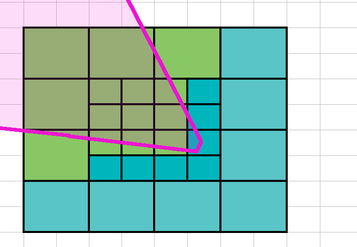
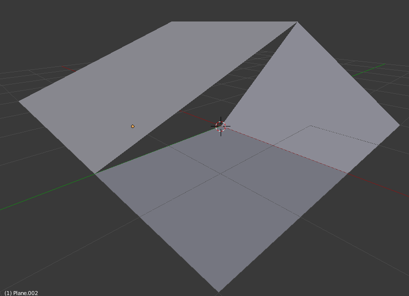
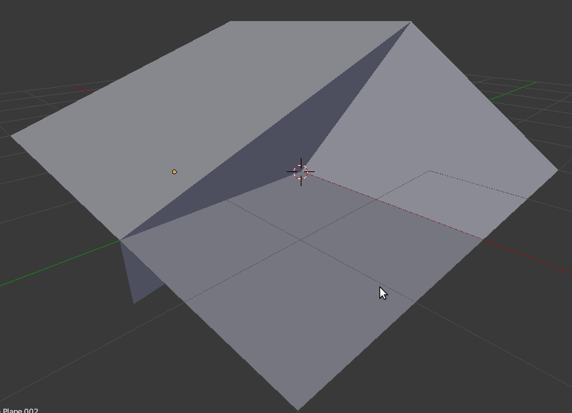

# Terra System {#TerraSystem}

@tableofcontents

Old Terrain systems used to be complicated. The reason behind this is that there was considerable effort into managing vertex and index buffers:

 - Each chunk needed its own memory space to hold vertex data
 - Each chunk may need cloned versions to deal with LOD
 - Modifying this data could cause stalls (if it's in use by the GPU)

Modern APIs simplify this a lot because **we can render vertex data without a vertex buffer at all**

## Vertex-bufferless rendering

The core of this technique is explored in detail in [Vertex Shader Tricks by Bill Bilodeau](https://www.gdcvault.com/play/1020624/Advanced-Visual-Effects-with-DirectX) ([PPT](http://amd-dev.wpengine.netdna-cdn.com/wordpress/media/2012/10/Vertex-Shader-Tricks-Bill-Bilodeau.ppsx)).

The short version is this: Let's forget about terrains for a sec. We want to render a screen-aligned quad. It is composed of either

 - 2 triangles = 4 vertices + 6 indices (w/ Index Buffer)
 - 2 triangles = 6 vertices (w/out Index Buffer, 3 vertex per triangle)

For simplicity we'll ignore index buffers.

Thus we need 6 vertices. On a traditional DX9-style API if we want to display the quad on screen, we'd ask for a vertex buffer that can hold 6 vertices, fill them with the 4 corners, and draw it.

But on DX10+ style API, we can do much better. These APIs expose [gl_VertexID](https://www.khronos.org/registry/OpenGL-Refpages/gl4/html/gl_VertexID.xhtml)/[SV_VertexID](https://docs.microsoft.com/en-us/windows/win32/direct3dhlsl/dx-graphics-hlsl-semantics) which is an int holding the current vertex index.

If the vertex shader were to be expressed in C++ code it would look like this (except that on the GPU it runs on parallel):

```cpp
for( int gl_VertexID = 0; gl_VertexID < num_vertices; ++gl_VertexID )
	vertex_shader( gl_VertexID );
```

Having `gl_VertexID` **available is extremely powerful**. As we can "generate" the quad using a few bitwise and compare tricks:

```cpp
uniform float2 particleScale[max_particles];
uniform float3 particlePos[max_particles];

// Generate a screen aligned quad using gl_VertexID alone
// (there's probably more efficient bitwise tricks that avoid division
// but this is clear)
int triVert = gl_VertexID % 6;
if( triVert < 3 )
{
	// First triangle
	vertexPos.x = triVert & 0x01 == 0 ? -1.0f : 1.0f;
	vertexPos.y = triVert < 2 ? 1.0f : -1.0f;
}
else
{
	// Second triangle
	vertexPos.x = triVert & 0x01 == 0 ? -1.0f : 1.0f;
	vertexPos.y = triVert > 4 ? -1.0f : 1.0f;
}

// vertexPos.xy is now in range [-1; 1]

vertexPos.z = 0.0f;
uv.xy = vertexPos.xy * 0.5f + 0.5f;

int particleIdx = gl_VertexID / 6;
// Now individualize this particle with per-particle data
finalVertexPos = vertexPos.xyz * float3( particleScale[particleIdx].xy, 1.0f ) + particlePos[particleIdx];
```

There are three big take aways from this snippet of code:

 1. Vertex data is generated procedurally in the vertex shader. At no point is there a vertex buffer bound. Both position and uvs were generated from gl_VertexID
 2. We reduced the amount of data we have to sent by at least 6x. We only need to send 3 floats for scale + 2 floats for position, per particle. With a vertex buffer we would have had to send 3 floats with final position + 2 floats for UVs, per vertex. We may try to get more clever and squeeze even more savings, but this is good enough for this example
 3. Thanks to Moore's Law, GPUs get 2x better ALU every 18 months, but bandwidth is not affected by Moore's Law, neither is latency. This version, which is pure raw math, is expected to benefit more from newer HW than the traditional version.
 4. Because the vertices are procedurally generated, *we could tessellate dynamically*. This example deals with 6 vertices, but we could modify it to have a dynamic amount. e.g. we could send num_vertices_per_quad instead of hardcoding it to 6. This way, rather than having multiple vertex buffers for each LOD, generating them on the fly, caching them, and then deciding which one to use based on the LOD setting, we just send a variable containing the tessellation factor and it will 'just work'

This technique can be used to perform all sort of tricks: Quad rendering, particle FXs, grass rendering (generate the blades in 2D, then slightly bend them in 3D), and of course Terrains.

## Vertex Trick in Terra

Ok now that we've explained what newer APIs enable us to do, Terra uses the same trick: Heightmap-based terrains are essentially 2D quads on the XZ plane stacked together while the height Y is fetch from a heightmap texture.

Terra uses triangle strips rather than triangle lists because it lets the vertex shader run less, but this also means we need to generate a few [degenerate triangles](https://www.learnopengles.com/tag/degenerate-triangles/) (i.e. triangles with 0 area) to start from the end of a row of quads, into the next row of quads.

The actual code is in [Samples/Media/Hlms/Terra/Any/800.VertexShader_piece_vs.any](https://github.com/OGRECave/ogre-next/blob/e8486341da0e0f9780e943a001adda33df00a268/Samples/Media/Hlms/Terra/Any/800.VertexShader_piece_vs.any#L58)

## Terra cells

### First layer, the 4x4 block

Terra divides the terrain into blocks or cells, a TerrainCell.

Every frame, when `Terra::update` is called, we calculate the visibility (frustum cull) of the first 4x4 blocks around the camera.

If the block is visible, it is added to a visible list in `Terra::addRenderable`.


In this example, there's 9 out of 16 blocks visible by the camera.

Let's say that each block has 4096 vertices (64 width x 64 depth)

In a DX9-style API, this would translate to 9 Draw calls: There's 9 chunks visible, we need 9 draws of 4096 vertices each.

However we're doing this procedurally, thus `Terra::optimizeCellsAndAdd` will attempt to merge these blocks as much as possible. This one is an easy case because the whole 3x3 is contiguous **thus it can be rendered as 1 block of 331776 vertices** (192 width x 192 depth)

### Outer layers

Like an onion, Terra will now start iterating around the circunscript blocks around this 4x4 starting block; while doubling its size and halving tessellation factor (tessellation factor is determined by `lodLevel` parameter `Terra::addRenderable`) every time:



In this case we see that 5 new blocks need to be rendered. Again, `Terra::optimizeCellsAndAdd` will attempt to merge these blocks, optimally producing two blocks of 1x3 and 2x1 (or 1x2 and 3x1).

As you may have noticed, after merging, a **`TerrainCell` may no longer be squared!**

After we've covered the whole terrain, for all surviving `TerrainCell` `TerrainCell::uploadToGpu` is called and added to Terra's MovableObject::mRenderables. 

This uploaded data is what the Vertex Shader reads in `CellData cellData = cellDataArray[inVs_drawId];`.

After that, `Terra::update` will return and Ogre will pick up the mRenderables from the Terra object for rendering.

> **Note:** Hardcoding `lodLevel` to be always 0 forces Terra to render without any sort of LOD, which is useful when maximum quality is needed.

> **Note 2:** If you need maximum accuracy (i.e. disable LODs) modern GPUs are extremely fast and can render the whole terrain at lod 0 at real time framerates thanks to our procedural approach. LOD is meant to save GPU time that can be dedicated to other tasks such as PBR or GI.

## Skirts

Every jump in LOD produces a discontinuity. In 2D it looks like this:


But in 3D there is a hole:



This hole is fixed with *skirts*, which is simply extruding the edge downwards:



This is a simple yet effective solution. Although clearly wrong when looking up close, this skirt is in the distance therefore it's often only a few pixels wide, and colour shading is done in a way that pretends the normal is pointing upwards, therefore it's contiguous.

Additionally, the skirts would be most noticeable on high frequency heightmaps (i.e. large differences between pixels), which is extremely rare as natural-occurring heightmaps are low frequency.

## Shadows

When it comes to directional lights, standard shadow mapping quality is very poor. Additionally, the number of vertices multiplies with each shadow map which can put a  strain on the GPU.

Directional lights are instead handled differently, using a compute shader that performs 2D raymarching, generating a shadow texture in real time.

This shadow texture is then gaussian blurred to give it a soft look.

The shadow texture contains 2 values:

 - Red channel: opacity (i.e. 'shadowiness') for the terrain
 - Green channel: Max height for applying shadows to regular objects. i.e. when an object.y is between [terrain.y; terrain.y + shadowTex.g) then the object's shadow factor is lerped. When > terrain.y + shadowTex.g then the object is fully lit by the sun. This allows objects to be affected by terrain shadows with a soft look (i.e. it mimics penumbra).

Skyline Game Engine has a [video](https://www.youtube.com/watch?v=4Q-0ALA6Cik) of Terra's sun shadows being modified in real time (in less than 2ms).

Point & spot lights use traditional shadow maps. They often have much higher quality and limited range, thus vertex count is also not an issue.

 ## Shading

 Starting Ogre 2.2, HlmsTerra derives from HlmsPbs therefore all or most features available to PBS are also available to Terra. That includes multiple light sources, multiple BRDFs, Forward+, PCC, etc.

 Terra shader [overrides texturing code](https://github.com/OGRECave/ogre-next/blob/e8486341da0e0f9780e943a001adda33df00a268/Samples/Media/Hlms/Terra/Any/800.PixelShader_piece_ps.any#L125) via `@undefpiece` to perform blending between detail maps in a manner that is most common to terrain tools.

 However every project has its own idea of how detail maps should be blended together in a terrain; and we encourage to override them to suit your needs.

 For example the [Ignition project customized blending](https://github.com/ignitionrobotics/ign-rendering/blob/056023a9f8f139925035b0e62db3837ad9a3f8e3/ogre2/src/media/Hlms/Terra/Any/800.PixelShader_piece_ps.any#L133) to more closely match that of their Terrain Component from Ogre1.

 With enough artistic work it can be made to look nice:
 
 
 
 
 

 Examples of Terra in real world use are [Racecraft](https://store.steampowered.com/app/346610/Racecraft/), [Alliance Air War](https://apps.apple.com/us/app/alliance-air-war/id1059604202), [Sunset Rangers](https://store.steampowered.com/app/559340/Sunset_Rangers/).

 ## Why is it not a component?

 Terrain rendering often needs heavy customizations to suit the user needs.