# OGRE-Next 3D (Object-Oriented Graphics Rendering Engine Next Generation)

Ogre-Next is a 3D graphics rendering engine. Not to be confused with a game engine which provides Networking, Sound, Physics, etc.

Ogre-Next 3.0 has had a substantial overhaul to focus on high performance graphics using Data Oriented Design with:
 * Cache friendly Entity and Node layout
 * Threaded batch processing of Nodes, Frustum Culling and other techniques such as Forward Clustered
 * SIMD processing using AoSoA (Array of Structures of Arrays) memory layout
 * Texture loaded via background streaming

This makes Ogre-Next suitable for projects aiming to have a **large number of objects on screen, or have tight rendering budgets such as VR.**

This is the repository where the 2.x branch is actively developed on.
Active development of the 1.x branch happens in https://github.com/OGRECave/ogre

Both branches are in active development. See [What version to choose?](https://www.ogre3d.org/about/what-version-to-choose) to understand the differences between 1.x and 2.x

Both repositories are compatible for merging, but have been split in separate ways as their
differences have diverged long enough.

| Build | Status (github) |
|-------|-----------------|
| Linux |[](https://github.com/OGRECave/ogre-next/actions/workflows/linux.build.yml)|
| MSVC | [](https://ci.appveyor.com/project/MatiasNGoldberg/ogre-next/branch/master)|
| Clang-Format Style Consistency |[](https://github.com/OGRECave/ogre-next/actions/workflows/clang-format.yml)|

## Supported Backends

 * Direct3D 11
 * OpenGL 3.3+
 * Metal
 * Vulkan

## Supported Platforms

 * Windows (7, 8, 10)
 * Linux
 * macOS\*
 * iOS
 * Android\*\*

(\*) Metal Backend is highly recommended. GL backend is supported in macOS, but the window subsystem hasn't been ported to 3.0 yet.<br/>
(\*\*) Device must be Vulkan-capable. Android 7.0+ is supported; but Android 8.0+ is strongly recommended due to lots of driver bugs in older versions.<br/>

## Supported Compilers

 * Clang 3.3 or newer
 * GCC 5 or newer
 * VS2015 or newer
 
## Samples
For a list of samples and their demonstrated features, refer to the [samples section in the manual.](https://ogrecave.github.io/ogre-next/api/latest/_samples.html) 

# Who's using it?

## [Yoy Simulators](https://www.yoy.cl/)

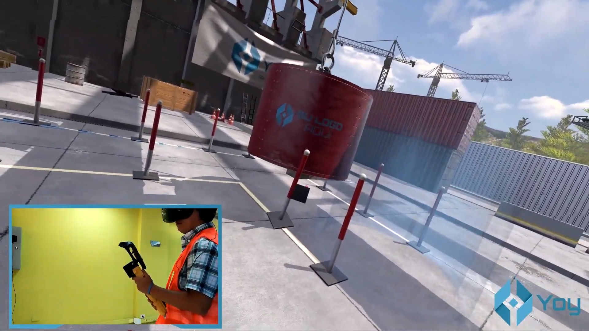

## [Skyline Game Engine](https://aurasoft-skyline.co.uk/)

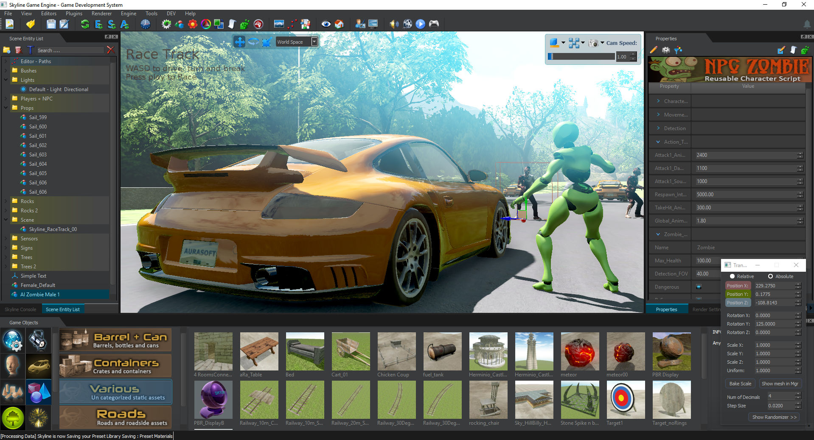

## [Racecraft](https://store.steampowered.com/app/346610/Racecraft/)

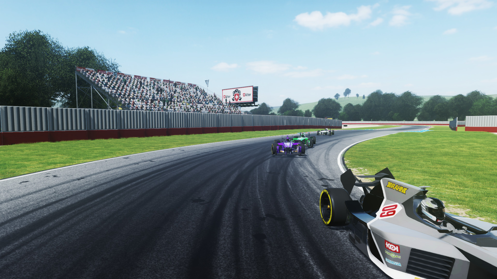

## [Sunset Rangers](https://store.steampowered.com/app/559340/Sunset_Rangers/)

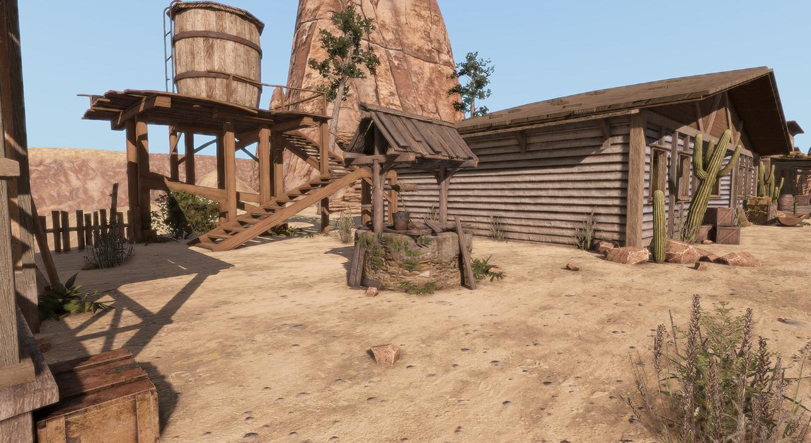

## [Stunt Rally 3](https://stuntrally.tuxfamily.org/)

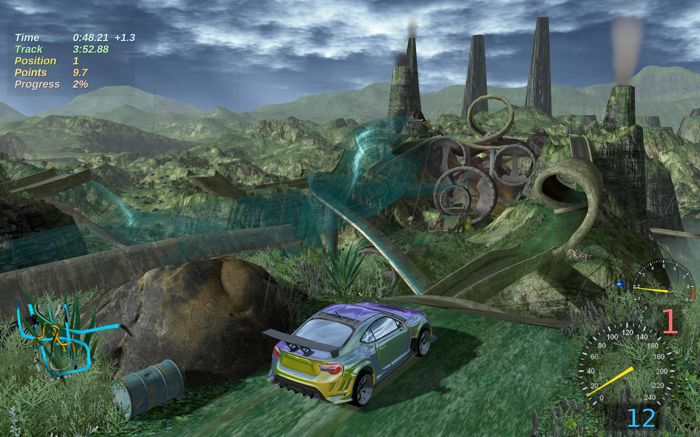


# Features

## Forward Clustered

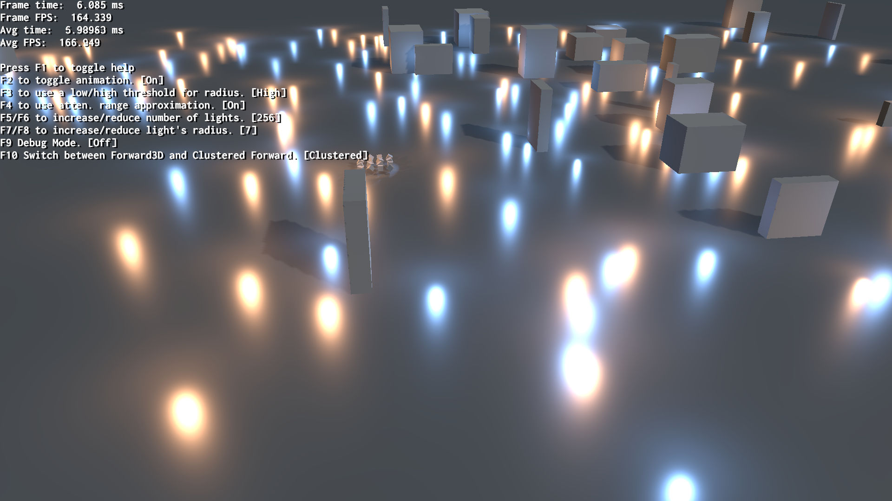

## PBS & HDR

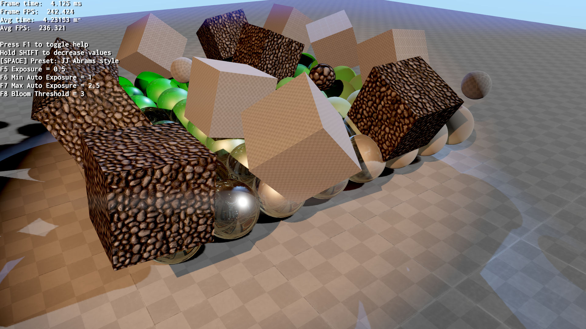

## Area Lights

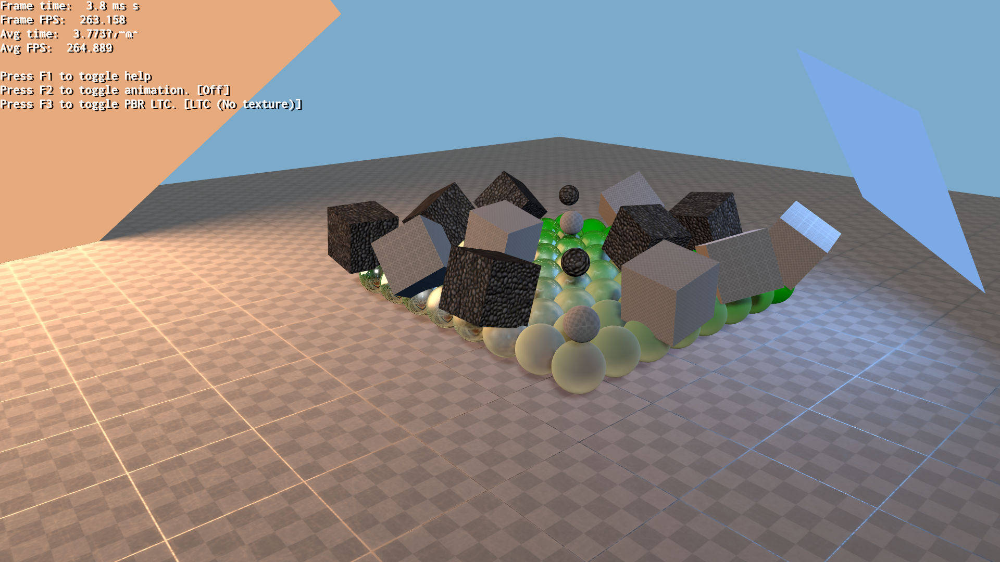

## Voxel Cone Tracing (VCT) GI


## Instant Radiosity GI

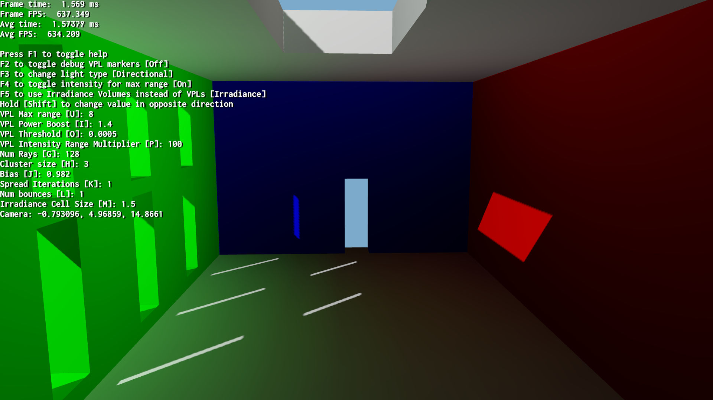

## [Voxel Cone Tracing + Per Pixel Parallax Corrected Cubemap (PCC) Hybrid](https://www.ogre3d.org/2019/08/14/pcc-vct-hybrid-progress)

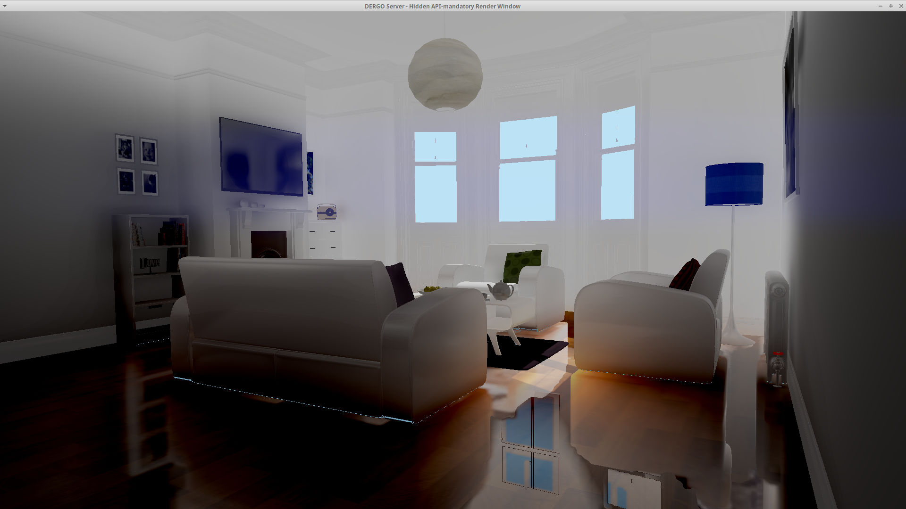

## [OpenVR Integration](https://www.ogre3d.org/2019/09/22/improvements-in-vr-morph-animations-moving-to-github-and-ci)

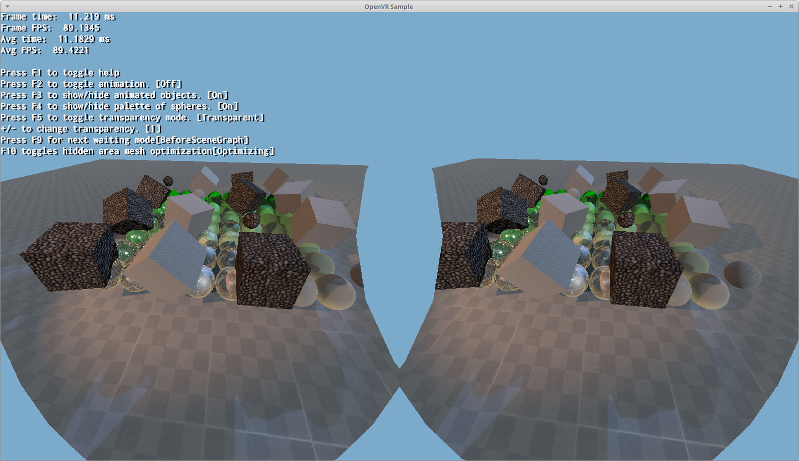

# Dependencies

* [CMake 3.x](https://cmake.org/download/)
* Git
* For HW & SW requirements, please visit http://www.ogre3d.org/developers/requirements
* Our source dependencies are grouped in [ogre-next-deps](https://github.com/OGRECave/ogre-next-deps) repo
* Python 3.x is needed to build shaderc dependency for Vulkan.

# Dependencies (Windows)

* Visual Studio 2015 - 2022. MinGW may work but we strongly recommend Visual Studio.
* [DirectX June 2010 SDK](https://www.microsoft.com/en-us/download/details.aspx?id=6812). Optional. Comes with useful tools.
* Windows 10 SDK. Contains the latest DirectX SDK, thus recommended over the DX June 2010 SDK,
  but you may still want to install the June 2010 SDK for those tools.
* Windows 7 or newer is highly recommended. For Windows Vista & 7, you need to have the
  [KB2670838 update](https://support.microsoft.com/en-us/kb/2670838) installed.
  **YOUR END USERS NEED THIS UPDATE AS WELL**.

# Dependencies (Linux)

* Clang >3.5 or GCC >4.0

Debian-based. Run:

```
sudo apt-get install libfreetype6-dev libfreeimage-dev libzzip-dev libxrandr-dev libxaw7-dev freeglut3-dev libgl1-mesa-dev libglu1-mesa-dev libx11-xcb-dev libxcb-keysyms1-dev doxygen graphviz python-clang libsdl2-dev cmake ninja-build git
```

Arch-based Run:

```
pacman -S freeimage freetype2 libxaw libxrandr mesa zziplib cmake gcc
```

# Quick Start

We provide quick download-build scripts under the [Scripts/BuildScripts/output](Scripts/BuildScripts/output) folder.

You can download all of these scripts [as a compressed 7zip file](https://github.com/OGRECave/ogre-next/releases/download/bin-releases/build_ogre_scripts-master.7z).
We also have an archive if you're looking for [scripts to build older versions](https://github.com/OGRECave/ogre-next/releases/bin-releases/).

If you're on Linux, make sure to first install the dependencies (i.e. run the sudo apt-get above)

# Download and Building manually

If for some reason you want to do it by hand, there's no script for your platform,
or you want to learn what the scripts are actually doing, see
[Setting Up Ogre](https://ogrecave.github.io/ogre-next/api/latest/_setting_up_ogre.html) from the Ogre manual.

# Manual

For more information see the [online manual](https://ogrecave.github.io/ogre-next/api/latest/manual.html).
The manual can build on Linux using Doxygen:

```
cd build/Debug
ninja OgreDoc
```

# Resolving Merge Conflicts in 3.0

Users who run a customized version of Ogre-Next may found rebasing to the latest version a near impossible job due to the sheer amount of minor merge conflicts when upgrading to Ogre-Next 3.0

See [this guide](https://ogrecave.github.io/ogre-next/api/latest/_resolving_merge_conflicts30.html) on how to deal with them more easily.


# OgreNext 3.0 changes

For details see [What's new?](https://ogrecave.github.io/ogre-next/api/latest/_ogre30_changes.html) from our manual.


## OgreNext versioning

Since OgreNext 3.0 we've modified our versioning scheme to be more consistent with other projects and what developers expect.

Our [Github ticket](https://github.com/OGRECave/ogre-next/issues/259#issuecomment-1086954560) and [Forum post](https://forums.ogre3d.org/viewtopic.php?t=96660) explain it in detail. Basically it boils down to:

OgreNext now uses a *modified* variation of [Semantic Versioning](https://semver.org/) (MAJOR.MINOR.PATCH).

 - PATCH can only be bumped as long as ABI compatibility remains 100%.
 - MINOR bumps as long as API compatibility stays >= 95% for all components and plugins, according to abi-compliance-checker. Measured against MAJOR.0.0
   - This is not strictly in compliance to SemVer, but stays close to its spirit
 - MAJOR bumps when API compatibility is < 95%. Although MAJOR can be bumped even if compat >= 95% at the dev's discretion.

As a result:

 - Patch +1 bumps can be release for hot fixes. Bugs that are easy to fix without breaking ABI and deploy everywhere.
 - Minor +1 tells our users upgrading is painless. A recompilation is necessary. Build errors may appear, but they should be very quick & easy to fix.
 Projects like Ignition which have strong ABI requirements can leverage whether to move to Minor+1 if they have to when a certain bugfix is too important and can't be done without breaking OgreNext's ABI.
 Main focus for minor bumps will be for fixing bugs that can't be or are too hard to fix without breaking ABI.
 - Major +1 tells our users to prepare for larger upgrading efforts. Although not necessarily too large if we release more often.

For OgreNext <= 2.3 the versioning stays the same.

# Support and Resources

 * [Forums](https://forums.ogre3d.org/viewforum.php?f=25)
 * [Bug Reports](https://github.com/OGRECave/ogre-next/issues)
 * [Contributing via Pull Requests](https://github.com/OGRECave/ogre-next/pulls)
 * [Documentation](https://ogrecave.github.io/ogre-next/api/latest/)
 * [Ogre 2.1+ FAQ](http://wiki.ogre3d.org/Ogre+2.1+FAQ)
 * [Older resources for interfaces carried over from 1.x](https://www.ogre3d.org/documentation)

# Samples

If you want to test or evaluate Ogre, you can try the [prebuilt samples for Windows](https://github.com/OGRECave/ogre-next/releases/download/bin-releases/ogre-samples-windows-x64-vs2015.7z).

# Unit Tests

To run the unit tests, go to Scripts/UnitTesting and to generate the comparison files type:

```
python3 RunUnitTests.py gl ../../build/Debug/bin/ ./JSON ../../build/UnitTestsOutput/
```

to check the diff against already generated data:

```
python3 RunUnitTests.py gl ../../build/Debug/bin/ ./JSON ../../build/UnitTestsOutput/ ../../build/UnitTestsOutput_old/
```

# License

OGRE-Next (www.ogre3d.org) is made available under the MIT License.

Copyright (c) 2000-present Torus Knot Software Ltd

Permission is hereby granted, free of charge, to any person obtaining a copy
of this software and associated documentation files (the "Software"), to deal
in the Software without restriction, including without limitation the rights
to use, copy, modify, merge, publish, distribute, sublicense, and/or sell
copies of the Software, and to permit persons to whom the Software is
furnished to do so, subject to the following conditions:

The above copyright notice and this permission notice shall be included in
all copies or substantial portions of the Software.

THE SOFTWARE IS PROVIDED "AS IS", WITHOUT WARRANTY OF ANY KIND, EXPRESS OR
IMPLIED, INCLUDING BUT NOT LIMITED TO THE WARRANTIES OF MERCHANTABILITY,
FITNESS FOR A PARTICULAR PURPOSE AND NONINFRINGEMENT. IN NO EVENT SHALL THE
AUTHORS OR COPYRIGHT HOLDERS BE LIABLE FOR ANY CLAIM, DAMAGES OR OTHER
LIABILITY, WHETHER IN AN ACTION OF CONTRACT, TORT OR OTHERWISE, ARISING FROM,
OUT OF OR IN CONNECTION WITH THE SOFTWARE OR THE USE OR OTHER DEALINGS IN
THE SOFTWARE.
